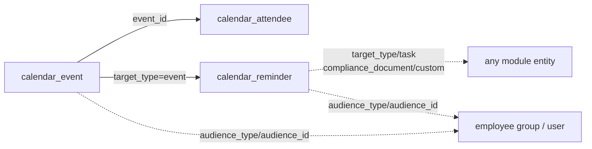

The Calendar module declares tenant tables with the `calendar_` prefix. Every table uses `id: uuidv7("id").primaryKey()` and `timestamptz` for `created_at`/`updated_at`.

## Enums

| Enum                        | Values                                                           |
| --------------------------- | ---------------------------------------------------------------- |
| `calendar_audience_type`    | `organization`, `group`, `user`                                  |
| `calendar_event_status`     | `confirmed`, `tentative`, `cancelled`                            |
| `calendar_reminder_target`  | `event`, `task`, `note`, `file`, `custom`, `compliance_document` |
| `calendar_reminder_type`    | `offset`, `custom`, `due_date`, `overdue`                        |
| `calendar_reminder_channel` | `pubsub`                                                         |
| `calendar_attendee_type`    | `user`, `contact`                                                |
| `calendar_attendee_status`  | `invited`, `accepted`, `declined`, `tentative`                   |

Validated in Valibot but stored as `jsonb`/free text (no pgEnum):

| Set                   | Values                                        |
| --------------------- | --------------------------------------------- |
| `RecurrenceFrequency` | `daily`, `weekly`, `monthly`, `yearly`        |
| `ReminderInterval`    | `daily`, `weekly`, `monthly`, `every_2_hours` |
| `Weekday`             | `MO`, `TU`, `WE`, `TH`, `FR`, `SA`, `SU`      |

## Tables

### `calendar_event`

A time-boxed entry scoped to an audience. Recurrence is jsonb; occurrences are computed on read.

| Column                      | Type                     | Description                                                                 |
| --------------------------- | ------------------------ | --------------------------------------------------------------------------- |
| `id`                        | text (PK)                | Auto UUIDv7                                                                 |
| `audience_type`             | `calendar_audience_type` | `organization` (default) / `group` / `user`                                 |
| `audience_id`               | text                     | Group id or user id; `null` for organization                                |
| `title`                     | text                     | Event title                                                                 |
| `description`               | text                     | Optional description                                                        |
| `location`                  | text                     | Optional location                                                           |
| `starts_at`                 | timestamptz              | Event start                                                                 |
| `ends_at`                   | timestamptz              | Required unless `all_day`                                                   |
| `all_day`                   | boolean                  | Default `false`; stores 00:00 in the event tz, `ends_at` exclusive next-day |
| `status`                    | `calendar_event_status`  | `confirmed` (default) / `tentative` / `cancelled`                           |
| `recurrence`                | jsonb                    | `{ frequency, interval, count?, until?, byDay? }`                           |
| `timezone`                  | text                     | IANA timezone                                                               |
| `color`                     | text                     | Optional color hint                                                         |
| `source_type`               | text                     | `<module>:<entity>` registry value (e.g. `tasks:task`)                      |
| `source_entity_id`          | text                     | Owning row's UUIDv7 id                                                      |
| `created_by`                | text                     | Creating actor                                                              |
| `created_at` / `updated_at` | timestamptz              | Record timestamps                                                           |

Indexes: `idx_calendar_event_audience(audience_type, audience_id)`, `idx_calendar_event_starts(starts_at)`, `idx_calendar_event_source(source_type, source_entity_id)`, `idx_calendar_event_status(status)`.

### `calendar_attendee`

An invitee on an event. Soft-references a user or masters contact.

| Column                      | Type                       | Description                                                 |
| --------------------------- | -------------------------- | ----------------------------------------------------------- |
| `id`                        | text (PK)                  | Auto UUIDv7                                                 |
| `event_id`                  | text                       | Soft FK → `calendar_event.id`                               |
| `email`                     | text                       | Attendee email                                              |
| `name`                      | text                       | Optional display name                                       |
| `attendee_id`               | text                       | Soft ref (user id or masters contact id)                    |
| `attendee_type`             | `calendar_attendee_type`   | `user` (default) / `contact`                                |
| `optional`                  | boolean                    | Default `false`                                             |
| `status`                    | `calendar_attendee_status` | `invited` (default) / `accepted` / `declined` / `tentative` |
| `created_at` / `updated_at` | timestamptz                | Record timestamps                                           |

Indexes: `idx_calendar_attendee_event(event_id)`, `idx_calendar_attendee_email(email)`.

### `calendar_reminder`

The platform's single polymorphic reminder surface.

| Column                      | Type                        | Description                                                           |
| --------------------------- | --------------------------- | --------------------------------------------------------------------- |
| `id`                        | text (PK)                   | Auto UUIDv7                                                           |
| `audience_type`             | `calendar_audience_type`    | `organization` (default) / `group` / `user`                           |
| `audience_id`               | text                        | Group id or user id; `null` for organization                          |
| `target_type`               | `calendar_reminder_target`  | `event` / `task` / `note` / `file` / `custom` / `compliance_document` |
| `target_id`                 | text                        | Soft ref; free-form or empty for `custom`                             |
| `type`                      | `calendar_reminder_type`    | `offset` / `custom` / `due_date` / `overdue`                          |
| `channel`                   | `calendar_reminder_channel` | `pubsub` (the only real channel in v1)                                |
| `remind_at`                 | timestamptz                 | Absolute; `null` until an offset anchor resolves                      |
| `offset_minutes`            | integer                     | For `type = offset`; anchor = target's start/due                      |
| `message`                   | text                        | Optional reminder message                                             |
| `is_recurring`              | boolean                     | Default `false`                                                       |
| `interval`                  | text                        | `daily` / `weekly` / `monthly` / `every_2_hours`                      |
| `is_sent`                   | boolean                     | Default `false`                                                       |
| `sent_at`                   | timestamptz                 | Set by dispatcher                                                     |
| `created_by`                | text                        | Creating actor (`task-bridge` / `compliance-bridge` for bridge rows)  |
| `created_at` / `updated_at` | timestamptz                 | Record timestamps                                                     |

Indexes: `idx_calendar_reminder_target(target_type, target_id)`, `idx_calendar_reminder_audience(audience_type, audience_id)`, `idx_calendar_reminder_sent(is_sent)`, `idx_calendar_reminder_at(remind_at)`.

## Relationships

```mermaid
flowchart LR
  E[calendar_event] -->|event_id| A[calendar_attendee]
  E -->|target_type=event| R[calendar_reminder]
  R -. target_type/task<br/>compliance_document/custom .-> EXT[any module entity]
  E -. audience_type/audience_id .-> G[employee group / user]
  R -. audience_type/audience_id .-> G
```

All FKs are soft, workflow-enforced. `reminder.interval` is decoded at the dispatcher boundary; unknown values are acknowledged but not rescheduled.
