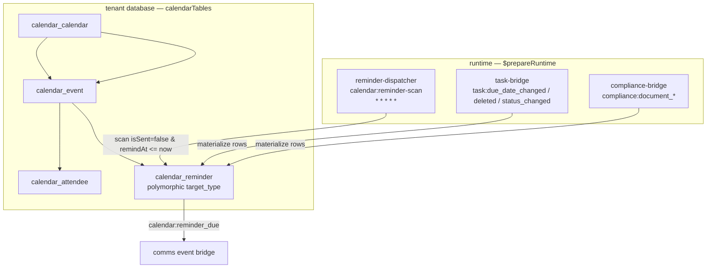
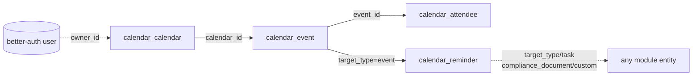

The Calendar module owns the three time-domain surfaces — calendars, events with recurrence and attendees, and the platform's single polymorphic reminder surface (`calendar_reminder`) for `event`, `task`, `compliance_document`, and other targets.

## Module

```ts title="src/module.ts"
export class Calendar implements Module {
  static create(config?: CalendarModuleConfig): Calendar;
  readonly $name = "calendar"; // proxy key: p.calendar
  readonly $dependencies: readonly string[] = [];
  readonly $consumes: readonly string[] = [
    "task:due_date_changed",
    "task:deleted",
    "task:status_changed",
    "compliance:document_expiring",
    "compliance:document_due",
    "compliance:document_archived",
    "compliance:document_deleted",
  ];
}
```

`$consumes` is introspection-only, never validated. Set `tasksEnabled: false` or `complianceEnabled: false` to skip the respective bridge.

## Configuration

```ts title="src/types.ts"
type CalendarModuleConfig = {
  complianceEnabled?: boolean; // true — subscribe to compliance:document_* events
  reminderScanCron?: string; // "* * * * *" — pg-boss cron for the reminder scan
  tasksEnabled?: boolean; // true — subscribe to task:* events
};
```

```ts
const calendar = Calendar.create({
  reminderScanCron: "* * * * *",
  tasksEnabled: true,
  complianceEnabled: true,
});
const p = IsolatedTenantPlatform.create(config, [calendar]);
```

## Dependencies

No module dependencies (`$dependencies: []`). Runtime wiring via units:

| Unit     | Purpose                                                    |
| -------- | ---------------------------------------------------------- |
| `db`     | Tenant tables; pg-boss schedules                           |
| `pubsub` | Reminder dispatcher cron + task and compliance bridges     |
| `audit`  | Audit writes via `getContext().audit` in `$prepareRuntime` |

## Architecture



`$initialize({ db, pubsub })` stores refs; `$prepareRuntime()` registers the reminder-dispatcher and both bridges; `$cleanup()` unregisters all three.

## Key concepts

### Access inheritance

Calendars carry `access` (`personal` default or `global`) plus `ownerId`. Events, attendees, and reminders inherit their calendar's access via `access-service.ts`; reminders are additionally recipient-scoped via `userId`. `assertCanAccess` is `global OR ownerId === actorId`; `assertCanMutate` is `ownerId === actorId OR tenant admin`; reminders allow `userId === actorId` or a readable event calendar.

### Recurrence on read

`calendar_event.recurrence` is `{ frequency, interval, count?, until?, byDay? }` validated by `EventRecurrenceSchema`. Occurrences are computed on read by `workflow-steps/recurrence.ts`, never materialized. `count` and `until` are mutually exclusive; `byDay` is weekly-only.

### Single reminder surface

`calendar_reminder` is polymorphic (`target_type` / `target_id` → any module entity). Task due-date reminders (`target_type = task`) are three rows per recipient (`due − 1d`, `due − 1h`, `due`) created by the task bridge. Compliance document reminders (`target_type = compliance_document`) are `reminderDays` rows per recipient created by the compliance bridge (expiry/due dates). No direct cross-module table reads.

## Relationships



All FKs are soft/logical. `reminder.target_id` is free-form except `custom` allows empty.
