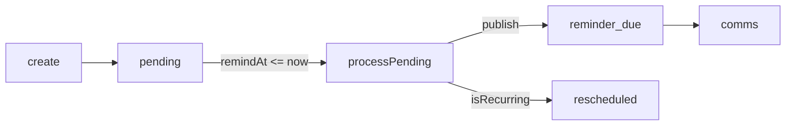

Workflow groups via `p.calendar`: `calendars`, `events`, `attendees`, `reminders`.

Scoped reminders require `targetType` + `targetId` (empty for `custom`); create takes Valibot `{ input }`, update takes `{ id, input }`, `get`/`delete`/`cancel` take `{ id }`. Every mutation writes an audit entry and publishes a `calendar:*` event.

## Features

### Calendars

Access: `p.calendar.calendars`

Named collections; the first calendar a user creates auto-defaults, and `setDefault` clears the owner's other defaults.

```ts
await p.calendar.calendars.create({
  input: { name: "Personal", access: "personal", timezone: "Asia/Kolkata", color: "#3B82F6" },
});
await p.calendar.calendars.setDefault({ id });
await p.calendar.calendars.get({ id });
await p.calendar.calendars.update({
  id,
  input: { name: "Work", access: "global", isDefault: true },
});
await p.calendar.calendars.delete({ id });
await p.calendar.calendars.list({
  filters: { access: "global", isDefault: false, search: "Personal", limit: 50, offset: 0 },
});
```

### Events

Access: `p.calendar.events`

Time-boxed entries with recurrence, attendees, timezone, and a polymorphic source link.

```ts
await p.calendar.events.create({
  input: {
    calendarId,
    title: "Sync",
    startsAt: new Date("2026-09-01T10:00:00Z"),
    endsAt: new Date("2026-09-01T11:00:00Z"),
    location: "HQ",
    recurrence: { frequency: "weekly", interval: 1, byDay: ["MO", "WE"] },
    sourceType: "tasks:task",
    sourceEntityId: taskId,
  },
});
await p.calendar.events.get({ id });
await p.calendar.events.cancel({ id });
await p.calendar.events.update({ id, input: { startsAt: new Date("2026-09-01T11:00:00Z") } });
await p.calendar.events.delete({ id });

const occurrences = await p.calendar.events.getOccurrences({
  id,
  query: { from: new Date("2026-09-01"), to: new Date("2026-10-01"), limit: 100 },
});
const all = await p.calendar.events.listOccurrences({
  filters: { calendarId },
  query: { from, to },
});
await p.calendar.events.list({
  filters: {
    calendarId,
    from,
    to,
    status: "confirmed",
    sourceType: "tasks:task",
    search: "Sync",
    limit: 50,
    offset: 0,
  },
});
```

`create`/`update` enforce `startsAt < endsAt` unless `allDay`; `update` re-anchors `type = offset` reminders (`remindAt = startsAt − offsetMinutes`).

### Attendees

Access: `p.calendar.attendees`

Invitees on events; `add` publishes `calendar:attendee_invited`.

```ts
await p.calendar.attendees.add({
  input: {
    eventId,
    email: "candidate@example.com",
    name: "Jane",
    attendeeType: "contact",
    optional: false,
  },
});
await p.calendar.attendees.get({ id });
await p.calendar.attendees.update({ id, input: { status: "accepted" } });
await p.calendar.attendees.remove({ id });
await p.calendar.attendees.list({
  filters: { eventId, email: "jane@example.com", status: "accepted", limit: 50, offset: 0 },
});
```

Status follows `invited → accepted/declined/tentative`; attendees inherit the event's calendar access.

### Reminders

Access: `p.calendar.reminders`

Polymorphic reminders; dispatcher runs on the `calendar:reminder-scan` cron (`* * * * *`).

```ts
await p.calendar.reminders.create({
  input: { targetType: "event", targetId: eventId, type: "offset", offsetMinutes: 30, userId },
});
await p.calendar.reminders.create({
  input: { targetType: "task", targetId: taskId, type: "due_date", remindAt: dueDate, userId },
});
await p.calendar.reminders.get({ id });
await p.calendar.reminders.update({ id, input: { remindAt, message: "…" } });
await p.calendar.reminders.delete({ id });
await p.calendar.reminders.list({
  filters: {
    targetType: "task",
    targetId: taskId,
    type: "due_date",
    userId,
    isSent: false,
    limit: 50,
    offset: 0,
  },
});
await p.calendar.reminders.getPending({});
await p.calendar.reminders.processPending({});
```

| Type       | Requirements                                                                                                                               |
| ---------- | ------------------------------------------------------------------------------------------------------------------------------------------ |
| `offset`   | `offsetMinutes` required. For `targetType = event`, `remindAt` resolves from event start; otherwise caller-supplied `remindAt` is required |
| `custom`   | `remindAt` required                                                                                                                        |
| `due_date` | `remindAt` required (task bridge and compliance bridge create these)                                                                       |
| `overdue`  | `remindAt` required (hosts check state on delivery)                                                                                        |

`getPending` returns `isSent = false AND remindAt <= now`. `processPending` claims a bounded batch (100, oldest first) with a conditional `isSent` flip, publishes `calendar:reminder_due`, and reschedules `isRecurring` reminders with a known interval.



## Links

- Events: [Calendar Events](/docs/calendar/events)
- Schema: [Calendar Schema](/docs/calendar/db-schemas)
