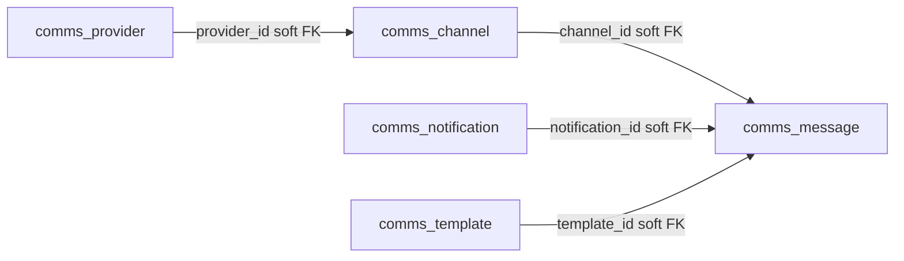

The Comms module declares one control-plane table (`comms_provider`) and tenant tables with the `comms_` prefix. Every table uses `id: uuidv7("id").primaryKey()` and `timestamptz` for `created_at`/`updated_at`. `channel.entityType` reuses `MASTER_ENTITY_TYPE` values (constants-only; no `masters` dependency).

## Enums

| Enum                      | Values                                                                          |
| ------------------------- | ------------------------------------------------------------------------------- |
| `channel_type`            | `email`, `sms`, `whatsapp`, `push`, `other`                                     |
| `channel_source`          | `tenant`, `host`                                                                |
| `channel_status`          | `active`, `inactive`, `revoked`, `expired`                                      |
| `provider_kind`           | `smtp`, `ses`, `resend`, `postmark`, `twilio`, `whatsapp_business_api`, `other` |
| `recipient_type`          | `user`, `contact`                                                               |
| `notification_status`     | `unread`, `read`, `dismissed`                                                   |
| `notification_severity`   | `normal`, `important`, `urgent`                                                 |
| `message_status`          | `queued`, `sending`, `sent`, `delivered`, `failed`                              |
| `preference_channel_type` | `email`, `sms`, `whatsapp`, `push`, `other`, `inapp`                            |

`inapp` is notification-routing only — it appears on `preference.channel_type` and `notification.channelTypes`, never on channels.

## Tables

### `comms_provider` (control plane)

Host delivery capability registry. Credential lives in the host kvStore under `comms:provider:<id>:credential`.

| Column                      | Type            | Description                                             |
| --------------------------- | --------------- | ------------------------------------------------------- |
| `id`                        | text (PK)       | Auto UUIDv7                                             |
| `name`                      | text            | e.g. `Host SES`, `Twilio`                               |
| `kind`                      | `provider_kind` | Provider kind                                           |
| `credential_ref`            | text            | Host kvStore key holding provider secrets               |
| `default_sender_address`    | text            | Fallback `from` for materialized host default channels  |
| `is_active`                 | boolean         | Deactivated providers leave `ensureDefaults` resolution |
| `metadata`                  | jsonb           | Account ids, verified domains/numbers, rate limits      |
| `created_at` / `updated_at` | timestamptz     | Record timestamps                                       |

### `comms_channel` (tenant)

Sender endpoint. Host defaults are materialized lazily by `ensureDefaults` (`source = host`, `provider_id` set).

| Column                                            | Type             | Description                                     |
| ------------------------------------------------- | ---------------- | ----------------------------------------------- |
| `id`                                              | text (PK)        | Auto UUIDv7                                     |
| `name`                                            | text             | Human label                                     |
| `type`                                            | `channel_type`   | Channel type                                    |
| `source`                                          | `channel_source` | `tenant` (BYOC) or `host` (default)             |
| `provider_id`                                     | text             | `provider.id` when `source = host`              |
| `sender_address`                                  | text             | The `from` address/number/sender ID             |
| `credential_ref`                                  | text             | BYOC kvStore key; `null` for host channels      |
| `status`                                          | `channel_status` | Lifecycle status                                |
| `is_default`                                      | boolean          | At most one per `(type, entityType, entityId)`  |
| `entity_type` / `entity_id`                       | text             | Polymorphic scope (`MASTER_ENTITY_TYPE` values) |
| `verified_at` / `last_tested_at` / `last_used_at` | timestamptz      | Verification + usage lifecycle                  |
| `metadata`                                        | jsonb            | Provider config, WhatsApp template ids          |
| `created_at` / `updated_at`                       | timestamptz      | Record timestamps                               |

### `comms_notification` (tenant)

The in-app inbox row + notification intent.

| Column                            | Type                    | Description                                              |
| --------------------------------- | ----------------------- | -------------------------------------------------------- |
| `id`                              | text (PK)               | Auto UUIDv7                                              |
| `type`                            | text                    | `document_expiring`, `reminder_fired`, `announcement`, … |
| `title`                           | text                    | Short headline                                           |
| `body`                            | text                    | Full content (plain markdown)                            |
| `severity`                        | `notification_severity` | Severity                                                 |
| `source_module`                   | text                    | Producing module                                         |
| `source_entity`                   | jsonb                   | `{ type, id }` source reference                          |
| `recipient_type` / `recipient_id` | `recipient_type` / text | `user` (auth id) or `contact`                            |
| `to`                              | jsonb                   | Resolved address snapshot `{ email?, phone?, name? }`    |
| `channel_types`                   | text[]                  | Requested channel types incl. `inapp`                    |
| `status`                          | `notification_status`   | Inbox status                                             |
| `read_at`                         | timestamptz             | When marked read                                         |
| `metadata`                        | jsonb                   | Producer payload extras                                  |
| `created_at` / `updated_at`       | timestamptz             | Record timestamps                                        |

### `comms_message` (tenant)

Delivery outbox. One row per outbound send.

| Column                                   | Type             | Description                                                       |
| ---------------------------------------- | ---------------- | ----------------------------------------------------------------- |
| `id`                                     | text (PK)        | Auto UUIDv7                                                       |
| `notification_id`                        | text             | Owning notification; `null` for standalone sends (`channel.test`) |
| `channel_id`                             | text             | Channel used (nulled when channel is deleted)                     |
| `channel_type`                           | `channel_type`   | `email`, `sms`, `whatsapp` (never `inapp`)                        |
| `provider_id`                            | text             | Resolved provider at send time                                    |
| `to`                                     | text             | Recipient address                                                 |
| `subject`                                | text             | Email subject                                                     |
| `body`                                   | text             | Rendered body                                                     |
| `template_id`                            | text             | `template` used; WhatsApp requires a provider template            |
| `tenant_id`                              | text             | Delivery tenant context                                           |
| `status`                                 | `message_status` | Outbox status                                                     |
| `attempts`                               | integer          | Delivery attempts so far                                          |
| `last_error`                             | text             | Last failure message                                              |
| `provider_message_id`                    | text             | Provider receipt correlation id                                   |
| `queued_at` / `sent_at` / `delivered_at` | timestamptz      | Lifecycle timestamps                                              |
| `metadata`                               | jsonb            | Template params                                                   |
| `created_at`                             | timestamptz      | Creation timestamp                                                |

### `comms_preference` (tenant)

Per-user routing + consent. `type = null` is the default row (applies to all notification types); exact `(userId, type, channelType)` wins.

| Column                      | Type                      | Description                                                 |
| --------------------------- | ------------------------- | ----------------------------------------------------------- |
| `id`                        | text (PK)                 | Auto UUIDv7                                                 |
| `user_id`                   | text                      | Auth user id                                                |
| `type`                      | text                      | Notification type; `null` = default                         |
| `channel_type`              | `preference_channel_type` | Includes `inapp`                                            |
| `enabled`                   | boolean                   | Opt-out hook (DPDP/HIPAA consent)                           |
| `priority`                  | integer                   | Routing order (`inapp` 1, `email` 2, `sms` 3, `whatsapp` 4) |
| `created_at` / `updated_at` | timestamptz               | Record timestamps                                           |

### `comms_template` (tenant)

Email/SMS/WhatsApp bodies with `{var}` placeholders.

| Column                      | Type        | Description                                       |
| --------------------------- | ----------- | ------------------------------------------------- |
| `id`                        | text (PK)   | Auto UUIDv7                                       |
| `name`                      | text        | Stable key (`document-expiring`, `otp-email`)     |
| `channel_type`              | enum        | `email`, `sms`, `whatsapp`                        |
| `subject`                   | text        | Email subject with placeholders                   |
| `body`                      | text        | Body template with placeholders                   |
| `provider_template_id`      | text        | Meta WhatsApp template id (required for WhatsApp) |
| `is_active`                 | boolean     | Inactive templates reject at `notify` time        |
| `metadata`                  | jsonb       | Provider language/category, params schema         |
| `created_at` / `updated_at` | timestamptz | Record timestamps                                 |

### `comms_setting` (tenant)

Tenant defaults.

| Column                      | Type        | Description        |
| --------------------------- | ----------- | ------------------ |
| `id`                        | text (PK)   | Auto UUIDv7        |
| `key`                       | text        | Unique setting key |
| `value`                     | jsonb       | Setting value      |
| `created_at` / `updated_at` | timestamptz | Record timestamps  |

Keys: `defaultChannels` (jsonb), `suppressOutOfBand` (boolean), `hostDefaultSenderAddressOverride` (text).

## Relationships

All FKs are soft; `provider` lives on the control-plane database. Credentials are never stored on rows.
