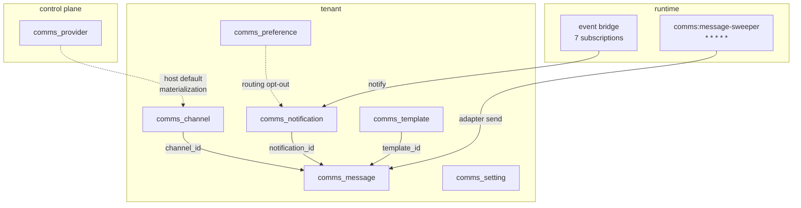
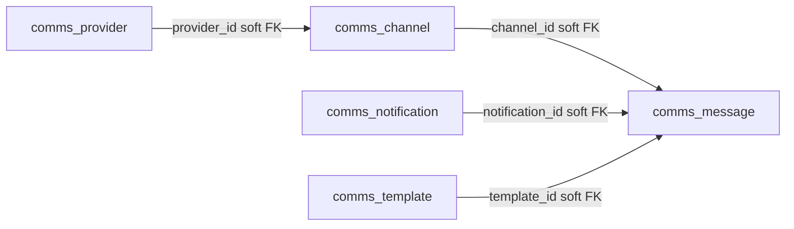
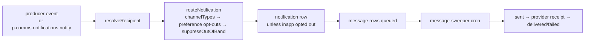

The Comms module is the notification and out-of-band delivery surface built on `@aspen-os/platform` — owning channels, host providers, the in-app inbox, and the delivery outbox for email, SMS, and WhatsApp.

<Callout type="warn">
  Comms is the single notification surface — there is no separate `notifications` package. There is
  no `comms:deliver` topic; delivery is the `comms:message-sweeper` cron scanning queued `message`
  rows.
</Callout>

## Module

```ts title="src/module.ts"
export class Comms implements Module {
  static create(config?: CommsModuleConfig): Comms;
  readonly $name = "comms"; // proxy key: p.comms
  readonly $dependencies: readonly string[] = [];
  readonly $consumes: readonly string[] = [
    "calendar:reminder_due",
    "dms:file_expired",
    "announcement:published",
    "workspace:delivery_due",
    "management:tenant_provisioned",
    "management:tenant_activated",
    "auth:email_otp_requested",
  ];
}
```

`$consumes` is introspection-only, never validated — a missing producer silently no-ops.

## Configuration

```ts title="src/module.ts"
export type CommsModuleConfig = undefined;

Comms.create(); // no config
```

## Dependencies

No module dependencies (`$dependencies: []`). Unit bindings are explicit:

| Unit      | Purpose                                                                                                          |
| --------- | ---------------------------------------------------------------------------------------------------------------- |
| `db`      | Control-plane `comms_provider` + tenant tables                                                                   |
| `kvStore` | Credentials (`comms:channel:<id>:credential` tenant scope, `comms:provider:<id>:credential` control-plane scope) |
| `pubsub`  | Sweeper cron + event-bridge subscriptions                                                                        |
| `auth`    | Recipient address resolution                                                                                     |

## Architecture



Tenant BYOC channels carry `credentialRef` (tenant kvStore); host defaults materialize lazily from an active `provider` (`source = host`, `provider_id` set).

## Key concepts

### Three-layer model

`provider` (host capability + credentialRef) → `channel` (tenant sender endpoint, `tenant` BYOC or `host` default) → `notification` (in-app inbox row) + `message` (one outbox row per outbound channel). `inapp` is a routing-only pseudo channel type on preferences and `channelTypes`, never on a channel.

### Credentials in kvStore

Rows carry `credentialRef`, never secret material. Host provider credentials live in the control-plane kvStore; tenant BYOC credentials live in the tenant kvStore.

### In-app is zero-delivery

The `notification` row _is_ the inbox; only non-`inapp` channel types produce `message` rows (`queued` → `sending` → `sent` → `delivered`/`failed`, terminal after 5 attempts).

### Default and verification

`setDefault` requires `active` + `verifiedAt`; `activate` requires `verifiedAt`; host defaults are pre-verified at materialization. At most one default per `(type, entityType, entityId)`.

## Relationships



All FKs are soft (tenant isolation, control-plane split). The provider → channel link is valid only when `channel.source = host`.

## Lifecycle



Provider receipt webhooks correlate by `providerMessageId` and promote the message to `delivered`/`failed`.

## Module structure

```text
packages/comms/src/
  module.ts        # $name, $consumes, $prepareRuntime (sweeper + bridge)
  auth.ts          # defineAcl 7 resources
  pubsub.ts        # comms:* events
  db-schemas/      # 1 control-plane + 6 tenant tables + 9 enums
  services/        # delivery-worker, event-bridge, adapters, credential-service
  workflows/       # channels, providers, notifications, preferences, templates, settings, messages
```
