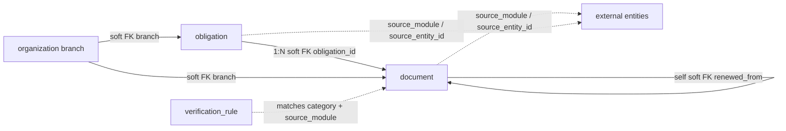

The Compliance module owns 3 tenant tables (`document`, `obligation`, `verification_rule`) pushed via `tenant_schemas`; `control_plane_schemas` is empty. Shared columns `id` (`text PK`, UUIDv7), `created_at`, `updated_at` (`timestamptz notNull defaultNow()`) appear on all tables and are omitted per-table below. Tenant scoping is via the platform's tenancy — tables carry no `tenant_id` column.

## Enums

| Enum                   | Values                                                                                                                                                                                                                                                                           |
| ---------------------- | -------------------------------------------------------------------------------------------------------------------------------------------------------------------------------------------------------------------------------------------------------------------------------- |
| `category`             | `tax`, `license`, `certificate`, `permit`, `insurance`, `regulatory`, `legal`, `hr`, `safety`, `environmental`, `audit`, `data_privacy`, `financial`, `property`, `vehicle`, `other`                                                                                             |
| `verification_status`  | `draft`, `submitted`, `under_review`, `verified`, `rejected`, `expired`, `overdue`, `renewed`, `archived`                                                                                                                                                                        |
| `renewal_frequency`    | `monthly`, `quarterly`, `semi_annual`, `annual`, `biennial`, `triennial`, `one_time`                                                                                                                                                                                             |
| `obligation_frequency` | `monthly`, `quarterly`, `semi_annual`, `annual`, `biennial`, `triennial`, `custom`                                                                                                                                                                                               |
| `reminder_channel`     | `email`, `pubsub`, `both`                                                                                                                                                                                                                                                        |
| `audit_entity_type`    | `document`, `obligation`, `verification_rule`                                                                                                                                                                                                                                    |
| `audit_action`         | `created`, `updated`, `submitted`, `verified`, `rejected`, `completed`, `renewed`, `archived`, `escalated`, `expired`, `overdue`, `snoozed`, `reviewer_assigned`, `attachment_uploaded`, `reminder_sent`, `document_generated`, `obligation_activated`, `obligation_deactivated` |

## Tables

### `document`

Core lifecycle table for compliance documents.

| Column                | Type                                        | Description                                     |
| --------------------- | ------------------------------------------- | ----------------------------------------------- |
| `name`                | `text notNull`                              | Document name                                   |
| `category`            | `category notNull`                          | Compliance category                             |
| `verification_status` | `verification_status notNull default draft` | Lifecycle status                                |
| `document_type`       | `text`                                      | Document type                                   |
| `reference_number`    | `text`                                      | Reference number                                |
| `source_module`       | `text notNull`                              | Source module                                   |
| `source_entity_id`    | `text`                                      | Source entity ID                                |
| `source_entity_type`  | `text`                                      | Source entity type                              |
| `branch`              | `text (FK → organization branch soft)`      | Branch                                          |
| `connection`          | `text (FK → organization connection soft)`  | Connection                                      |
| `obligation_id`       | `text (FK → obligation soft)`               | Originating obligation                          |
| `created_by`          | `text notNull`                              | Creator user ID                                 |
| `assigned_to`         | `text`                                      | Assigned user                                   |
| `assigned_reviewer`   | `text`                                      | Assigned reviewer                               |
| `attachment`          | `text`                                      | Storage key                                     |
| `issue_date`          | `date`                                      | Issue date                                      |
| `effective_date`      | `date`                                      | Effective date                                  |
| `expiry_date`         | `date`                                      | Expiry date                                     |
| `due_date`            | `date`                                      | Due date                                        |
| `renewal_date`        | `date`                                      | Renewal date                                    |
| `renewal_frequency`   | `renewal_frequency`                         | Renewal frequency                               |
| `period_start`        | `date`                                      | Period start                                    |
| `period_end`          | `date`                                      | Period end                                      |
| `reminder_days`       | `integer[] default [90,60,30,7]`            | Days before expiry to remind                    |
| `escalation_days`     | `integer[]`                                 | Days after expiry to escalate                   |
| `reminder_channel`    | `reminder_channel default pubsub`           | How to send reminders                           |
| `auto_renewal`        | `boolean notNull default false`             | Auto-renewal flag                               |
| `jurisdiction`        | `text`                                      | Jurisdiction                                    |
| `issuing_authority`   | `text`                                      | Issuing authority                               |
| `notes`               | `text`                                      | Notes                                           |
| `metadata`            | `jsonb`                                     | Flexible metadata (`Record<string, JsonValue>`) |
| `snoozed_until`       | `timestamptz`                               | Snooze timestamp                                |
| `renewed_from`        | `text (FK → document soft self)`            | Previous document in renewal chain              |
| `reviewed_by`         | `text`                                      | Reviewer user ID                                |
| `reviewed_at`         | `timestamptz`                               | Review timestamp                                |
| `rejection_reason`    | `text`                                      | Rejection reason                                |
| `completed_at`        | `timestamptz`                               | Completion timestamp                            |
| `last_notified_at`    | `timestamptz`                               | Last reminder timestamp                         |
| `last_escalated_at`   | `timestamptz`                               | Last escalation timestamp                       |

Indexes: `idx_document_category(category)`, `idx_document_status(verification_status)`, `idx_document_branch(branch)`, `idx_document_expiry(expiry_date)`, `idx_document_due(due_date)`, `idx_document_source(source_module, source_entity_type, source_entity_id)`, `idx_document_reviewer(assigned_reviewer)`, `idx_document_assignee(assigned_to)`, `idx_document_obligation(obligation_id)`, `idx_document_renewed_from(renewed_from)`.

### `obligation`

Recurring compliance obligation templates.

| Column                      | Type                                   | Description               |
| --------------------------- | -------------------------------------- | ------------------------- |
| `name`                      | `text notNull`                         | Obligation name           |
| `category`                  | `category notNull`                     | Category                  |
| `frequency`                 | `obligation_frequency notNull`         | Recurrence frequency      |
| `document_type`             | `text`                                 | Document type             |
| `source_module`             | `text notNull`                         | Source module             |
| `source_entity_id`          | `text`                                 | Source entity             |
| `source_entity_type`        | `text`                                 | Source entity type        |
| `branch`                    | `text (FK → organization branch soft)` | Branch                    |
| `created_by`                | `text notNull`                         | Creator user ID           |
| `start_date`                | `date notNull`                         | Start date                |
| `end_date`                  | `date`                                 | End date                  |
| `is_active`                 | `boolean notNull default true`         | Active flag               |
| `expiry_based`              | `boolean notNull default false`        | Whether based on expiry   |
| `expiry_duration_months`    | `integer`                              | Expiry duration           |
| `period_based`              | `boolean notNull default false`        | Whether based on period   |
| `due_day`                   | `integer`                              | Day of month for due date |
| `due_month_offset`          | `integer`                              | Month offset for due date |
| `custom_cron`               | `text`                                 | Custom cron expression    |
| `auto_generate`             | `boolean notNull default true`         | Auto-generate documents   |
| `default_reminder_days`     | `integer[]`                            | Default reminder days     |
| `default_escalation_days`   | `integer[]`                            | Default escalation days   |
| `default_assigned_to`       | `text`                                 | Default assignee          |
| `default_assigned_reviewer` | `text`                                 | Default reviewer          |
| `default_jurisdiction`      | `text`                                 | Default jurisdiction      |
| `default_issuing_authority` | `text`                                 | Default issuing authority |
| `default_metadata`          | `jsonb`                                | Default metadata          |

Indexes: `idx_obligation_active(is_active)`, `idx_obligation_category(category)`, `idx_obligation_source(source_module, source_entity_type, source_entity_id)`.

### `verification_rule`

Rules for auto-assigning reviewers by category and source.

| Column                   | Type                           | Description            |
| ------------------------ | ------------------------------ | ---------------------- |
| `name`                   | `text notNull`                 | Rule name              |
| `category`               | `category`                     | Category filter        |
| `source_module`          | `text`                         | Source module filter   |
| `assigned_reviewer`      | `text`                         | Reviewer to assign     |
| `required_reviewer_role` | `text`                         | Required reviewer role |
| `priority`               | `integer notNull default 0`    | Rule priority          |
| `is_active`              | `boolean notNull default true` | Active flag            |

Indexes: `idx_verification_rule_active(is_active)`, `idx_verification_rule_category(category)`, `idx_verification_rule_priority(priority)`.

## Relationships

All FKs are soft (logical, workflow/event-bridge enforced). Audit trails are written to the platform's `audit_log` (not a module table).
