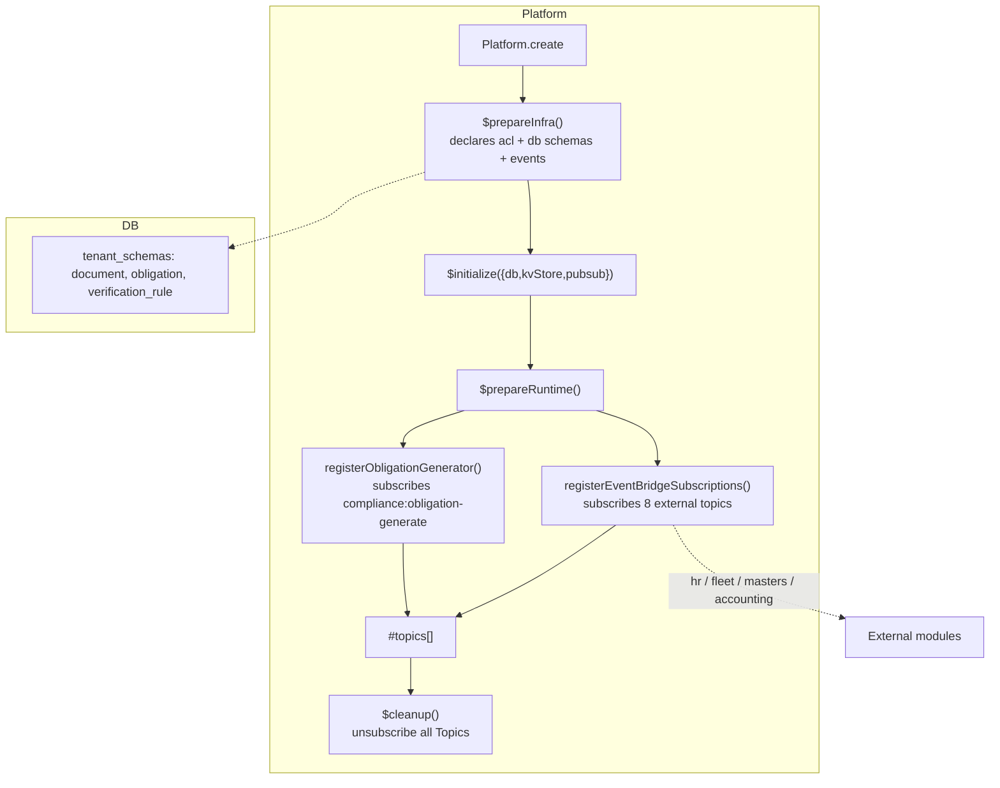
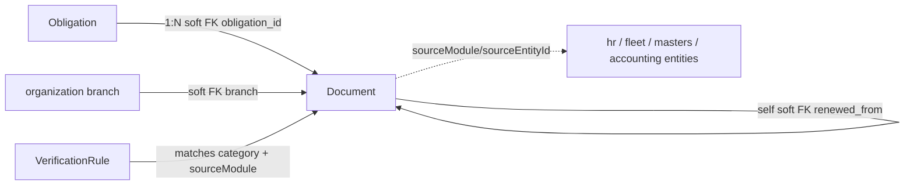

The Compliance module manages compliance documents through their full lifecycle — creation, submission, verification, expiry, renewal, and archival — with obligation templates and audit trails.

## Module

```ts title="src/module.ts"
export class Compliance implements Module {
  static create(config: ComplianceModuleConfig): Compliance;
  readonly $name = "compliance";
  readonly $dependencies: readonly string[] = [];
  readonly $consumes: readonly string[] = [
    "hr:employee_onboarded",
    "hr:employee_separated",
    "fleet:vehicle_registered",
    "masters:org_branch_created",
    "accounting:financial_year_started",
    "masters:contact_created",
  ];
}
```

## Configuration

```ts title="src/module.ts"
export interface ComplianceModuleConfig {
  country: "INDIA";
  dashboardCacheTtl?: number; // default 300
  defaultReminderDays?: number[];
  defaultEscalationDays?: number[];
}
```

```ts
const compliance = Compliance.create({ country: "INDIA" });
SingleTenantPlatform.create(config, [compliance]);
```

## Dependencies

No hard module dependencies. Runtime requires platform units `db`, `kvStore`, `pubsub` (stored in `$initialize`) and an `audit` context from `getContext()` at `$prepareRuntime` time. Optional peer topics in `$consumes` are introspection-only — a missing producer (including stub modules) silently no-ops, so compliance composes solo or in any subset.

## Architecture



`$prepareInfra()` returns `{ auth: { acl }, db: { control_plane_schemas: {}, tenant_schemas }, events }`. `$initialize` stores unit handles; `$prepareRuntime` registers only the two runtime subscriptions; `$cleanup` unsubscribes and clears state. No reminder schedules are registered.

## Key Concepts

### Tenant-Scope

All three tables (`document`, `obligation`, `verification_rule`) live in `tenant_schemas` (per-tenant in isolated mode, single DB in single/shared mode). Every document carries `sourceModule`/`sourceEntityId` soft links to external entities — no hard FK across modules.

### Obligation Templates

`obligation` rows are recurring-templates (`frequency`, `periodBased`/`expiryBased`, `autoGenerate`). The obligation generator materializes `document` rows per period, copying defaults (`reminderDays`, `escalationDays`, `assignedTo`, reviewer, jurisdiction).

### Verification Flow

`verification_status` derives from workflow actions (`submit` → `under_review` → `verified`/`rejected`, past `expiryDate` → `expired`/`overdue`, `renew` archives old and creates new). `verification_rule` auto-assigns `assigned_reviewer` by `category`/`sourceModule` priority.

## Relationships



Soft FKs are logical — enforced by workflows and event-bridge dedup, not DB constraints.

## Runtime Wiring

`$prepareRuntime()` registers exactly two participants:

1. **Obligation generator** — `pubsub.subscribe("compliance:obligation-generate", generatePendingDocuments)` via `registerObligationGenerator()`; handler iterates `obligations.getActive`, computes periods, dedupes by `obligationId:periodStart:periodEnd:dueDate:expiryDate`, then `documents.create` + `publish("compliance:document_generated")`.
2. **Event bridge** — `registerEventBridgeSubscriptions({ audit, db, pubsub })` subscribes 6 topics validating with Valibot and deduping by `{sourceModule, sourceEntityId, documentType}`.

No reminder crons are registered — expiry/due reminders are published by document workflows as `compliance:document_expiring` facts consumed by the calendar bridge.
