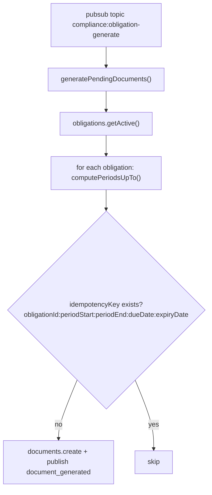

Two runtime services are wired in `$prepareRuntime()`.

## Obligation Generator

Subscribes to `compliance:obligation-generate` and materializes `document` rows from active obligation templates.



- **Register**: `registerObligationGenerator()` reads `getContext()` for `{ audit, db, pubsub }`, subscribes to `SCHEDULED_JOBS.OBLIGATION_GENERATE`, returns the topic. Stored in `#topics`; removed in `$cleanup` via `unsubscribe`.
- **Manual trigger**: `generatePendingDocuments(deps)` and `generateForObligation(obligation, upToDate, deps)` are exported for ad-hoc runs; `CRON_SCHEDULES.OBLIGATION_GENERATE` (`0 6 * * *`) is defined but never scheduled — call `generatePendingDocuments` externally until a cron is registered.
- **Dedup**: check-then-insert per period on `(obligation_id, period_start, period_end, due_date, expiry_date)` via `metadata.idempotencyKey`.

## Event Bridge

Subscribes to 6 external topics and creates compliance artifacts. Validates each message with Valibot; invalid payloads are skipped; creates are deduped by `{sourceModule, sourceEntityId, documentType}`.

| Topic                                                                           | Creates                                                                              |
| ------------------------------------------------------------------------------- | ------------------------------------------------------------------------------------ |
| `hr:employee_onboarded`                                                         | `background_check` + `id_verification` docs (hr, 365d expiry)                        |
| `hr:employee_separated`                                                         | `exit_documents` (7d due) + `final_settlement` (30d due)                             |
| `fleet:vehicle_registered`                                                      | semi-annual `pollution_certificate` obligation + certificate doc                     |
| `masters:org_branch_created` / `organization:branch_created` / `branch:created` | annual `trade_license` obligation + `trade_license` + `fire_safety_certificate` docs |
| `accounting:financial_year_started`                                             | monthly `GST Return` obligation (periodBased, dueDay 20)                             |
| `masters:contact_created`                                                       | `insurance_policy` doc on insurer contacts scoped to `organization` only             |

```ts title="src/services/event-bridge.ts"
await registerEventBridgeSubscriptions({ audit, db, pubsub });
// subscribes 8 topics, each schema-validated; handler → documents.create / obligations.create
```

`unregisterEventBridge(topics, { pubsub })` unsubscribes on teardown (called via module `$cleanup`).

No cron schedules or handlers are registered by the compliance module. Reminder delivery is via the calendar bridge (`compliance:document_expiring` → `calendar_reminder` → `calendar:reminder-scan`).
