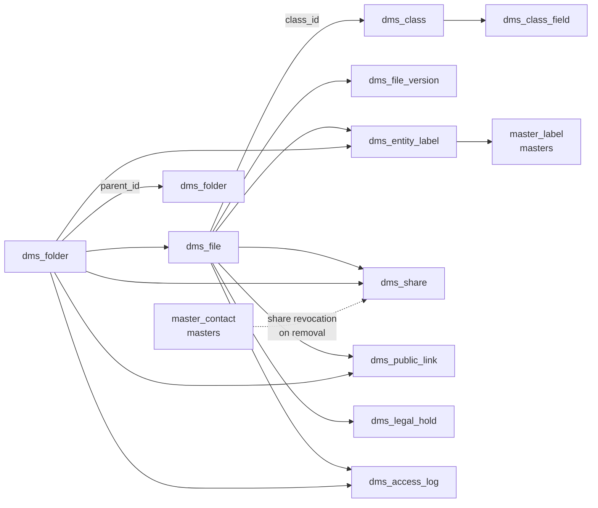

The DMS module declares tenant tables with the `dms_` prefix. Every table uses `id: uuidv7("id").primaryKey()` and `timestamptz` (`withTimezone: true`) for `created_at`/`updated_at`. Labels live in `masters` (`master_label`); no `dms_label` table exists.

## Enums

| Enum                         | Values                                                                                                    |
| ---------------------------- | --------------------------------------------------------------------------------------------------------- |
| `dms_entity_type`            | `file`, `folder`                                                                                          |
| `dms_file_status`            | `triaged`, `active`, `expired`, `trashed`                                                                 |
| `dms_grantee_type`           | `user`, `group`, `contact`                                                                                |
| `dms_share_permission`       | `viewer`, `editor`, `owner`                                                                               |
| `dms_public_link_permission` | `view`, `edit`                                                                                            |
| `dms_field_type`             | `text`, `number`, `date`, `select`, `multi-select`, `boolean`, `user`, `contact`, `url`, `email`, `phone` |

`dms_entity_type` scopes `dms_entity_label`, `dms_share`, `dms_public_link`, and `dms_access_log`.

## Tables

### `dms_file`

Single file entity merging filesystem and records attributes. Full-text search uses a GIN expression index over `to_tsvector('simple', name || description || metadata || field_values)`.

| Column                      | Type              | Description                                                                 |
| --------------------------- | ----------------- | --------------------------------------------------------------------------- |
| `id`                        | text (PK)         | Auto UUIDv7                                                                 |
| `name`                      | text              | Current file name (may differ from version name after naming-schema rename) |
| `version`                   | integer           | Current version number (starts at 1)                                        |
| `storage_key`               | text              | `dms/{tenant}/{id}/v{version}/{safeName}`                                   |
| `content_type`              | text              | MIME type                                                                   |
| `size`                      | bigint            | Bytes of current version                                                    |
| `etag`                      | text              | S3 ETag                                                                     |
| `folder_id`                 | text              | Containing folder; `null` for triaged files                                 |
| `path`                      | text              | Materialized path (`/Projects/2026/invoice.pdf`); `null` for triaged        |
| `description`               | text              | Optional free-text                                                          |
| `class_id`                  | text              | Class; `null` while triaged                                                 |
| `doc_number`                | text              | `DOC-000123` assigned at classify; `null` for plain filesystem files        |
| `field_values`              | jsonb             | Values for assigned class fields                                            |
| `status`                    | `dms_file_status` | `triaged` / `active` / `expired` / `trashed`                                |
| `metadata`                  | jsonb             | Free-form key/value                                                         |
| `compression`               | jsonb             | Per-file compression override                                               |
| `batch_id`                  | text              | Groups bulk uploads                                                         |
| `owner_id`                  | text              | Owner                                                                       |
| `uploaded_by`               | text              | Who performed the upload                                                    |
| `expiry_date`               | date              | Optional expiry; scanner promotes to `expired`                              |
| `expired_at`                | timestamptz       | Expiry transition timestamp                                                 |
| `deleted_at`                | timestamptz       | Trash transition timestamp                                                  |
| `deleted_by`                | text              | Who soft-deleted                                                            |
| `created_at` / `updated_at` | timestamptz       | Record timestamps                                                           |

Indexes: `status`, `class_id`, `folder_id`, `owner_id`, `batch_id`, `expiry_date`, `path`, GIN `search_vector`.

### `dms_file_version`

| Column         | Type                   | Description                    |
| -------------- | ---------------------- | ------------------------------ |
| `id`           | text (PK)              | Auto UUIDv7                    |
| `file_id`      | text (FK → `dms_file`) | Owning file                    |
| `version`      | integer                | 1-based, unique per file       |
| `storage_key`  | text                   | S3 key for this revision       |
| `name`         | text                   | Name at version write time     |
| `content_type` | text                   | MIME of this version           |
| `size`         | bigint                 | Bytes                          |
| `etag`         | text                   | S3 ETag                        |
| `compression`  | jsonb                  | Compression for this version   |
| `uploaded_by`  | text                   | Who created the version        |
| `is_current`   | boolean                | Mirrors file's current version |
| `created_at`   | timestamptz            | Version creation               |

Indexes: unique `(file_id, version)`, `file_id`.

### `dms_folder`

| Column                      | Type                  | Description                                       |
| --------------------------- | --------------------- | ------------------------------------------------- |
| `id`                        | text (PK)             | Auto UUIDv7                                       |
| `name`                      | text                  | Folder name                                       |
| `path`                      | text (unique)         | Materialized hierarchical path (`/Projects/2026`) |
| `parent_id`                 | text                  | Parent folder; `null` = root                      |
| `owner_id`                  | text                  | Creator                                           |
| `color` / `description`     | text                  | UI hints                                          |
| `is_trashed` / `trashed_at` | boolean / timestamptz | Soft-delete (trash)                               |
| `created_at` / `updated_at` | timestamptz           | Record timestamps                                 |

Indexes: `parent_id`, `owner_id`, `path`, `is_trashed`.

### `dms_class`

| Column                      | Type        | Description                                                             |
| --------------------------- | ----------- | ----------------------------------------------------------------------- |
| `id`                        | text (PK)   | Auto UUIDv7                                                             |
| `name`                      | text        | e.g. `Invoice`, `Certificate`                                           |
| `description`               | text        | Purpose / guidance                                                      |
| `color` / `icon`            | text        | UI hints                                                                |
| `file_naming_schema`        | text        | Template with `{field:<name>}`, `{class}`, `{docNumber}`, `{date:yyyy}` |
| `retention_days`            | integer     | Overrides `defaultRetentionDays` setting                                |
| `is_active`                 | boolean     | `false` archives the class                                              |
| `created_by`                | text        | Admin who created it                                                    |
| `created_at` / `updated_at` | timestamptz | Record timestamps                                                       |

### `dms_class_field`

| Column                      | Type                    | Description                                |
| --------------------------- | ----------------------- | ------------------------------------------ |
| `id`                        | text (PK)               | Auto UUIDv7                                |
| `class_id`                  | text (FK → `dms_class`) | Owning class                               |
| `name`                      | text                    | Unique key within the class                |
| `label`                     | text                    | Display label                              |
| `type`                      | `dms_field_type`        | Field type                                 |
| `is_required`               | boolean                 | Must be filled before classify             |
| `include_in_search`         | boolean                 | Indexed for full-text search               |
| `default_value`             | jsonb                   | Auto-filled when not provided              |
| `options`                   | jsonb                   | Allowed values for `select`/`multi-select` |
| `sort_order`                | integer                 | Display order                              |
| `is_active`                 | boolean                 | Hidden from classify form when `false`     |
| `created_at` / `updated_at` | timestamptz             | Record timestamps                          |

Indexes: `class_id`, unique `(class_id, name)`.

### `dms_entity_label`

Polymorphic join between `master_label` and `file`/`folder`.

| Column        | Type                       | Description                    |
| ------------- | -------------------------- | ------------------------------ |
| `id`          | text (PK)                  | Auto UUIDv7                    |
| `entity_id`   | text                       | Labeled file or folder         |
| `entity_type` | `dms_entity_type`          | `file` or `folder`             |
| `label_id`    | text (FK → `master_label`) | Label; logical FK to `masters` |
| `applied_by`  | text                       | Who applied                    |
| `applied_at`  | timestamptz                | When applied                   |

Indexes: unique `(entity_type, entity_id, label_id)`, `(entity_type, entity_id)`, `label_id`.

### `dms_share`

Unified grant to `user`/`group`/`contact` over polymorphic `file`/`folder` entities. `contact` grantees hold Masters contact ids.

| Column         | Type                   | Description                                   |
| -------------- | ---------------------- | --------------------------------------------- |
| `id`           | text (PK)              | Auto UUIDv7                                   |
| `entity_type`  | `dms_entity_type`      | `file` or `folder`                            |
| `entity_id`    | text                   | Shared file or folder                         |
| `grantee_type` | `dms_grantee_type`     | `user`, `group`, or `contact`                 |
| `grantee_id`   | text                   | Grantee id (Masters contact id for `contact`) |
| `permission`   | `dms_share_permission` | `viewer`, `editor`, or `owner`                |
| `share_token`  | text                   | Token for `contact` grantees                  |
| `message`      | text                   | Optional note                                 |
| `shared_by`    | text                   | Who created                                   |
| `expires_at`   | timestamptz            | Optional expiry                               |
| `created_at`   | timestamptz            | Creation time                                 |

Indexes: unique `(entity_type, entity_id, grantee_type, grantee_id)`, `(entity_id, entity_type)`, `(grantee_id, grantee_type)`.

### `dms_public_link`

| Column                      | Type                         | Description                     |
| --------------------------- | ---------------------------- | ------------------------------- |
| `id`                        | text (PK)                    | Auto UUIDv7                     |
| `entity_id` / `entity_type` | text / `dms_entity_type`     | Shared file or folder           |
| `token`                     | text (unique)                | Shareable token                 |
| `permission`                | `dms_public_link_permission` | `view` or `edit`                |
| `password`                  | text                         | bcrypt-hashed optional password |
| `max_views` / `view_count`  | integer                      | Access limits                   |
| `expires_at`                | timestamptz                  | Optional expiry                 |
| `is_active`                 | boolean                      | Revoked links are deactivated   |
| `created_by`                | text                         | Creator                         |
| `created_at`                | timestamptz                  | Creation                        |

Indexes: `(entity_id, entity_type)`, `is_active`.

### `dms_legal_hold`

| Column        | Type                   | Description                     |
| ------------- | ---------------------- | ------------------------------- |
| `id`          | text (PK)              | Auto UUIDv7                     |
| `file_id`     | text (FK → `dms_file`) | Held file                       |
| `reason`      | text                   | Mandatory justification         |
| `placed_by`   | text                   | Admin who placed                |
| `placed_at`   | timestamptz            | When placed                     |
| `released_by` | text                   | Admin who released              |
| `released_at` | timestamptz            | When released (`null` = active) |

Indexes: `file_id`, `released_at`.

### `dms_setting`

| Column                      | Type          | Description       |
| --------------------------- | ------------- | ----------------- |
| `id`                        | text (PK)     | Auto UUIDv7       |
| `key`                       | text (unique) | Setting key       |
| `value`                     | jsonb         | Setting value     |
| `created_at` / `updated_at` | timestamptz   | Record timestamps |

Default keys: `defaultCompression`, `presignedUrlDefaultExpiry`, `presignedUrlMaxExpiry`, `defaultRetentionDays`, `autoPurgeEveryHours`, `logDownloads`.

### `dms_access_log`

| Column                      | Type                     | Description                    |
| --------------------------- | ------------------------ | ------------------------------ |
| `id`                        | text (PK)                | Auto UUIDv7                    |
| `entity_id` / `entity_type` | text / `dms_entity_type` | Accessed entity                |
| `action`                    | text                     | e.g. `public_link_accessed`    |
| `accessed_by`               | text                     | User id (`null` for anonymous) |
| `ip` / `user_agent`         | text                     | Client metadata                |
| `public_link_id`            | text                     | Link used, if any              |
| `created_at`                | timestamptz              | Access timestamp               |

Indexes: `(entity_id, entity_type)`, `public_link_id`, `created_at`.

## Relationships

All FKs are logical, workflow-enforced (soft). The only cross-module FKs are soft references to `masters` (`master_label`, `master_contact`).
