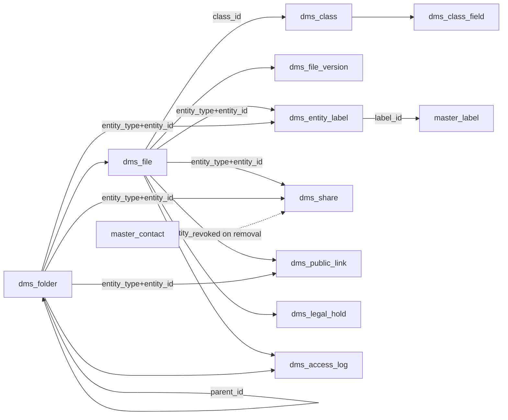
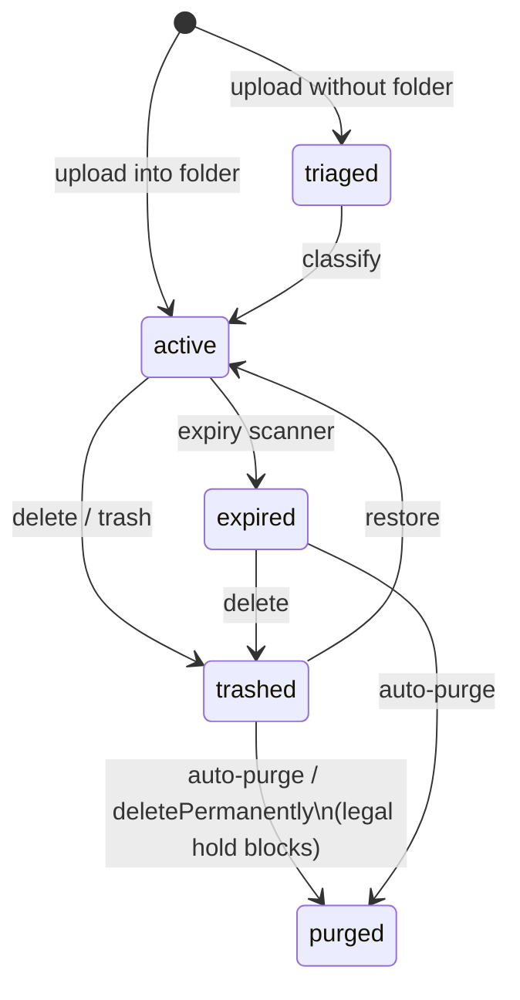

The DMS module is the unified document and file management surface built on `@aspen-os/platform` — one `dms_file` entity carrying both filesystem and records attributes, with triage, classes, folders, versions, sharing, and retention.

## Module

```ts title="src/module.ts"
export class Dms implements Module {
  static create(config?: DmsModuleConfig): Dms;
  readonly $name = "dms"; // proxy key: p.dms
  readonly $dependencies: readonly string[] = ["masters"];
  readonly $consumes: readonly string[] = ["masters:contact_removed"];
}
```

## Configuration

```ts title="src/types.ts"
type DmsModuleConfig = {
  allowedContentTypes?: string[];
  defaultAutoPurgeEveryHours?: number; // 24
  defaultCompression?: CompressionOption; // { enabled: true, mode: "none" }
  defaultDownloadLinkExpiry?: number; // 3600
  defaultRetentionDays?: number; // 180
  maxDownloadLinkExpiry?: number; // 604_800
  maxFileSize?: number; // 5 GiB
  maxNestingDepth?: number; // 20
  maxVersions?: number; // 10
  trashRetentionDays?: number; // 30
};
```

```ts
const dms = Dms.create({ maxFileSize: 50 * 1024 * 1024, trashRetentionDays: 14 });
const p = IsolatedTenantPlatform.create(config, [masters, dms]);
```

## Dependencies

| Dependency | Kind                                          | Purpose                                                                               |
| ---------- | --------------------------------------------- | ------------------------------------------------------------------------------------- |
| `masters`  | module `$dependencies`                        | Unified label taxonomy (`master_label`) and contact identities for `contact` grantees |
| `db`       | unit (`$initialize`)                          | Tenant tables; pg-boss schedules                                                      |
| `pubsub`   | unit (`$initialize`)                          | Expiry scan, auto-purge, contact bridge                                               |
| `storage`  | unit (`$initialize`)                          | Binary objects under version-bound keys `dms/{tenant}/{fileId}/v{n}/{name}`           |
| `audit`    | context (`getContext()` in `$prepareRuntime`) | Audit writes for every mutation                                                       |

`$consumes: ["masters:contact_removed"]` — removing a Masters contact revokes every DMS share granted to that contact via the contact-share bridge. The platform does not validate `$consumes`.

## Architecture

```mermaid
flowchart TB
  subgraph TenantDB[tenant database — dmsTables]
    direction LR
    subgraph Core[file]
      F[dms_file]
      V[dms_file_version]
    end
    subgraph Org[classification]
      C[dms_class]
      CF[dms_class_field]
    end
    subgraph FS[filesystem]
      FO[dms_folder]
    end
    subgraph Share[sharing]
      S[dms_share]
      PL[dms_public_link]
    end
    subgraph Ops[ops]
      LH[dms_legal_hold]
      SE[dms_setting]
      AL[dms_access_log]
      EL[dms_entity_label]
    end
  end

  masters[master_label<br/>master_contact] -. soft FK .-> S & EL
  storage[(StorageUnit<br/>dms/{tenant}/{fileId}/v{n}/{name})] --- F
  F --- C
  F --- V
  FO --- F
```

All tables are tenant schemas (`tenant_schemas = dmsTables`); there are no control-plane tables.

## Key concepts

### Triage gate

Upload with a `folderId` lands `active`. Upload without a folder lands `triaged` — staged for classification. Only `classify` transitions out of triage, validating required class fields, applying the file-naming schema as a metadata rename, and assigning `docNumber`.

### File as unified entity

`dms_file` merges the filesystem record (`folder_id`, `path`, `storage_key`) and the records-system record (`class_id`, `field_values`, `status`, `expiry_date`). The same row participates in both.

### Version-scoped keys

Storage keys embed `{fileId}/v{n}` so renames, moves, and naming-schema application are metadata-only; no S3 object moves. `new` saves the previous current into `dms_file_version` and prunes the oldest beyond `maxVersions` (held versions are never pruned).

### Folders & paths

Folders keep materialized `path` (`/Projects/2026`) with cycle-safe moves guarded by `wouldCreateCycle` and depth bounded by `maxNestingDepth`. Uniqueness within a parent is app-enforced via `paths.checkNameUniqueness`, not a DB constraint.

### Sharing, labels, holds

Shares are grants to `user`/`group`/`contact` over polymorphic `file`/`folder` entities; folder grants inherit down the tree. `contact` grantees hold Masters contact ids — invalidated on `masters:contact_removed`. Labels live in `masters` (`master_label`); `dms_entity_label` links them to files/folders. Legal holds block purge.

## Relationships



Relationships are logical, workflow-enforced; `entity_type` is `dms_entity_type` (`file` | `folder`). No hard DB FKs to `masters` tables.

## Lifecycle



`$prepareRuntime()` registers `dms:expiry-scan` (`5 0 * * *`) and `dms:auto-purge` (`30 3 * * *`) plus the contact-share bridge; `$cleanup()` unregisters all three.

## Module structure

```text
packages/dms/src/
  module.ts    # $name, $dependencies, $consumes, $prepareInfra/Runtime
  auth.ts      # defineAcl 9 resources
  pubsub.ts    # 27 events across 5 groups
  db-schemas/  # 11 tenant tables + 6 enums
  workflows/   # 16 groups — one file per action
  services/    # expiry-scanner, purge-service, contact-share-bridge, paths, storage
  schemas/     # Valibot input schemas
```
