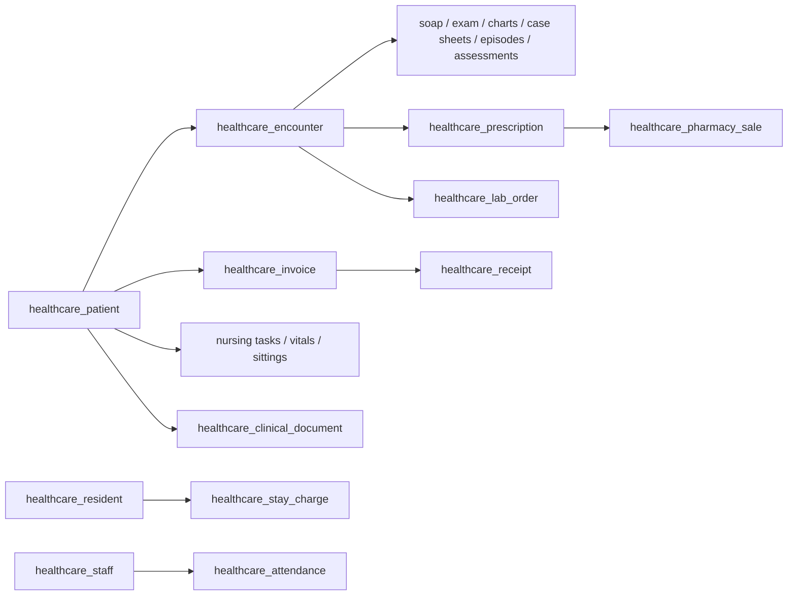

The Healthcare module declares tenant tables with the `healthcare_` prefix, wired via `healthcareTables` / `tenant_schemas` (control plane gets nothing). Every table uses `id: uuidv7().primaryKey()` (text UUIDv7) and `timestamptz` for `created_at`/`updated_at` unless noted; every clinical table carries `branch_id` (default `"main"`). Cross-entity links are soft text references enforced by workflow guards — there are no foreign keys. Money uses `numeric`, counts use `integer`, open-ended metadata lives in `payload: jsonb`.

## Enums

| Enum                            | Values                                                                                                                              |
| ------------------------------- | ----------------------------------------------------------------------------------------------------------------------------------- |
| `healthcare_appointment_status` | `booked`, `confirmed`, `checked-in`, `in-queue`, `in-consult`, `done`, `no-show`, `cancelled`, `rescheduled`                        |
| `healthcare_queue_token_status` | `called`, `done`, `serving`, `skipped`, `waiting`                                                                                   |
| `healthcare_encounter_status`   | `open`, `signed`                                                                                                                    |
| `healthcare_invoice_status`     | `draft`, `final`, `partial`, `paid`                                                                                                 |
| `healthcare_lab_order_status`   | `ordered`, `paid`, `confirmed`, `collected`, `received`, `processing`, `resulted`, `authorized`, `delivered`, `billed`, `cancelled` |
| `healthcare_radio_order_status` | `booked`, `checked-in`, `performed`, `reported`, `authorized`, `rescheduled`, `cancelled`                                           |
| `healthcare_task_status`        | `open`, `done`, `overdue`, `closed`                                                                                                 |
| `healthcare_sitting_status`     | `booked`, `attended`, `missed`                                                                                                      |
| `healthcare_resident_status`    | `enquiry`, `admitted`, `discharged`, `transferred`                                                                                  |
| `healthcare_sale_status`        | `pending`, `partial`, `fulfilled`, `cancelled`                                                                                      |
| `healthcare_po_status`          | `draft`, `sent`, `partial`, `closed`                                                                                                |
| `healthcare_grn_status`         | `open`, `verified`, `billed`                                                                                                        |
| `healthcare_batch_status`       | `active`, `near-expiry`, `expired`, `quarantined`                                                                                   |

Specialty-domain statuses (dental, ayush, rehab, psych, therapy sittings) stay clinic-capitalized `text` columns, not enums.

## Tables

### Registration

#### `healthcare_patient`

| Column                      | Type        | Description                            |
| --------------------------- | ----------- | -------------------------------------- |
| `id`                        | text (PK)   | Auto UUIDv7                            |
| `uhid`                      | text        | Gapless `UHID-000001…` (unique)        |
| `full_name`                 | text        |                                        |
| `phone`                     | text        | Dedupe key                             |
| `abha`                      | text        | Dedupe key                             |
| `gender`                    | text        |                                        |
| `dob`                       | date        |                                        |
| `guardian`                  | text        |                                        |
| `language`                  | text        |                                        |
| `status`                    | text        |                                        |
| `merged_into`               | text        | Primary id after merge (never deleted) |
| `payload`                   | jsonb       | Carries `allergies`                    |
| `branch_id`                 | text        |                                        |
| `created_at` / `updated_at` | timestamptz |                                        |

Indexes: `uhid`, `branch_id`, `phone`, `abha`, `status`.

#### `healthcare_family_link`

| Column                      | Type        | Description          |
| --------------------------- | ----------- | -------------------- |
| `id`                        | text (PK)   |                      |
| `patient_id`                | text        | (FK → patient, soft) |
| `linked_name`               | text        |                      |
| `linked_phone`              | text        |                      |
| `relation`                  | text        |                      |
| `payload`                   | jsonb       |                      |
| `branch_id`                 | text        |                      |
| `created_at` / `updated_at` | timestamptz |                      |

Indexes: `patient_id`, `branch_id`.

#### `healthcare_allergy`

| Column                      | Type        | Description          |
| --------------------------- | ----------- | -------------------- |
| `id`                        | text (PK)   |                      |
| `patient_id`                | text        | (FK → patient, soft) |
| `name`                      | text        |                      |
| `severity`                  | text        |                      |
| `note`                      | text        |                      |
| `payload`                   | jsonb       |                      |
| `branch_id`                 | text        |                      |
| `created_at` / `updated_at` | timestamptz |                      |

Indexes: `patient_id`, `branch_id`.

#### `healthcare_consent`

| Column                      | Type        | Description          |
| --------------------------- | ----------- | -------------------- |
| `id`                        | text (PK)   |                      |
| `patient_id`                | text        | (FK → patient, soft) |
| `type`                      | text        |                      |
| `granted`                   | boolean     |                      |
| `note`                      | text        |                      |
| `archived_at`               | timestamptz |                      |
| `payload`                   | jsonb       |                      |
| `branch_id`                 | text        |                      |
| `created_at` / `updated_at` | timestamptz |                      |

Indexes: `patient_id`, `branch_id`.

#### `healthcare_flag`

| Column                      | Type        | Description          |
| --------------------------- | ----------- | -------------------- |
| `id`                        | text (PK)   |                      |
| `patient_id`                | text        | (FK → patient, soft) |
| `label`                     | text        |                      |
| `level`                     | text        |                      |
| `payload`                   | jsonb       |                      |
| `branch_id`                 | text        |                      |
| `created_at` / `updated_at` | timestamptz |                      |

Indexes: `patient_id`, `branch_id`.

#### `healthcare_merge_request`

| Column                      | Type        | Description          |
| --------------------------- | ----------- | -------------------- |
| `id`                        | text (PK)   |                      |
| `primary_id`                | text        | (FK → patient, soft) |
| `duplicate_id`              | text        | (FK → patient, soft) |
| `reason`                    | text        |                      |
| `status`                    | text        | `pending` / decided  |
| `decided_at`                | timestamptz |                      |
| `payload`                   | jsonb       |                      |
| `branch_id`                 | text        |                      |
| `created_at` / `updated_at` | timestamptz |                      |

Indexes: `status`, `branch_id`.

#### `healthcare_communication`

| Column                      | Type        | Description          |
| --------------------------- | ----------- | -------------------- |
| `id`                        | text (PK)   |                      |
| `patient_id`                | text        | (FK → patient, soft) |
| `channel`                   | text        |                      |
| `message`                   | text        |                      |
| `payload`                   | jsonb       |                      |
| `branch_id`                 | text        |                      |
| `created_at` / `updated_at` | timestamptz |                      |

Indexes: `patient_id`, `branch_id`.

#### `healthcare_recall`

| Column                      | Type        | Description          |
| --------------------------- | ----------- | -------------------- |
| `id`                        | text (PK)   |                      |
| `patient_id`                | text        | (FK → patient, soft) |
| `at`                        | text        | Free-form datetime   |
| `reason`                    | text        |                      |
| `status`                    | text        |                      |
| `payload`                   | jsonb       |                      |
| `branch_id`                 | text        |                      |
| `created_at` / `updated_at` | timestamptz |                      |

Indexes: `patient_id`, `status`.

#### `healthcare_share_slip`

Log-only share receipts (the clinic's ephemeral share slips, kept for audit).

| Column                      | Type        | Description          |
| --------------------------- | ----------- | -------------------- |
| `id`                        | text (PK)   |                      |
| `patient_id`                | text        | (FK → patient, soft) |
| `text`                      | text        |                      |
| `payload`                   | jsonb       |                      |
| `branch_id`                 | text        |                      |
| `created_at` / `updated_at` | timestamptz |                      |

Indexes: `patient_id`, `branch_id`.

#### `healthcare_practitioner`

| Column                      | Type        | Description                         |
| --------------------------- | ----------- | ----------------------------------- |
| `id`                        | text (PK)   |                                     |
| `name`                      | text        |                                     |
| `specialty`                 | text        |                                     |
| `phone`                     | text        |                                     |
| `email`                     | text        |                                     |
| `overall_yrs`               | integer     | `specialistYrs <= overallYrs` guard |
| `specialist_yrs`            | integer     |                                     |
| `languages`                 | text[]      |                                     |
| `status`                    | text        |                                     |
| `payload`                   | jsonb       |                                     |
| `branch_id`                 | text        |                                     |
| `created_at` / `updated_at` | timestamptz |                                     |

Indexes: `branch_id`, `status`.

#### `healthcare_practitioner_registration`

| Column                      | Type        | Description                                                 |
| --------------------------- | ----------- | ----------------------------------------------------------- |
| `id`                        | text (PK)   |                                                             |
| `practitioner_id`           | text        | (FK → practitioner, soft; unique with `council` + `reg_no`) |
| `council`                   | text        |                                                             |
| `reg_no`                    | text        |                                                             |
| `year`                      | integer     |                                                             |
| `payload`                   | jsonb       |                                                             |
| `branch_id`                 | text        |                                                             |
| `created_at` / `updated_at` | timestamptz |                                                             |

Indexes: `branch_id`, `practitioner_id`.

#### `healthcare_practitioner_education`

| Column                      | Type        | Description               |
| --------------------------- | ----------- | ------------------------- |
| `id`                        | text (PK)   |                           |
| `practitioner_id`           | text        | (FK → practitioner, soft) |
| `degree`                    | text        |                           |
| `institute`                 | text        |                           |
| `year`                      | integer     |                           |
| `payload`                   | jsonb       |                           |
| `branch_id`                 | text        |                           |
| `created_at` / `updated_at` | timestamptz |                           |

Indexes: `branch_id`, `practitioner_id`.

#### `healthcare_posting`

| Column                      | Type        | Description               |
| --------------------------- | ----------- | ------------------------- |
| `id`                        | text (PK)   |                           |
| `practitioner_id`           | text        | (FK → practitioner, soft) |
| `facility_id`               | text        | (FK → facility, soft)     |
| `from_date`                 | date        |                           |
| `to_date`                   | date        |                           |
| `payload`                   | jsonb       |                           |
| `branch_id`                 | text        |                           |
| `created_at` / `updated_at` | timestamptz |                           |

Indexes: `branch_id`, `practitioner_id`.

#### `healthcare_practitioner_schedule`

| Column                      | Type        | Description               |
| --------------------------- | ----------- | ------------------------- |
| `id`                        | text (PK)   |                           |
| `practitioner_id`           | text        | (FK → practitioner, soft) |
| `facility_id`               | text        | (FK → facility, soft)     |
| `weekday`                   | text        | `mon`…`sun`               |
| `start_time`                | text        | `HH:MM`                   |
| `end_time`                  | text        | `HH:MM`                   |
| `slot_min`                  | integer     |                           |
| `buffer_min`                | integer     |                           |
| `emergency_count`           | integer     |                           |
| `video_flag`                | boolean     |                           |
| `payload`                   | jsonb       |                           |
| `branch_id`                 | text        |                           |
| `created_at` / `updated_at` | timestamptz |                           |

Indexes: `branch_id`, `practitioner_id`.

#### `healthcare_practitioner_fee`

Forward-only fee versions; `effectiveFrom >= today`.

| Column                      | Type        | Description               |
| --------------------------- | ----------- | ------------------------- |
| `id`                        | text (PK)   |                           |
| `practitioner_id`           | text        | (FK → practitioner, soft) |
| `service_id`                | text        | (FK → service, soft)      |
| `amount`                    | numeric     |                           |
| `effective_from`            | date        | Prospective only          |
| `payload`                   | jsonb       |                           |
| `branch_id`                 | text        |                           |
| `created_at` / `updated_at` | timestamptz |                           |

Indexes: `branch_id`, `practitioner_id`.

#### `healthcare_leave_block`

| Column                      | Type        | Description               |
| --------------------------- | ----------- | ------------------------- |
| `id`                        | text (PK)   |                           |
| `practitioner_id`           | text        | (FK → practitioner, soft) |
| `from_date`                 | date        |                           |
| `to_date`                   | date        |                           |
| `reason`                    | text        |                           |
| `payload`                   | jsonb       |                           |
| `branch_id`                 | text        |                           |
| `created_at` / `updated_at` | timestamptz |                           |

Indexes: `branch_id`, `practitioner_id`.

#### `healthcare_facility`

Weekly schedules live in `payload.schedules` (upsert-by-weekday); `category` stays free `text` validated by `FacilityCategorySchema`.

| Column                      | Type        | Description                                                                             |
| --------------------------- | ----------- | --------------------------------------------------------------------------------------- |
| `id`                        | text (PK)   |                                                                                         |
| `code`                      | text        | Auto `FAC-<n>`; unique per branch                                                       |
| `name`                      | text        |                                                                                         |
| `category`                  | text        | `consultation` / `procedure` / `diagnostics` / `pharmacy` / `ward` / `tele` / `support` |
| `status`                    | text        |                                                                                         |
| `occupied_at`               | timestamptz | Single-occupancy marker                                                                 |
| `occupied_note`             | text        |                                                                                         |
| `payload`                   | jsonb       | `schedules`                                                                             |
| `branch_id`                 | text        |                                                                                         |
| `created_at` / `updated_at` | timestamptz |                                                                                         |

Indexes: `branch_id`, `category`, `status`.

#### `healthcare_facility_block`

| Column                      | Type        | Description                                      |
| --------------------------- | ----------- | ------------------------------------------------ |
| `id`                        | text (PK)   |                                                  |
| `facility_id`               | text        | (FK → facility, soft)                            |
| `from_at`                   | timestamptz |                                                  |
| `to_at`                     | timestamptz |                                                  |
| `reason`                    | text        | `reserve`-containing reasons flag slots reserved |
| `payload`                   | jsonb       |                                                  |
| `branch_id`                 | text        |                                                  |
| `created_at` / `updated_at` | timestamptz |                                                  |

Indexes: `branch_id`, `facility_id`.

#### `healthcare_sterilization_log`

| Column                      | Type        | Description           |
| --------------------------- | ----------- | --------------------- |
| `id`                        | text (PK)   |                       |
| `facility_id`               | text        | (FK → facility, soft) |
| `item`                      | text        |                       |
| `method`                    | text        |                       |
| `by`                        | text        |                       |
| `at`                        | timestamptz |                       |
| `payload`                   | jsonb       |                       |
| `branch_id`                 | text        |                       |
| `created_at` / `updated_at` | timestamptz |                       |

Indexes: `branch_id`, `facility_id`.

#### `healthcare_service`

Facility mapping is the `facility_ids` array (idempotent add).

| Column                      | Type        | Description                       |
| --------------------------- | ----------- | --------------------------------- |
| `id`                        | text (PK)   |                                   |
| `code`                      | text        | Unique per branch                 |
| `name`                      | text        |                                   |
| `base_price`                | numeric     |                                   |
| `facility_ids`              | text[]      | Mapped facilities                 |
| `status`                    | text        | `draft` / `published` / `retired` |
| `tele_exempt`               | boolean     |                                   |
| `payload`                   | jsonb       |                                   |
| `branch_id`                 | text        |                                   |
| `created_at` / `updated_at` | timestamptz |                                   |

Indexes: `code`, `branch_id`, `status`.

#### `healthcare_service_price`

| Column                      | Type        | Description          |
| --------------------------- | ----------- | -------------------- |
| `id`                        | text (PK)   |                      |
| `service_id`                | text        | (FK → service, soft) |
| `amount`                    | numeric     |                      |
| `pricelist`                 | text        |                      |
| `effective_from`            | date        | Prospective only     |
| `payload`                   | jsonb       |                      |
| `branch_id`                 | text        |                      |
| `created_at` / `updated_at` | timestamptz |                      |

Indexes: `branch_id`, `service_id`.

#### `healthcare_discount_rule`

| Column                      | Type        | Description          |
| --------------------------- | ----------- | -------------------- |
| `id`                        | text (PK)   |                      |
| `service_id`                | text        | (FK → service, soft) |
| `code`                      | text        |                      |
| `pct`                       | numeric     | 0–100                |
| `min_qty`                   | integer     |                      |
| `payload`                   | jsonb       |                      |
| `branch_id`                 | text        |                      |
| `created_at` / `updated_at` | timestamptz |                      |

Indexes: `branch_id`, `service_id`.

#### `healthcare_package_def`

Redemption counters live in `payload` (`totalRedemptions`, `redeemedCount`, `redemptions[]`) — no separate redemption table.

| Column                      | Type        | Description         |
| --------------------------- | ----------- | ------------------- |
| `id`                        | text (PK)   |                     |
| `name`                      | text        |                     |
| `price`                     | numeric     |                     |
| `service_ids`               | text        |                     |
| `status`                    | text        |                     |
| `payload`                   | jsonb       | Redemption counters |
| `branch_id`                 | text        |                     |
| `created_at` / `updated_at` | timestamptz |                     |

Indexes: `branch_id`, `status`.

#### `healthcare_appointment`

| Column                      | Type                            | Description               |
| --------------------------- | ------------------------------- | ------------------------- |
| `id`                        | text (PK)                       |                           |
| `patient_id`                | text                            | (FK → patient, soft)      |
| `practitioner_id`           | text                            | (FK → practitioner, soft) |
| `facility_id`               | text                            | (FK → facility, soft)     |
| `service_id`                | text                            | (FK → service, soft)      |
| `slot_start`                | timestamptz                     |                           |
| `duration_min`              | integer                         |                           |
| `status`                    | `healthcare_appointment_status` |                           |
| `tele`                      | boolean                         |                           |
| `daycare`                   | boolean                         |                           |
| `pricelist`                 | text                            |                           |
| `payload`                   | jsonb                           |                           |
| `branch_id`                 | text                            |                           |
| `created_at` / `updated_at` | timestamptz                     |                           |

Indexes: `branch_id`, `patient_id`, `practitioner_id`, `facility_id`, `service_id`, `slot_start`, `status`.

#### `healthcare_queue_token`

Append-only `max+1` numbering; never renumbers, so walk-ins never displace booked slots.

| Column                      | Type                            | Description |
| --------------------------- | ------------------------------- | ----------- |
| `id`                        | text (PK)                       |             |
| `token_no`                  | integer                         |             |
| `patient_id`                | text                            |             |
| `practitioner_id`           | text                            |             |
| `facility_id`               | text                            |             |
| `status`                    | `healthcare_queue_token_status` |             |
| `walkin`                    | boolean                         |             |
| `called_at`                 | timestamptz                     |             |
| `payload`                   | jsonb                           |             |
| `branch_id`                 | text                            |             |
| `created_at` / `updated_at` | timestamptz                     |             |

Indexes: `branch_id`, `patient_id`, `practitioner_id`, `status`.

#### `healthcare_video_session`

| Column                      | Type        | Description                              |
| --------------------------- | ----------- | ---------------------------------------- |
| `id`                        | text (PK)   |                                          |
| `appointment_id`            | text        | (FK → appointment, soft)                 |
| `patient_id`                | text        |                                          |
| `practitioner_id`           | text        |                                          |
| `status`                    | text        | `scheduled` (free text — no frozen enum) |
| `join_link`                 | text        | 2h-expiring                              |
| `expires_at`                | timestamptz |                                          |
| `payload`                   | jsonb       |                                          |
| `branch_id`                 | text        |                                          |
| `created_at` / `updated_at` | timestamptz |                                          |

Indexes: `branch_id`, `appointment_id`, `status`.

#### `healthcare_certificate`

| Column                      | Type        | Description              |
| --------------------------- | ----------- | ------------------------ |
| `id`                        | text (PK)   |                          |
| `appointment_id`            | text        | (FK → appointment, soft) |
| `patient_id`                | text        |                          |
| `cert_type`                 | text        |                          |
| `body`                      | text        |                          |
| `status`                    | text        | `issued` (free text)     |
| `payload`                   | jsonb       |                          |
| `branch_id`                 | text        |                          |
| `created_at` / `updated_at` | timestamptz |                          |

Indexes: `branch_id`, `appointment_id`, `patient_id`, `status`.

#### `healthcare_encounter`

Immutable after `sign` (`status = signed`).

| Column                      | Type                          | Description                                                      |
| --------------------------- | ----------------------------- | ---------------------------------------------------------------- |
| `id`                        | text (PK)                     |                                                                  |
| `patient_id`                | text                          | (FK → patient, soft)                                             |
| `appointment_id`            | text                          |                                                                  |
| `specialty`                 | text                          | `allopathy` / `dental` / `ayush` / `physio` / `speech` / `psych` |
| `visit_type`                | text                          | `new` / `followup` / `casualty` / `tele`                         |
| `status`                    | `healthcare_encounter_status` | `open` / `signed`                                                |
| `payload`                   | jsonb                         |                                                                  |
| `branch_id`                 | text                          |                                                                  |
| `created_at` / `updated_at` | timestamptz                   |                                                                  |

Indexes: `branch_id`, `patient_id`, `appointment_id`, `status`.

#### `healthcare_encounter_diagnosis`

| Column                      | Type        | Description                                      |
| --------------------------- | ----------- | ------------------------------------------------ |
| `id`                        | text (PK)   |                                                  |
| `encounter_id`              | text        | (FK → encounter, soft; dedupe-guarded with code) |
| `patient_id`                | text        |                                                  |
| `code`                      | text        |                                                  |
| `label`                     | text        |                                                  |
| `kind`                      | text        | `provisional` / `confirmed`                      |
| `is_primary`                | boolean     |                                                  |
| `payload`                   | jsonb       |                                                  |
| `branch_id`                 | text        |                                                  |
| `created_at` / `updated_at` | timestamptz |                                                  |

Indexes: `branch_id`, `encounter_id`, `patient_id`.

#### `healthcare_prescription`

Items plus interaction `ackWarnings` live in `payload`; refills are rows with `payload.refillOf`.

| Column                      | Type        | Description            |
| --------------------------- | ----------- | ---------------------- |
| `id`                        | text (PK)   |                        |
| `encounter_id`              | text        | (FK → encounter, soft) |
| `patient_id`                | text        |                        |
| `item_count`                | integer     |                        |
| `payload`                   | jsonb       | Items, acks, refills   |
| `branch_id`                 | text        |                        |
| `created_at` / `updated_at` | timestamptz |                        |

Indexes: `branch_id`, `encounter_id`, `patient_id`.

#### `healthcare_vitals`

| Column                      | Type        | Description            |
| --------------------------- | ----------- | ---------------------- |
| `id`                        | text (PK)   |                        |
| `encounter_id`              | text        | (FK → encounter, soft) |
| `patient_id`                | text        |                        |
| `bp`                        | text        |                        |
| `pulse`                     | integer     |                        |
| `spo2`                      | integer     |                        |
| `temp_c`                    | numeric     |                        |
| `weight_kg`                 | numeric     |                        |
| `payload`                   | jsonb       |                        |
| `branch_id`                 | text        |                        |
| `created_at` / `updated_at` | timestamptz |                        |

Indexes: `branch_id`, `encounter_id`, `patient_id`.

#### `healthcare_clinic_order`

`kind` is free text (`procedure`, `nursing`, … — no frozen enum).

| Column                      | Type        | Description            |
| --------------------------- | ----------- | ---------------------- |
| `id`                        | text (PK)   |                        |
| `encounter_id`              | text        | (FK → encounter, soft) |
| `patient_id`                | text        |                        |
| `kind`                      | text        |                        |
| `item`                      | text        |                        |
| `status`                    | text        | `ordered`              |
| `note`                      | text        |                        |
| `payload`                   | jsonb       |                        |
| `branch_id`                 | text        |                        |
| `created_at` / `updated_at` | timestamptz |                        |

Indexes: `branch_id`, `encounter_id`, `patient_id`, `status`.

#### `healthcare_follow_up`

`encounter_id` is nullable: recalls persist here with `encounter_id = NULL` and `payload.kind = 'recall'`.

| Column                      | Type        | Description          |
| --------------------------- | ----------- | -------------------- |
| `id`                        | text (PK)   |                      |
| `encounter_id`              | text        | Nullable for recalls |
| `patient_id`                | text        |                      |
| `at`                        | date        |                      |
| `note`                      | text        |                      |
| `payload`                   | jsonb       |                      |
| `branch_id`                 | text        |                      |
| `created_at` / `updated_at` | timestamptz |                      |

Indexes: `branch_id`, `encounter_id`, `patient_id`.

#### `healthcare_encounter_addendum`

| Column                      | Type        | Description                               |
| --------------------------- | ----------- | ----------------------------------------- |
| `id`                        | text (PK)   |                                           |
| `encounter_id`              | text        | (FK → encounter, soft; allowed post-sign) |
| `note`                      | text        |                                           |
| `created_by`                | text        |                                           |
| `payload`                   | jsonb       |                                           |
| `branch_id`                 | text        |                                           |
| `created_at` / `updated_at` | timestamptz |                                           |

Indexes: `branch_id`, `encounter_id`.

#### `healthcare_company`

Singleton: the oldest row wins.

| Column                      | Type        | Description |
| --------------------------- | ----------- | ----------- |
| `id`                        | text (PK)   |             |
| `name`                      | text        |             |
| `slug`                      | text        |             |
| `logo`                      | text        |             |
| `payload`                   | jsonb       | `address`   |
| `branch_id`                 | text        |             |
| `created_at` / `updated_at` | timestamptz |             |

Indexes: `branch_id`.

#### `healthcare_role`

Role-membership changes live in the staff group; no role workflows here beyond the table.

| Column                      | Type        | Description |
| --------------------------- | ----------- | ----------- |
| `id`                        | text (PK)   |             |
| `name`                      | text        |             |
| `permissions`               | text        | Array       |
| `status`                    | text        |             |
| `payload`                   | jsonb       |             |
| `branch_id`                 | text        |             |
| `created_at` / `updated_at` | timestamptz |             |

Indexes: `branch_id`, `status`.

#### `healthcare_master_version`

Raw version blobs live in `payload.raw`.

| Column                      | Type        | Description |
| --------------------------- | ----------- | ----------- |
| `id`                        | text (PK)   |             |
| `domain`                    | text        | + `version` |
| `version`                   | text        |             |
| `payload`                   | jsonb       | `raw`       |
| `branch_id`                 | text        |             |
| `created_at` / `updated_at` | timestamptz |             |

Indexes: `branch_id`, `domain`.

#### `healthcare_template`

| Column                      | Type        | Description |
| --------------------------- | ----------- | ----------- |
| `id`                        | text (PK)   |             |
| `name`                      | text        |             |
| `kind`                      | text        |             |
| `body`                      | text        |             |
| `status`                    | text        |             |
| `payload`                   | jsonb       |             |
| `branch_id`                 | text        |             |
| `created_at` / `updated_at` | timestamptz |             |

Indexes: `branch_id`, `kind`, `status`.

#### `healthcare_recall_rule`

| Column                      | Type        | Description |
| --------------------------- | ----------- | ----------- |
| `id`                        | text (PK)   |             |
| `name`                      | text        |             |
| `days_after`                | integer     |             |
| `message`                   | text        |             |
| `status`                    | text        |             |
| `payload`                   | jsonb       |             |
| `branch_id`                 | text        |             |
| `created_at` / `updated_at` | timestamptz |             |

Indexes: `branch_id`, `status`.

#### `healthcare_branch` and `healthcare_counter`

`healthcare_branch` is the shared branch registry (address in `payload.address`); `healthcare_counter` backs gapless series. Both follow the same `id` / `timestamptz` conventions.

### EMR specialties

#### `healthcare_soap_note`

| Column                                             | Type        | Description                 |
| -------------------------------------------------- | ----------- | --------------------------- |
| `id`                                               | text (PK)   |                             |
| `encounter_id`                                     | text        | (FK → encounter, soft)      |
| `patient_id`                                       | text        |                             |
| `subjective` / `objective` / `assessment` / `plan` | text        |                             |
| `diagnoses`                                        | jsonb       | Required before prescribing |
| `created_by`                                       | text        |                             |
| `payload`                                          | jsonb       |                             |
| `branch_id`                                        | text        |                             |
| `created_at` / `updated_at`                        | timestamptz |                             |

Indexes: `branch_id`, `encounter_id`, `patient_id`.

#### `healthcare_exam_finding`

| Column                      | Type        | Description                          |
| --------------------------- | ----------- | ------------------------------------ |
| `id`                        | text (PK)   |                                      |
| `encounter_id`              | text        |                                      |
| `patient_id`                | text        |                                      |
| `system`                    | text        | `general` / `cvs` / `rs` / `cns` / … |
| `finding`                   | text        |                                      |
| `severity`                  | text        | `mild` / `moderate` / `severe`       |
| `created_by`                | text        |                                      |
| `payload`                   | jsonb       |                                      |
| `branch_id`                 | text        |                                      |
| `created_at` / `updated_at` | timestamptz |                                      |

Indexes: `branch_id`, `encounter_id`, `patient_id`.

#### `healthcare_chronic_log`

| Column                      | Type        | Description |
| --------------------------- | ----------- | ----------- |
| `id`                        | text (PK)   |             |
| `encounter_id`              | text        |             |
| `patient_id`                | text        |             |
| `condition`                 | text        |             |
| `parameter`                 | text        |             |
| `value`                     | numeric     |             |
| `unit`                      | text        |             |
| `created_by`                | text        |             |
| `payload`                   | jsonb       |             |
| `branch_id`                 | text        |             |
| `created_at` / `updated_at` | timestamptz |             |

Indexes: `branch_id`, `condition`, `patient_id`.

#### `healthcare_immunization`

| Column                      | Type        | Description |
| --------------------------- | ----------- | ----------- |
| `id`                        | text (PK)   |             |
| `patient_id`                | text        |             |
| `vaccine`                   | text        |             |
| `dose_no`                   | integer     |             |
| `given_at`                  | text        |             |
| `due_date`                  | text        |             |
| `status`                    | text        |             |
| `created_by`                | text        |             |
| `payload`                   | jsonb       |             |
| `branch_id`                 | text        |             |
| `created_at` / `updated_at` | timestamptz |             |

Indexes: `branch_id`, `patient_id`, `status`.

#### `healthcare_register_entry`

| Column                      | Type        | Description                      |
| --------------------------- | ----------- | -------------------------------- |
| `id`                        | text (PK)   |                                  |
| `encounter_id`              | text        |                                  |
| `patient_id`                | text        |                                  |
| `register_type`             | text        |                                  |
| `diagnoses`                 | jsonb       | Final register needs a diagnosis |
| `notes`                     | text        |                                  |
| `status`                    | text        |                                  |
| `created_by`                | text        |                                  |
| `payload`                   | jsonb       |                                  |
| `branch_id`                 | text        |                                  |
| `created_at` / `updated_at` | timestamptz |                                  |

Indexes: `branch_id`, `patient_id`, `register_type`, `status`.

#### `healthcare_triage_entry`

| Column                                        | Type        | Description                        |
| --------------------------------------------- | ----------- | ---------------------------------- |
| `id`                                          | text (PK)   |                                    |
| `encounter_id`                                | text        |                                    |
| `patient_id`                                  | text        |                                    |
| `priority`                                    | text        | `routine` / `urgent` / `emergency` |
| `bp_sys` / `bp_dys` / `pulse` / `rr` / `spo2` | integer     |                                    |
| `temp_c`                                      | numeric     |                                    |
| `pain_score`                                  | integer     |                                    |
| `created_by`                                  | text        |                                    |
| `payload`                                     | jsonb       |                                    |
| `branch_id`                                   | text        |                                    |
| `created_at` / `updated_at`                   | timestamptz |                                    |

Indexes: `branch_id`, `patient_id`, `priority`.

#### `healthcare_dental_chart`

| Column                      | Type        | Description                |
| --------------------------- | ----------- | -------------------------- |
| `id`                        | text (PK)   |                            |
| `encounter_id`              | text        |                            |
| `patient_id`                | text        |                            |
| `entries`                   | jsonb       | FDI `{ tooth, condition }` |
| `created_by`                | text        |                            |
| `payload`                   | jsonb       |                            |
| `branch_id`                 | text        |                            |
| `created_at` / `updated_at` | timestamptz |                            |

Indexes: `branch_id`, `encounter_id`, `patient_id`.

#### `healthcare_treatment_plan`

| Column                      | Type        | Description |
| --------------------------- | ----------- | ----------- |
| `id`                        | text (PK)   |             |
| `encounter_id`              | text        |             |
| `patient_id`                | text        |             |
| `status`                    | text        |             |
| `created_by`                | text        |             |
| `payload`                   | jsonb       |             |
| `branch_id`                 | text        |             |
| `created_at` / `updated_at` | timestamptz |             |

Indexes: `branch_id`, `patient_id`, `status`.

#### `healthcare_plan_stage`

| Column                      | Type        | Description                                  |
| --------------------------- | ----------- | -------------------------------------------- |
| `id`                        | text (PK)   |                                              |
| `plan_id`                   | text        | (FK → treatment plan, soft)                  |
| `patient_id`                | text        |                                              |
| `stage`                     | text        | `Planned` / `Scheduled` / `InChair` / `Done` |
| `procedure`                 | text        |                                              |
| `tooth`                     | text        |                                              |
| `price`                     | numeric     |                                              |
| `created_by`                | text        |                                              |
| `payload`                   | jsonb       |                                              |
| `branch_id`                 | text        |                                              |
| `created_at` / `updated_at` | timestamptz |                                              |

Indexes: `branch_id`, `plan_id`, `stage`.

#### `healthcare_quote`

| Column                      | Type        | Description                 |
| --------------------------- | ----------- | --------------------------- |
| `id`                        | text (PK)   |                             |
| `plan_id`                   | text        | (FK → treatment plan, soft) |
| `patient_id`                | text        |                             |
| `subtotal` / `total`        | numeric     |                             |
| `discount_pct` / `gst_pct`  | numeric     |                             |
| `status`                    | text        |                             |
| `created_by`                | text        |                             |
| `payload`                   | jsonb       |                             |
| `branch_id`                 | text        |                             |
| `created_at` / `updated_at` | timestamptz |                             |

Indexes: `branch_id`, `patient_id`, `plan_id`.

#### `healthcare_dental_consent`

| Column                      | Type        | Description                                |
| --------------------------- | ----------- | ------------------------------------------ |
| `id`                        | text (PK)   |                                            |
| `encounter_id`              | text        |                                            |
| `patient_id`                | text        |                                            |
| `procedure_name`            | text        |                                            |
| `status`                    | text        | Required before chair / `InChair` / `Done` |
| `signed_at`                 | timestamptz |                                            |
| `created_by`                | text        |                                            |
| `payload`                   | jsonb       |                                            |
| `branch_id`                 | text        |                                            |
| `created_at` / `updated_at` | timestamptz |                                            |

Indexes: `branch_id`, `encounter_id`, `patient_id`, `status`.

#### `healthcare_chair_slot`

Same chair + date + slot double-booking is blocked.

| Column                      | Type        | Description |
| --------------------------- | ----------- | ----------- |
| `id`                        | text (PK)   |             |
| `chair_id`                  | text        |             |
| `date`                      | date        |             |
| `slot`                      | text        |             |
| `encounter_id`              | text        |             |
| `patient_id`                | text        |             |
| `status`                    | text        |             |
| `created_by`                | text        |             |
| `payload`                   | jsonb       |             |
| `branch_id`                 | text        |             |
| `created_at` / `updated_at` | timestamptz |             |

Indexes: `branch_id`, `chair_id`, `date`, `patient_id`.

#### `healthcare_lab_job`

Dental prosthesis lab work (distinct from diagnostics lab orders).

| Column                      | Type        | Description |
| --------------------------- | ----------- | ----------- |
| `id`                        | text (PK)   |             |
| `plan_id`                   | text        |             |
| `encounter_id`              | text        |             |
| `patient_id`                | text        |             |
| `kind`                      | text        |             |
| `tooth`                     | text        |             |
| `lab_name`                  | text        |             |
| `status`                    | text        |             |
| `history`                   | jsonb       |             |
| `created_by`                | text        |             |
| `payload`                   | jsonb       |             |
| `branch_id`                 | text        |             |
| `created_at` / `updated_at` | timestamptz |             |

Indexes: `branch_id`, `patient_id`, `plan_id`, `status`.

#### `healthcare_ayush_case_sheet`

Dual diagnoses append to `payload.diagnoses`; Nadi follow-ups append to `payload.followups`.

| Column                        | Type        | Description                                             |
| ----------------------------- | ----------- | ------------------------------------------------------- |
| `id`                          | text (PK)   |                                                         |
| `encounter_id`                | text        |                                                         |
| `patient_id`                  | text        |                                                         |
| `pathy`                       | text        | `ayurveda` / `yoga` / `unani` / `siddha` / `homeopathy` |
| `prakriti` / `dosha` / `nadi` | text        |                                                         |
| `complaints` / `history`      | text        |                                                         |
| `created_by`                  | text        |                                                         |
| `payload`                     | jsonb       | `diagnoses`, `followups`                                |
| `branch_id`                   | text        |                                                         |
| `created_at` / `updated_at`   | timestamptz |                                                         |

Indexes: `branch_id`, `encounter_id`, `patient_id`, `pathy`.

#### `healthcare_repertorization`

| Column                      | Type        | Description             |
| --------------------------- | ----------- | ----------------------- |
| `id`                        | text (PK)   |                         |
| `case_id`                   | text        | (FK → case sheet, soft) |
| `patient_id`                | text        |                         |
| `rubrics`                   | text        |                         |
| `remedy` / `potency`        | text        |                         |
| `created_by`                | text        |                         |
| `payload`                   | jsonb       |                         |
| `branch_id`                 | text        |                         |
| `created_at` / `updated_at` | timestamptz |                         |

Indexes: `branch_id`, `case_id`, `patient_id`.

#### `healthcare_therapy_package`

| Column                             | Type        | Description |
| ---------------------------------- | ----------- | ----------- |
| `id`                               | text (PK)   |             |
| `case_id`                          | text        |             |
| `patient_id`                       | text        |             |
| `name`                             | text        |             |
| `total_sittings` / `used_sittings` | integer     |             |
| `status`                           | text        |             |
| `valid_till`                       | timestamptz |             |
| `created_by`                       | text        |             |
| `payload`                          | jsonb       |             |
| `branch_id`                        | text        |             |
| `created_at` / `updated_at`        | timestamptz |             |

Indexes: `branch_id`, `patient_id`, `status`.

#### `healthcare_therapy_sitting`

| Column                                       | Type        | Description                  |
| -------------------------------------------- | ----------- | ---------------------------- |
| `id`                                         | text (PK)   |                              |
| `package_id`                                 | text        | (FK → therapy package, soft) |
| `patient_id`                                 | text        |                              |
| `date`                                       | date        |                              |
| `status`                                     | text        |                              |
| `pre_bp_sys` / `pre_bp_dys` / `pre_pulse`    | integer     | Nullable pre vitals          |
| `post_bp_sys` / `post_bp_dys` / `post_pulse` | integer     | Nullable post vitals         |
| `notes`                                      | text        |                              |
| `created_by`                                 | text        |                              |
| `payload`                                    | jsonb       |                              |
| `branch_id`                                  | text        |                              |
| `created_at` / `updated_at`                  | timestamptz |                              |

Indexes: `branch_id`, `package_id`, `patient_id`, `status`.

#### `healthcare_diet_plan`

| Column                      | Type        | Description |
| --------------------------- | ----------- | ----------- |
| `id`                        | text (PK)   |             |
| `case_id`                   | text        |             |
| `patient_id`                | text        |             |
| `chart`                     | text        |             |
| `valid_from` / `valid_to`   | date        |             |
| `created_by`                | text        |             |
| `payload`                   | jsonb       |             |
| `branch_id`                 | text        |             |
| `created_at` / `updated_at` | timestamptz |             |

Indexes: `branch_id`, `patient_id`.

#### `healthcare_yoga_batch`

| Column                      | Type        | Description      |
| --------------------------- | ----------- | ---------------- |
| `id`                        | text (PK)   |                  |
| `name`                      | text        |                  |
| `schedule`                  | text        |                  |
| `capacity`                  | integer     | Enrollment guard |
| `created_by`                | text        |                  |
| `payload`                   | jsonb       |                  |
| `branch_id`                 | text        |                  |
| `created_at` / `updated_at` | timestamptz |                  |

Indexes: `branch_id`, `name`.

#### `healthcare_yoga_enrollment`

| Column                      | Type        | Description             |
| --------------------------- | ----------- | ----------------------- |
| `id`                        | text (PK)   |                         |
| `batch_id`                  | text        | (FK → yoga batch, soft) |
| `patient_id`                | text        |                         |
| `created_by`                | text        |                         |
| `payload`                   | jsonb       |                         |
| `branch_id`                 | text        |                         |
| `created_at` / `updated_at` | timestamptz |                         |

Indexes: `batch_id`, `branch_id`, `patient_id`.

#### `healthcare_rehab_episode`

Package counters live in `payload.rehabPackage` (`totalSessions`, `usedSessions`).

| Column                      | Type        | Description             |
| --------------------------- | ----------- | ----------------------- |
| `id`                        | text (PK)   |                         |
| `encounter_id`              | text        |                         |
| `patient_id`                | text        |                         |
| `discipline`                | text        | `physio` / `speech`     |
| `condition`                 | text        |                         |
| `status`                    | text        | `Active` / `Discharged` |
| `created_by`                | text        |                         |
| `payload`                   | jsonb       | `rehabPackage`          |
| `branch_id`                 | text        |                         |
| `created_at` / `updated_at` | timestamptz |                         |

Indexes: `branch_id`, `discipline`, `patient_id`, `status`.

#### `healthcare_rehab_assessment`

| Column                      | Type        | Description                                                                   |
| --------------------------- | ----------- | ----------------------------------------------------------------------------- |
| `id`                        | text (PK)   |                                                                               |
| `episode_id`                | text        | (FK → episode, soft)                                                          |
| `patient_id`                | text        |                                                                               |
| `tool`                      | text        | `MMT` / `ROM` / `Berg` / `Barthel` / `FIM` / `VAS` / `gait` / `GUSS` / `FOIS` |
| `score` / `max_score`       | numeric     |                                                                               |
| `band`                      | text        | `low` / `moderate` / `high`                                                   |
| `npo_flag`                  | boolean     | Set when GUSS ≤ 9                                                             |
| `details`                   | text        |                                                                               |
| `status`                    | text        | `Draft` / `Final`                                                             |
| `created_by`                | text        |                                                                               |
| `payload`                   | jsonb       |                                                                               |
| `branch_id`                 | text        |                                                                               |
| `created_at` / `updated_at` | timestamptz |                                                                               |

Indexes: `branch_id`, `episode_id`, `patient_id`, `tool`.

#### `healthcare_rehab_goal`

One row per goal.

| Column                      | Type        | Description          |
| --------------------------- | ----------- | -------------------- |
| `id`                        | text (PK)   |                      |
| `episode_id`                | text        | (FK → episode, soft) |
| `patient_id`                | text        |                      |
| `goal`                      | text        |                      |
| `target_date`               | date        |                      |
| `status`                    | text        |                      |
| `created_by`                | text        |                      |
| `payload`                   | jsonb       |                      |
| `branch_id`                 | text        |                      |
| `created_at` / `updated_at` | timestamptz |                      |

Indexes: `branch_id`, `episode_id`, `patient_id`, `status`.

#### `healthcare_rehab_sitting`

Completed sittings require `modality` plus pre/post vitals.

| Column                                       | Type        | Description                                   |
| -------------------------------------------- | ----------- | --------------------------------------------- |
| `id`                                         | text (PK)   |                                               |
| `episode_id`                                 | text        | (FK → episode, soft)                          |
| `package_id`                                 | text        |                                               |
| `patient_id`                                 | text        |                                               |
| `date` / `slot`                              | date / text |                                               |
| `modality`                                   | text        | Required when completed                       |
| `status`                                     | text        | Clinic-capitalized (`Booked`, `Completed`, …) |
| `pre_bp_sys` / `pre_bp_dys` / `pre_pulse`    | integer     |                                               |
| `post_bp_sys` / `post_bp_dys` / `post_pulse` | integer     |                                               |
| `notes`                                      | text        |                                               |
| `created_by`                                 | text        |                                               |
| `payload`                                    | jsonb       |                                               |
| `branch_id`                                  | text        |                                               |
| `created_at` / `updated_at`                  | timestamptz |                                               |

Indexes: `branch_id`, `episode_id`, `patient_id`, `status`.

#### `healthcare_exercise_sheet`

| Column                      | Type        | Description          |
| --------------------------- | ----------- | -------------------- |
| `id`                        | text (PK)   |                      |
| `episode_id`                | text        | (FK → episode, soft) |
| `patient_id`                | text        |                      |
| `exercises`                 | jsonb       |                      |
| `created_by`                | text        |                      |
| `payload`                   | jsonb       |                      |
| `branch_id`                 | text        |                      |
| `created_at` / `updated_at` | timestamptz |                      |

Indexes: `branch_id`, `episode_id`, `patient_id`.

#### `healthcare_outcome_score`

| Column                      | Type        | Description          |
| --------------------------- | ----------- | -------------------- |
| `id`                        | text (PK)   |                      |
| `episode_id`                | text        | (FK → episode, soft) |
| `patient_id`                | text        |                      |
| `tool`                      | text        |                      |
| `score`                     | numeric     |                      |
| `band`                      | text        |                      |
| `created_by`                | text        |                      |
| `payload`                   | jsonb       |                      |
| `branch_id`                 | text        |                      |
| `created_at` / `updated_at` | timestamptz |                      |

Indexes: `branch_id`, `episode_id`, `patient_id`, `tool`.

#### `healthcare_rehab_discharge`

Discharge requires ≥1 assessment (pre) and ≥1 outcome score (post).

| Column                      | Type        | Description          |
| --------------------------- | ----------- | -------------------- |
| `id`                        | text (PK)   |                      |
| `episode_id`                | text        | (FK → episode, soft) |
| `patient_id`                | text        |                      |
| `summary` / `outcome`       | text        |                      |
| `created_by`                | text        |                      |
| `payload`                   | jsonb       |                      |
| `branch_id`                 | text        |                      |
| `created_at` / `updated_at` | timestamptz |                      |

Indexes: `branch_id`, `episode_id`, `patient_id`.

#### `healthcare_psych_assessment`

Masked: `assess` returns a masked DTO only.

| Column                                                              | Type        | Description        |
| ------------------------------------------------------------------- | ----------- | ------------------ |
| `id`                                                                | text (PK)   |                    |
| `encounter_id`                                                      | text        |                    |
| `patient_id`                                                        | text        |                    |
| `chief_complaint` / `history` / `mental_status_exam` / `impression` | text        |                    |
| `masked`                                                            | boolean     |                    |
| `created_by`                                                        | text        |                    |
| `payload`                                                           | jsonb       | `involuntaryHooks` |
| `branch_id`                                                         | text        |                    |
| `created_at` / `updated_at`                                         | timestamptz |                    |

Indexes: `branch_id`, `encounter_id`, `patient_id`.

#### `healthcare_scale_result`

| Column                      | Type        | Description                                                  |
| --------------------------- | ----------- | ------------------------------------------------------------ |
| `id`                        | text (PK)   |                                                              |
| `assessment_id`             | text        |                                                              |
| `encounter_id`              | text        |                                                              |
| `patient_id`                | text        |                                                              |
| `scale`                     | text        |                                                              |
| `score` / `max_score`       | numeric     |                                                              |
| `band`                      | text        | `mild` / `moderate` / `severe` (thirds; CIWA/CoWS own bands) |
| `override`                  | boolean     | Needs reason; audited `OVERRIDE`                             |
| `override_reason`           | text        |                                                              |
| `created_by`                | text        |                                                              |
| `payload`                   | jsonb       |                                                              |
| `branch_id`                 | text        |                                                              |
| `created_at` / `updated_at` | timestamptz |                                                              |

Indexes: `branch_id`, `patient_id`, `scale`.

#### `healthcare_risk_flag`

Senior alerts append to `payload.alerts`.

| Column                      | Type        | Description                 |
| --------------------------- | ----------- | --------------------------- |
| `id`                        | text (PK)   |                             |
| `encounter_id`              | text        |                             |
| `patient_id`                | text        |                             |
| `level`                     | text        | `Low` / `Moderate` / `High` |
| `factors`                   | text        | Array                       |
| `created_by`                | text        |                             |
| `payload`                   | jsonb       | `alerts`                    |
| `branch_id`                 | text        |                             |
| `created_at` / `updated_at` | timestamptz |                             |

Indexes: `branch_id`, `level`, `patient_id`.

#### `healthcare_safety_plan`

| Column                                                      | Type        | Description |
| ----------------------------------------------------------- | ----------- | ----------- |
| `id`                                                        | text (PK)   |             |
| `encounter_id`                                              | text        |             |
| `patient_id`                                                | text        |             |
| `warning_signs` / `coping_strategies` / `means_restriction` | text        |             |
| `contacts`                                                  | text        |             |
| `created_by`                                                | text        |             |
| `payload`                                                   | jsonb       |             |
| `branch_id`                                                 | text        |             |
| `created_at` / `updated_at`                                 | timestamptz |             |

Indexes: `branch_id`, `patient_id`.

#### `healthcare_counselling_session`

| Column                      | Type        | Description                                          |
| --------------------------- | ----------- | ---------------------------------------------------- |
| `id`                        | text (PK)   |                                                      |
| `encounter_id`              | text        |                                                      |
| `patient_id`                | text        |                                                      |
| `date`                      | date        |                                                      |
| `duration_mins`             | integer     |                                                      |
| `mode`                      | text        | In-person / tele (tele needs matching consent scope) |
| `notes`                     | text        |                                                      |
| `status`                    | text        |                                                      |
| `created_by`                | text        |                                                      |
| `payload`                   | jsonb       |                                                      |
| `branch_id`                 | text        |                                                      |
| `created_at` / `updated_at` | timestamptz |                                                      |

Indexes: `branch_id`, `date`, `patient_id`.

#### `healthcare_addiction_chart`

| Column                      | Type        | Description |
| --------------------------- | ----------- | ----------- |
| `id`                        | text (PK)   |             |
| `encounter_id`              | text        |             |
| `patient_id`                | text        |             |
| `tool`                      | text        | CIWA / CoWS |
| `score`                     | numeric     |             |
| `band`                      | text        |             |
| `created_by`                | text        |             |
| `payload`                   | jsonb       |             |
| `branch_id`                 | text        |             |
| `created_at` / `updated_at` | timestamptz |             |

Indexes: `branch_id`, `patient_id`, `tool`.

#### `healthcare_relapse_plan`

| Column                                        | Type        | Description |
| --------------------------------------------- | ----------- | ----------- |
| `id`                                          | text (PK)   |             |
| `patient_id`                                  | text        |             |
| `triggers` / `responses` / `support_contacts` | text        |             |
| `created_by`                                  | text        |             |
| `payload`                                     | jsonb       |             |
| `branch_id`                                   | text        |             |
| `created_at` / `updated_at`                   | timestamptz |             |

Indexes: `branch_id`, `patient_id`.

#### `healthcare_controlled_prescription`

| Column                         | Type           | Description       |
| ------------------------------ | -------------- | ----------------- |
| `id`                           | text (PK)      |                   |
| `encounter_id`                 | text           |                   |
| `patient_id`                   | text           |                   |
| `medicine`                     | text           |                   |
| `qty` / `days_supply`          | integer        |                   |
| `last_refill_at`               | timestamptz    | Early-refill gate |
| `override` / `override_reason` | boolean / text |                   |
| `created_by`                   | text           |                   |
| `payload`                      | jsonb          |                   |
| `branch_id`                    | text           |                   |
| `created_at` / `updated_at`    | timestamptz    |                   |

Indexes: `branch_id`, `medicine`, `patient_id`.

#### `healthcare_side_effect_check`

| Column                      | Type        | Description |
| --------------------------- | ----------- | ----------- |
| `id`                        | text (PK)   |             |
| `prescription_id`           | text        |             |
| `patient_id`                | text        |             |
| `effects`                   | text        |             |
| `severity`                  | text        |             |
| `created_by`                | text        |             |
| `payload`                   | jsonb       |             |
| `branch_id`                 | text        |             |
| `created_at` / `updated_at` | timestamptz |             |

Indexes: `branch_id`, `patient_id`, `prescription_id`.

#### `healthcare_caregiver_consent`

| Column                        | Type        | Description                                              |
| ----------------------------- | ----------- | -------------------------------------------------------- |
| `id`                          | text (PK)   |                                                          |
| `encounter_id`                | text        |                                                          |
| `patient_id`                  | text        |                                                          |
| `caregiver_name` / `relation` | text        |                                                          |
| `scope`                       | text        | Matched `/tele\|general\|counselling/i` for tele booking |
| `status`                      | text        | `Signed` gate                                            |
| `created_by`                  | text        |                                                          |
| `payload`                     | jsonb       |                                                          |
| `branch_id`                   | text        |                                                          |
| `created_at` / `updated_at`   | timestamptz |                                                          |

Indexes: `branch_id`, `patient_id`, `status`.

#### `healthcare_break_glass_log`

Audit-only; publishes no event.

| Column                      | Type        | Description |
| --------------------------- | ----------- | ----------- |
| `id`                        | text (PK)   |             |
| `patient_id`                | text        |             |
| `actor_id`                  | text        |             |
| `reason`                    | text        |             |
| `created_by`                | text        |             |
| `payload`                   | jsonb       |             |
| `branch_id`                 | text        |             |
| `created_at` / `updated_at` | timestamptz |             |

Indexes: `branch_id`, `patient_id`.

### Stay

#### `healthcare_resident`

Clinic `active` maps to `ADMITTED`; resident `lapsed` packages map to `expired`.

| Column                       | Type                         | Description |
| ---------------------------- | ---------------------------- | ----------- |
| `id`                         | text (PK)                    |             |
| `uhid`                       | text                         | Unique      |
| `name` / `phone` / `address` | text                         |             |
| `age`                        | integer                      |             |
| `sex`                        | text                         |             |
| `bed_id`                     | text                         |             |
| `room_type`                  | text                         |             |
| `nok_name` / `nok_phone`     | text                         |             |
| `advance`                    | numeric                      |             |
| `status`                     | `healthcare_resident_status` |             |
| `payload`                    | jsonb                        |             |
| `branch_id`                  | text                         |             |
| `created_at` / `updated_at`  | timestamptz                  |             |

Indexes: `uhid`, `branch_id`, `status`.

#### `healthcare_bed_assignment`

Release-then-allocate; occupying an occupied bed throws.

| Column                      | Type        | Description           |
| --------------------------- | ----------- | --------------------- |
| `id`                        | text (PK)   |                       |
| `resident_id`               | text        | (FK → resident, soft) |
| `bed_id`                    | text        |                       |
| `status`                    | text        |                       |
| `note`                      | text        |                       |
| `released_at`               | timestamptz |                       |
| `payload`                   | jsonb       |                       |
| `branch_id`                 | text        |                       |
| `created_at` / `updated_at` | timestamptz |                       |

Indexes: `bed_id`, `branch_id`, `resident_id`.

#### `healthcare_geriatric_score`

Bands auto-derived (Morse/Braden/MNA/MMSE/ADL).

| Column                      | Type        | Description           |
| --------------------------- | ----------- | --------------------- |
| `id`                        | text (PK)   |                       |
| `resident_id`               | text        | (FK → resident, soft) |
| `kind`                      | text        |                       |
| `score`                     | numeric     |                       |
| `band`                      | text        |                       |
| `note`                      | text        |                       |
| `assessed_by`               | text        |                       |
| `payload`                   | jsonb       |                       |
| `branch_id`                 | text        |                       |
| `created_at` / `updated_at` | timestamptz |                       |

Indexes: `branch_id`, `resident_id`.

#### `healthcare_polypharmacy_review`

| Column                      | Type        | Description |
| --------------------------- | ----------- | ----------- |
| `id`                        | text (PK)   |             |
| `resident_id`               | text        |             |
| `meds`                      | jsonb       |             |
| `action`                    | text        |             |
| `note`                      | text        |             |
| `reviewed_by`               | text        |             |
| `payload`                   | jsonb       |             |
| `branch_id`                 | text        |             |
| `created_at` / `updated_at` | timestamptz |             |

Indexes: `branch_id`, `resident_id`.

#### `healthcare_daily_log`

| Column                      | Type        | Description |
| --------------------------- | ----------- | ----------- |
| `id`                        | text (PK)   |             |
| `resident_id`               | text        |             |
| `mood` / `appetite`         | text        |             |
| `note`                      | text        |             |
| `status`                    | text        |             |
| `payload`                   | jsonb       |             |
| `branch_id`                 | text        |             |
| `created_at` / `updated_at` | timestamptz |             |

Indexes: `branch_id`, `resident_id`.

#### `healthcare_round`

| Column                      | Type        | Description |
| --------------------------- | ----------- | ----------- |
| `id`                        | text (PK)   |             |
| `resident_id`               | text        |             |
| `findings` / `plan`         | text        |             |
| `orders_note`               | text        |             |
| `done_by`                   | text        |             |
| `payload`                   | jsonb       |             |
| `branch_id`                 | text        |             |
| `created_at` / `updated_at` | timestamptz |             |

Indexes: `branch_id`, `resident_id`.

#### `healthcare_visit_log`

Append-only.

| Column                             | Type        | Description |
| ---------------------------------- | ----------- | ----------- |
| `id`                               | text (PK)   |             |
| `resident_id`                      | text        |             |
| `visitor` / `relation` / `purpose` | text        |             |
| `payload`                          | jsonb       |             |
| `branch_id`                        | text        |             |
| `created_at` / `updated_at`        | timestamptz |             |

Indexes: `branch_id`, `resident_id`.

#### `healthcare_stay_charge`

| Column                      | Type        | Description |
| --------------------------- | ----------- | ----------- |
| `id`                        | text (PK)   |             |
| `resident_id`               | text        |             |
| `kind`                      | text        |             |
| `amount`                    | numeric     |             |
| `charge_date`               | date        |             |
| `payload`                   | jsonb       |             |
| `branch_id`                 | text        |             |
| `created_at` / `updated_at` | timestamptz |             |

Indexes: `branch_id`, `resident_id`.

### Pharmacy

#### `healthcare_pharmacy_item`

Unique on salt + strength + pack.

| Column                                | Type        | Description              |
| ------------------------------------- | ----------- | ------------------------ |
| `id`                                  | text (PK)   |                          |
| `name` / `salt` / `strength` / `pack` | text        |                          |
| `schedule`                            | text        | `H` / `H1` / `X` / `OTC` |
| `hsn`                                 | text        |                          |
| `gst_pct`                             | numeric     |                          |
| `reorder_level`                       | integer     |                          |
| `payload`                             | jsonb       |                          |
| `branch_id`                           | text        |                          |
| `created_at` / `updated_at`           | timestamptz |                          |

Indexes: unique item key, `branch_id`, `name`, `salt`, `schedule`.

#### `healthcare_pharmacy_batch`

Unique on item + lot.

| Column                      | Type                      | Description          |
| --------------------------- | ------------------------- | -------------------- |
| `id`                        | text (PK)                 |                      |
| `item_id`                   | text                      | (FK → item, soft)    |
| `lot`                       | text                      |                      |
| `qty`                       | integer                   |                      |
| `rate` / `mrp`              | numeric                   |                      |
| `expiry`                    | date                      |                      |
| `location`                  | text                      | Default `main-store` |
| `status`                    | `healthcare_batch_status` |                      |
| `payload`                   | jsonb                     |                      |
| `branch_id`                 | text                      |                      |
| `created_at` / `updated_at` | timestamptz               |                      |

Indexes: unique item+lot, `branch_id`, `item_id`, `expiry`, `status`.

#### `healthcare_pharmacy_sale`

Sale totals derive from batch `mrp × qty`; `open` maps to `pending`.

| Column                      | Type                     | Description      |
| --------------------------- | ------------------------ | ---------------- |
| `id`                        | text (PK)                |                  |
| `sale_no`                   | text                     | Gapless (unique) |
| `patient_id`                | text                     |                  |
| `prescription_id`           | text                     |                  |
| `total`                     | numeric                  |                  |
| `mode`                      | text                     |                  |
| `status`                    | `healthcare_sale_status` |                  |
| `payload`                   | jsonb                    |                  |
| `branch_id`                 | text                     |                  |
| `created_at` / `updated_at` | timestamptz              |                  |

Indexes: `sale_no`, `branch_id`, `patient_id`, `prescription_id`, `status`.

#### `healthcare_pharmacy_return`

7-day return window enforced.

| Column                      | Type        | Description       |
| --------------------------- | ----------- | ----------------- |
| `id`                        | text (PK)   |                   |
| `return_no`                 | text        | Gapless (unique)  |
| `original_bill_id`          | text        | (FK → sale, soft) |
| `reason`                    | text        |                   |
| `status`                    | text        |                   |
| `payload`                   | jsonb       |                   |
| `branch_id`                 | text        |                   |
| `created_at` / `updated_at` | timestamptz |                   |

Indexes: `return_no`, `branch_id`, `original_bill_id`, `status`.

#### `healthcare_purchase_order`

| Column                      | Type                   | Description      |
| --------------------------- | ---------------------- | ---------------- |
| `id`                        | text (PK)              |                  |
| `po_no`                     | text                   | Gapless (unique) |
| `vendor`                    | text                   |                  |
| `note`                      | text                   |                  |
| `status`                    | `healthcare_po_status` |                  |
| `payload`                   | jsonb                  |                  |
| `branch_id`                 | text                   |                  |
| `created_at` / `updated_at` | timestamptz            |                  |

Indexes: `po_no`, `branch_id`, `vendor`, `status`.

#### `healthcare_grn`

| Column                      | Type                    | Description                 |
| --------------------------- | ----------------------- | --------------------------- |
| `id`                        | text (PK)               |                             |
| `grn_no`                    | text                    | Gapless (unique)            |
| `po_id`                     | text                    | (FK → purchase order, soft) |
| `verified_by`               | text                    |                             |
| `status`                    | `healthcare_grn_status` |                             |
| `payload`                   | jsonb                   |                             |
| `branch_id`                 | text                    |                             |
| `created_at` / `updated_at` | timestamptz             |                             |

Indexes: `grn_no`, `branch_id`, `po_id`, `status`.

#### `healthcare_purchase_invoice`

| Column                      | Type        | Description      |
| --------------------------- | ----------- | ---------------- |
| `id`                        | text (PK)   |                  |
| `invoice_no`                | text        | Unique           |
| `grn_id`                    | text        | (FK → GRN, soft) |
| `amount` / `gst_amount`     | numeric     |                  |
| `status`                    | text        |                  |
| `payload`                   | jsonb       |                  |
| `branch_id`                 | text        |                  |
| `created_at` / `updated_at` | timestamptz |                  |

Indexes: `invoice_no`, `branch_id`, `grn_id`, `status`.

#### `healthcare_stock_transfer`

| Column                          | Type        | Description      |
| ------------------------------- | ----------- | ---------------- |
| `id`                            | text (PK)   |                  |
| `transfer_no`                   | text        | Gapless (unique) |
| `item_id` / `batch_id`          | text        |                  |
| `qty`                           | integer     |                  |
| `from_location` / `to_location` | text        |                  |
| `is_accepted`                   | boolean     |                  |
| `accepted_by`                   | text        |                  |
| `note`                          | text        |                  |
| `status`                        | text        |                  |
| `payload`                       | jsonb       |                  |
| `branch_id`                     | text        |                  |
| `created_at` / `updated_at`     | timestamptz |                  |

Indexes: `transfer_no`, `branch_id`, `item_id`, `batch_id`, `status`.

### Diagnostics

The lab lifecycle states `resulted` / `billed` / `cancelled` and radio `rescheduled` / `cancelled` live in the pgEnums; in-flight rows may still carry the prior value mirrored in `payload.statusDetail`.

#### `healthcare_lab_test`

Reference ranges drive auto L/H flags.

| Column                      | Type        | Description |
| --------------------------- | ----------- | ----------- |
| `id`                        | text (PK)   |             |
| `code`                      | text        | Unique      |
| `name` / `specimen`         | text        |             |
| `price`                     | numeric     |             |
| `ref_low` / `ref_high`      | numeric     | Nullable    |
| `turnaround_hrs`            | integer     |             |
| `payload`                   | jsonb       |             |
| `branch_id`                 | text        |             |
| `created_at` / `updated_at` | timestamptz |             |

Indexes: `code`, `branch_id`, `name`.

#### `healthcare_lab_panel`

| Column                      | Type        | Description                   |
| --------------------------- | ----------- | ----------------------------- |
| `id`                        | text (PK)   |                               |
| `name`                      | text        |                               |
| `test_ids`                  | text        | Array; ids verified on create |
| `payload`                   | jsonb       |                               |
| `branch_id`                 | text        |                               |
| `created_at` / `updated_at` | timestamptz |                               |

Indexes: `branch_id`, `name`.

#### `healthcare_lab_order`

| Column                      | Type                          | Description           |
| --------------------------- | ----------------------------- | --------------------- |
| `id`                        | text (PK)                     |                       |
| `order_no`                  | text                          | Gapless (unique)      |
| `patient_id`                | text                          |                       |
| `encounter_id`              | text                          |                       |
| `dx`                        | text                          |                       |
| `priority`                  | text                          |                       |
| `payer`                     | text                          |                       |
| `is_billed`                 | boolean                       |                       |
| `status`                    | `healthcare_lab_order_status` |                       |
| `payload`                   | jsonb                         | `statusDetail` mirror |
| `branch_id`                 | text                          |                       |
| `created_at` / `updated_at` | timestamptz                   |                       |

Indexes: `order_no`, `branch_id`, `patient_id`, `encounter_id`, `status`, `priority`.

#### `healthcare_lab_sample`

Barcode unique with pre-check; collect-after-authorized is hard-blocked.

| Column                         | Type        | Description            |
| ------------------------------ | ----------- | ---------------------- |
| `id`                           | text (PK)   |                        |
| `order_id`                     | text        | (FK → lab order, soft) |
| `barcode`                      | text        | Unique                 |
| `collected_by`                 | text        |                        |
| `collected_at` / `received_at` | timestamptz |                        |
| `status`                       | text        |                        |
| `payload`                      | jsonb       |                        |
| `branch_id`                    | text        |                        |
| `created_at` / `updated_at`    | timestamptz |                        |

Indexes: `barcode`, `branch_id`, `order_id`, `status`.

#### `healthcare_lab_result`

One row per order + test + version; numeric delta vs prior version in `payload.delta`.

| Column                      | Type        | Description                       |
| --------------------------- | ----------- | --------------------------------- |
| `id`                        | text (PK)   |                                   |
| `order_id`                  | text        | (FK → lab order, soft)            |
| `test_code`                 | text        |                                   |
| `value`                     | text        |                                   |
| `flag`                      | text        | `normal` / `L` / `H` / `critical` |
| `version`                   | integer     |                                   |
| `entered_by`                | text        |                                   |
| `entered_at`                | timestamptz |                                   |
| `payload`                   | jsonb       | `delta` vs prior version          |
| `branch_id`                 | text        |                                   |
| `created_at` / `updated_at` | timestamptz |                                   |

Indexes: `branch_id`, `order_id`, `test_code`, `flag`.

#### `healthcare_radio_booking`

| Column                      | Type                            | Description      |
| --------------------------- | ------------------------------- | ---------------- |
| `id`                        | text (PK)                       |                  |
| `booking_no`                | text                            | Gapless (unique) |
| `patient_id`                | text                            |                  |
| `service`                   | text                            |                  |
| `slot`                      | text                            |                  |
| `referred_by`               | text                            |                  |
| `status`                    | `healthcare_radio_order_status` |                  |
| `payload`                   | jsonb                           |                  |
| `branch_id`                 | text                            |                  |
| `created_at` / `updated_at` | timestamptz                     |                  |

Indexes: `booking_no`, `branch_id`, `patient_id`, `service`, `status`.

#### `healthcare_radio_report`

Unique on booking + version.

| Column                      | Type        | Description                |
| --------------------------- | ----------- | -------------------------- |
| `id`                        | text (PK)   |                            |
| `booking_id`                | text        | (FK → radio booking, soft) |
| `impression`                | text        |                            |
| `report_path`               | text        |                            |
| `version`                   | integer     |                            |
| `authorized_by`             | text        |                            |
| `status`                    | text        |                            |
| `payload`                   | jsonb       |                            |
| `branch_id`                 | text        |                            |
| `created_at` / `updated_at` | timestamptz |                            |

Indexes: version uniqueness, `branch_id`, `booking_id`, `status`.

#### `healthcare_qc_log`

| Column                      | Type        | Description |
| --------------------------- | ----------- | ----------- |
| `id`                        | text (PK)   |             |
| `equipment`                 | text        |             |
| `param` / `value`           | text        |             |
| `status`                    | text        |             |
| `logged_by`                 | text        |             |
| `payload`                   | jsonb       |             |
| `branch_id`                 | text        |             |
| `created_at` / `updated_at` | timestamptz |             |

Indexes: `branch_id`, `equipment`, `status`.

### Billing

#### `healthcare_invoice`

Source-traced lines; discount `>15%` needs maker-checker approval; overpay and draft-collect blocked.

| Column                      | Type                        | Description                                       |
| --------------------------- | --------------------------- | ------------------------------------------------- |
| `id`                        | text (PK)                   |                                                   |
| `invoice_no`                | text                        | Gapless (unique)                                  |
| `patient_id`                | text                        |                                                   |
| `encounter_id`              | text                        |                                                   |
| `lines`                     | jsonb                       | Source-traced `{ price, qty, serviceId, source }` |
| `total` / `paid`            | numeric                     |                                                   |
| `discount_pct` / `gst_pct`  | numeric                     |                                                   |
| `payer` / `pricelist_id`    | text                        |                                                   |
| `status`                    | `healthcare_invoice_status` |                                                   |
| `payload`                   | jsonb                       |                                                   |
| `branch_id`                 | text                        |                                                   |
| `created_at` / `updated_at` | timestamptz                 |                                                   |

Indexes: `invoice_no`, `branch_id`, `patient_id`, `status`.

#### `healthcare_receipt`

Multi-mode; one row per collection.

| Column                      | Type        | Description                                 |
| --------------------------- | ----------- | ------------------------------------------- |
| `id`                        | text (PK)   |                                             |
| `receipt_no`                | text        | Gapless (unique)                            |
| `invoice_id`                | text        | (FK → invoice, soft)                        |
| `amount`                    | numeric     |                                             |
| `mode`                      | text        | `cash` / `card` / `upi` / `neft` / `cheque` |
| `ref`                       | text        |                                             |
| `status`                    | text        |                                             |
| `payload`                   | jsonb       |                                             |
| `branch_id`                 | text        |                                             |
| `created_at` / `updated_at` | timestamptz |                                             |

Indexes: `receipt_no`, `branch_id`, `invoice_id`.

#### `healthcare_package_balance`

| Column                      | Type        | Description                                   |
| --------------------------- | ----------- | --------------------------------------------- |
| `id`                        | text (PK)   |                                               |
| `package_id`                | text        |                                               |
| `patient_id`                | text        |                                               |
| `balance`                   | jsonb       |                                               |
| `price`                     | numeric     |                                               |
| `validity_days`             | integer     |                                               |
| `expires_at`                | timestamptz |                                               |
| `status`                    | text        | `active` / `exhausted` / `expired` / `lapsed` |
| `payload`                   | jsonb       |                                               |
| `branch_id`                 | text        |                                               |
| `created_at` / `updated_at` | timestamptz |                                               |

Indexes: `branch_id`, `package_id`, `patient_id`, `status`.

#### `healthcare_pricelist`

Forward-only versions.

| Column                      | Type        | Description |
| --------------------------- | ----------- | ----------- |
| `id`                        | text (PK)   |             |
| `name`                      | text        |             |
| `version`                   | integer     |             |
| `rates`                     | jsonb       |             |
| `payload`                   | jsonb       |             |
| `branch_id`                 | text        |             |
| `created_at` / `updated_at` | timestamptz |             |

Indexes: `branch_id`, `name`.

#### `healthcare_credit_debit_note`

| Column                      | Type        | Description          |
| --------------------------- | ----------- | -------------------- |
| `id`                        | text (PK)   |                      |
| `note_no`                   | text        | Gapless (unique)     |
| `invoice_id`                | text        | (FK → invoice, soft) |
| `kind`                      | text        | credit / debit       |
| `amount`                    | numeric     |                      |
| `reason`                    | text        |                      |
| `approver`                  | text        |                      |
| `payload`                   | jsonb       |                      |
| `branch_id`                 | text        |                      |
| `created_at` / `updated_at` | timestamptz |                      |

Indexes: `note_no`, `branch_id`, `invoice_id`.

#### `healthcare_advance`

| Column                      | Type        | Description |
| --------------------------- | ----------- | ----------- |
| `id`                        | text (PK)   |             |
| `patient_id`                | text        |             |
| `amount` / `balance`        | numeric     |             |
| `direction`                 | text        |             |
| `payload`                   | jsonb       |             |
| `branch_id`                 | text        |             |
| `created_at` / `updated_at` | timestamptz |             |

Indexes: `branch_id`, `patient_id`.

### Nursing

Daycare-only nursing (no IPD continuous care).

#### `healthcare_nursing_task`

| Column                      | Type                     | Description         |
| --------------------------- | ------------------------ | ------------------- |
| `id`                        | text (PK)                |                     |
| `patient_id`                | text                     |                     |
| `encounter_id`              | text                     |                     |
| `order_id`                  | text                     | Source clinic order |
| `kind` / `title`            | text                     |                     |
| `due_at`                    | timestamptz              |                     |
| `status`                    | `healthcare_task_status` |                     |
| `payload`                   | jsonb                    |                     |
| `branch_id`                 | text                     |                     |
| `created_at` / `updated_at` | timestamptz              |                     |

Indexes: `branch_id`, `patient_id`, `status`.

#### `healthcare_nursing_note`

| Column                      | Type        | Description |
| --------------------------- | ----------- | ----------- |
| `id`                        | text (PK)   |             |
| `patient_id`                | text        |             |
| `encounter_id`              | text        |             |
| `note`                      | text        |             |
| `recorded_by`               | text        |             |
| `payload`                   | jsonb       |             |
| `branch_id`                 | text        |             |
| `created_at` / `updated_at` | timestamptz |             |

Indexes: `branch_id`, `patient_id`.

#### `healthcare_nursing_vitals`

EWS auto-derived.

| Column                                        | Type        | Description |
| --------------------------------------------- | ----------- | ----------- |
| `id`                                          | text (PK)   |             |
| `patient_id` / `encounter_id`                 | text        |             |
| `bp_sys` / `bp_dia` / `pulse` / `rr` / `spo2` | integer     |             |
| `temp`                                        | numeric     |             |
| `ews`                                         | integer     |             |
| `note`                                        | text        |             |
| `payload`                                     | jsonb       |             |
| `branch_id`                                   | text        |             |
| `created_at` / `updated_at`                   | timestamptz |             |

Indexes: `branch_id`, `patient_id`.

#### `healthcare_io_entry`

| Column                      | Type        | Description |
| --------------------------- | ----------- | ----------- |
| `id`                        | text (PK)   |             |
| `patient_id`                | text        |             |
| `intake_ml` / `output_ml`   | integer     |             |
| `note`                      | text        |             |
| `payload`                   | jsonb       |             |
| `branch_id`                 | text        |             |
| `created_at` / `updated_at` | timestamptz |             |

Indexes: `branch_id`, `patient_id`.

#### `healthcare_pain_score`

Post scores require a pre score.

| Column                      | Type        | Description |
| --------------------------- | ----------- | ----------- |
| `id`                        | text (PK)   |             |
| `patient_id`                | text        |             |
| `phase`                     | text        | pre / post  |
| `score`                     | integer     |             |
| `note`                      | text        |             |
| `payload`                   | jsonb       |             |
| `branch_id`                 | text        |             |
| `created_at` / `updated_at` | timestamptz |             |

Indexes: `branch_id`, `patient_id`.

#### `healthcare_nursing_risk_screen`

| Column                      | Type        | Description |
| --------------------------- | ----------- | ----------- |
| `id`                        | text (PK)   |             |
| `patient_id`                | text        |             |
| `kind`                      | text        |             |
| `score`                     | numeric     |             |
| `precautions`               | jsonb       |             |
| `screened_by`               | text        |             |
| `payload`                   | jsonb       |             |
| `branch_id`                 | text        |             |
| `created_at` / `updated_at` | timestamptz |             |

Indexes: `branch_id`, `patient_id`.

#### `healthcare_drug_administration`

Batch columns; allergy input optional with doctor override; Given/Missed witness rules and Missed escalation.

| Column                       | Type               | Description                             |
| ---------------------------- | ------------------ | --------------------------------------- |
| `id`                         | text (PK)          |                                         |
| `patient_id` / `order_id`    | text               |                                         |
| `drug` / `dose` / `batch_id` | text               |                                         |
| `outcome`                    | text               | `Given` / `Held` / `Refused` / `Missed` |
| `given_by` / `given_at`      | text / timestamptz |                                         |
| `witness`                    | text               |                                         |
| `doctor_override_id`         | text               |                                         |
| `note`                       | text               |                                         |
| `payload`                    | jsonb              |                                         |
| `branch_id`                  | text               |                                         |
| `created_at` / `updated_at`  | timestamptz        |                                         |

Indexes: `branch_id`, `patient_id`, `outcome`.

#### `healthcare_nursing_escalation`

| Column                      | Type        | Description |
| --------------------------- | ----------- | ----------- |
| `id`                        | text (PK)   |             |
| `patient_id`                | text        |             |
| `drug_admin_id`             | text        |             |
| `reason`                    | text        |             |
| `status`                    | text        |             |
| `payload`                   | jsonb       |             |
| `branch_id`                 | text        |             |
| `created_at` / `updated_at` | timestamptz |             |

Indexes: `branch_id`, `patient_id`, `status`.

#### `healthcare_daycare_sitting`

Requires `consent_id`; post vitals require pre vitals.

| Column                      | Type        | Description                |
| --------------------------- | ----------- | -------------------------- |
| `id`                        | text (PK)   |                            |
| `patient_id`                | text        |                            |
| `consent_id`                | text        | (FK → consent grant, soft) |
| `phase`                     | text        |                            |
| `note`                      | text        |                            |
| `recorded_by`               | text        |                            |
| `payload`                   | jsonb       |                            |
| `branch_id`                 | text        |                            |
| `created_at` / `updated_at` | timestamptz |                            |

Indexes: `branch_id`, `patient_id`.

#### `healthcare_nursing_checklist`

| Column                      | Type        | Description             |
| --------------------------- | ----------- | ----------------------- |
| `id`                        | text (PK)   |                         |
| `patient_id`                | text        |                         |
| `name`                      | text        |                         |
| `items`                     | jsonb       | No open items on record |
| `payload`                   | jsonb       |                         |
| `branch_id`                 | text        |                         |
| `created_at` / `updated_at` | timestamptz |                         |

Indexes: `branch_id`, `patient_id`.

#### `healthcare_handover`

Draft → signed; compile auto-includes open tasks.

| Column                      | Type               | Description        |
| --------------------------- | ------------------ | ------------------ |
| `id`                        | text (PK)          |                    |
| `from_shift` / `to_shift`   | text               |                    |
| `notes`                     | text               |                    |
| `open_tasks`                | jsonb              |                    |
| `status`                    | text               | `draft` / `signed` |
| `signed_by` / `signed_at`   | text / timestamptz |                    |
| `payload`                   | jsonb              |                    |
| `branch_id`                 | text               |                    |
| `created_at` / `updated_at` | timestamptz        |                    |

Indexes: `branch_id`, `status`.

#### `healthcare_triage_tag`

Red tags escalate.

| Column                      | Type        | Description |
| --------------------------- | ----------- | ----------- |
| `id`                        | text (PK)   |             |
| `patient_id`                | text        |             |
| `tag`                       | text        |             |
| `reason`                    | text        |             |
| `tagged_by`                 | text        |             |
| `payload`                   | jsonb       |             |
| `branch_id`                 | text        |             |
| `created_at` / `updated_at` | timestamptz |             |

Indexes: `branch_id`, `patient_id`, `tag`.

### Records

#### `healthcare_clinical_document`

Files-typed allowlist with four-eyes verification.

| Column                        | Type               | Description                  |
| ----------------------------- | ------------------ | ---------------------------- |
| `id`                          | text (PK)          |                              |
| `patient_id`                  | text               |                              |
| `encounter_id`                | text               |                              |
| `label`                       | text               |                              |
| `file_path` / `file_type`     | text               |                              |
| `uploaded_by` / `uploaded_at` | text / timestamptz |                              |
| `verified`                    | boolean            |                              |
| `verified_by` / `verified_at` | text / timestamptz |                              |
| `payload`                     | jsonb              | `retainDays` (default 2555d) |
| `branch_id`                   | text               |                              |
| `created_at` / `updated_at`   | timestamptz        |                              |

Indexes: `branch_id`, `encounter_id`, `patient_id`.

#### `healthcare_share_log`

One row per shared record.

| Column                      | Type               | Description                    |
| --------------------------- | ------------------ | ------------------------------ |
| `id`                        | text (PK)          |                                |
| `doc_id`                    | text               | (FK → clinical document, soft) |
| `patient_id`                | text               |                                |
| `channel`                   | text               | print / whatsapp               |
| `recipient`                 | text               |                                |
| `shared_by` / `shared_at`   | text / timestamptz |                                |
| `payload`                   | jsonb              |                                |
| `branch_id`                 | text               |                                |
| `created_at` / `updated_at` | timestamptz        |                                |

Indexes: `branch_id`, `doc_id`, `patient_id`.

#### `healthcare_medical_register`

Gapless `serial` per register; voids keep the number.

| Column                                    | Type                      | Description                                                                   |
| ----------------------------------------- | ------------------------- | ----------------------------------------------------------------------------- |
| `id`                                      | text (PK)                 |                                                                               |
| `register`                                | text                      | `birth` / `death` / `lab` / `mlc` / `opd` / `pharmacy` / `radio` / `referral` |
| `serial`                                  | integer                   | Gapless                                                                       |
| `details`                                 | text                      |                                                                               |
| `status`                                  | text                      |                                                                               |
| `entered_by` / `entered_at`               | text / timestamptz        |                                                                               |
| `void_reason` / `voided_by` / `voided_at` | text / text / timestamptz |                                                                               |
| `payload`                                 | jsonb                     |                                                                               |
| `branch_id`                               | text                      |                                                                               |
| `created_at` / `updated_at`               | timestamptz               |                                                                               |

Indexes: `branch_id`, `register`, `serial`.

#### `healthcare_medical_addendum`

Append-only.

| Column                      | Type        | Description |
| --------------------------- | ----------- | ----------- |
| `id`                        | text (PK)   |             |
| `encounter_id`              | text        |             |
| `note`                      | text        |             |
| `author_id`                 | text        |             |
| `payload`                   | jsonb       |             |
| `branch_id`                 | text        |             |
| `created_at` / `updated_at` | timestamptz |             |

Indexes: `branch_id`, `encounter_id`.

#### `healthcare_breakglass_grant`

| Column                        | Type               | Description |
| ----------------------------- | ------------------ | ----------- |
| `id`                          | text (PK)          |             |
| `patient_id`                  | text               |             |
| `reason`                      | text               |             |
| `accessed_by` / `accessed_at` | text / timestamptz |             |
| `payload`                     | jsonb              |             |
| `branch_id`                   | text               |             |
| `created_at` / `updated_at`   | timestamptz        |             |

Indexes: `branch_id`, `patient_id`.

#### `healthcare_merge_log`

Patient-row pointer writes stay in the patients group; this log records the merge.

| Column                        | Type               | Description     |
| ----------------------------- | ------------------ | --------------- |
| `id`                          | text (PK)          |                 |
| `primary_id` / `duplicate_id` | text               |                 |
| `merged_by` / `merged_at`     | text / timestamptz |                 |
| `payload`                     | jsonb              | `pointerUpdate` |
| `branch_id`                   | text               |                 |
| `created_at` / `updated_at`   | timestamptz        |                 |

Indexes: `branch_id`, `primary_id`.

#### `healthcare_discharge_summary`

| Column                      | Type               | Description |
| --------------------------- | ------------------ | ----------- |
| `id`                        | text (PK)          |             |
| `encounter_id`              | text               |             |
| `summary`                   | text               |             |
| `issued_by` / `issued_at`   | text / timestamptz |             |
| `payload`                   | jsonb              |             |
| `branch_id`                 | text               |             |
| `created_at` / `updated_at` | timestamptz        |             |

Indexes: `branch_id`, `encounter_id`.

#### `healthcare_consent_grant`

Consent store backing consents-get and the sittings consent guard.

| Column                      | Type        | Description |
| --------------------------- | ----------- | ----------- |
| `id`                        | text (PK)   |             |
| `patient_id`                | text        |             |
| `encounter_id`              | text        |             |
| `kind`                      | text        |             |
| `granted_by`                | text        |             |
| `status`                    | text        |             |
| `payload`                   | jsonb       |             |
| `branch_id`                 | text        |             |
| `created_at` / `updated_at` | timestamptz |             |

Indexes: `branch_id`, `patient_id`.

#### `healthcare_message_log`

| Column                      | Type        | Description               |
| --------------------------- | ----------- | ------------------------- |
| `id`                        | text (PK)   |                           |
| `patient_id`                | text        |                           |
| `channel`                   | text        | Single rail               |
| `to`                        | text        |                           |
| `template`                  | text        |                           |
| `status`                    | text        | `queued` + opt-out blocks |
| `opted_out`                 | boolean     |                           |
| `payload`                   | jsonb       |                           |
| `branch_id`                 | text        |                           |
| `created_at` / `updated_at` | timestamptz |                           |

Indexes: `branch_id`, `status`, `to`.

#### `healthcare_message_optout`

| Column                      | Type        | Description |
| --------------------------- | ----------- | ----------- |
| `id`                        | text (PK)   |             |
| `channel`                   | text        |             |
| `to`                        | text        |             |
| `opted_at`                  | timestamptz |             |
| `payload`                   | jsonb       |             |
| `branch_id`                 | text        |             |
| `created_at` / `updated_at` | timestamptz |             |

Indexes: `branch_id`, `to`.

### Operations

#### `healthcare_report_definition`

Reports run only against the 21-table explorer allowlist.

| Column                      | Type        | Description |
| --------------------------- | ----------- | ----------- |
| `id`                        | text (PK)   |             |
| `name`                      | text        |             |
| `collection`                | text        | Allowlisted |
| `filters`                   | text        |             |
| `status`                    | text        |             |
| `payload`                   | jsonb       |             |
| `branch_id`                 | text        |             |
| `created_at` / `updated_at` | timestamptz |             |

Indexes: `branch_id`, `collection`.

#### `healthcare_compliance_evidence`

| Column                      | Type        | Description |
| --------------------------- | ----------- | ----------- |
| `id`                        | text (PK)   |             |
| `framework` / `control`     | text        |             |
| `evidence_path`             | text        |             |
| `attested_by`               | text        |             |
| `recorded_at`               | timestamptz |             |
| `payload`                   | jsonb       |             |
| `branch_id`                 | text        |             |
| `created_at` / `updated_at` | timestamptz |             |

Indexes: `branch_id`, `framework`.

#### `healthcare_master_entry`

Unique on domain + key; every upsert writes a version record.

| Column                      | Type        | Description    |
| --------------------------- | ----------- | -------------- |
| `id`                        | text (PK)   |                |
| `domain`                    | text        | + `key` unique |
| `key`                       | text        |                |
| `value`                     | text        |                |
| `version`                   | integer     |                |
| `payload`                   | jsonb       |                |
| `branch_id`                 | text        |                |
| `created_at` / `updated_at` | timestamptz |                |

Indexes: `domain_key`, `branch_id`, `domain`.

#### `healthcare_seed_run`

| Column                      | Type        | Description                       |
| --------------------------- | ----------- | --------------------------------- |
| `id`                        | text (PK)   |                                   |
| `preset`                    | text        | `masters` / `pricelist` / `tests` |
| `status`                    | text        |                                   |
| `payload`                   | jsonb       |                                   |
| `branch_id`                 | text        |                                   |
| `created_at` / `updated_at` | timestamptz |                                   |

Indexes: `branch_id`, `preset`.

### Staff

Staff audit rows use `healthcare:operations` entity types; staff workflows publish `OPERATIONS_EVENTS`.

#### `healthcare_staff`

| Column                      | Type        | Description                       |
| --------------------------- | ----------- | --------------------------------- |
| `id`                        | text (PK)   |                                   |
| `name` / `phone` / `role`   | text        |                                   |
| `doj`                       | date        |                                   |
| `status`                    | text        | `active` / `on-notice` / `exited` |
| `payload`                   | jsonb       |                                   |
| `branch_id`                 | text        |                                   |
| `created_at` / `updated_at` | timestamptz |                                   |

Indexes: `branch_id`, `role`, `status`.

#### `healthcare_staff_role`

Unique on branch + name; deletes blocked while holders exist.

| Column                      | Type        | Description |
| --------------------------- | ----------- | ----------- |
| `id`                        | text (PK)   |             |
| `name`                      | text        |             |
| `permissions`               | jsonb       |             |
| `payload`                   | jsonb       |             |
| `branch_id`                 | text        |             |
| `created_at` / `updated_at` | timestamptz |             |

Indexes: `branch_name`, `branch_id`.

#### `healthcare_roster_entry`

| Column                      | Type        | Description                    |
| --------------------------- | ----------- | ------------------------------ |
| `id`                        | text (PK)   |                                |
| `staff_id`                  | text        | (FK → staff, soft; must exist) |
| `month`                     | text        | Month scope                    |
| `date`                      | date        |                                |
| `shift`                     | text        |                                |
| `payload`                   | jsonb       |                                |
| `branch_id`                 | text        |                                |
| `created_at` / `updated_at` | timestamptz |                                |

Indexes: `branch_id`, `month`, `staff_id`.

#### `healthcare_attendance`

Active staff only.

| Column                      | Type        | Description |
| --------------------------- | ----------- | ----------- |
| `id`                        | text (PK)   |             |
| `staff_id`                  | text        |             |
| `date`                      | date        |             |
| `status`                    | text        |             |
| `marked_at`                 | timestamptz |             |
| `payload`                   | jsonb       |             |
| `branch_id`                 | text        |             |
| `created_at` / `updated_at` | timestamptz |             |

Indexes: `branch_id`, `date`, `staff_id`.

#### `healthcare_leave_request`

Clinic `pending` maps to `applied`; overlapping date ranges blocked; decisions are maker-checker on applied-only requests.

| Column                      | Type               | Description                                      |
| --------------------------- | ------------------ | ------------------------------------------------ |
| `id`                        | text (PK)          |                                                  |
| `staff_id`                  | text               |                                                  |
| `from_date` / `to_date`     | date               |                                                  |
| `reason`                    | text               |                                                  |
| `status`                    | text               | `applied` / `approved` / `rejected` / `exported` |
| `decided_by` / `decided_at` | text / timestamptz |                                                  |
| `requested_at`              | timestamptz        |                                                  |
| `payload`                   | jsonb              |                                                  |
| `branch_id`                 | text               |                                                  |
| `created_at` / `updated_at` | timestamptz        |                                                  |

Indexes: `branch_id`, `staff_id`, `status`.

#### `healthcare_explorer_grant`

| Column                      | Type        | Description |
| --------------------------- | ----------- | ----------- |
| `id`                        | text (PK)   |             |
| `grantee_id`                | text        |             |
| `scope`                     | text        |             |
| `expires_at`                | timestamptz |             |
| `payload`                   | jsonb       |             |
| `branch_id`                 | text        |             |
| `created_at` / `updated_at` | timestamptz |             |

Indexes: `branch_id`, `grantee_id`.

## Relationships

All arrows are soft text references resolved by workflow guards (patient-mismatch, open-encounter, same-branch checks) — the database enforces no foreign keys.
