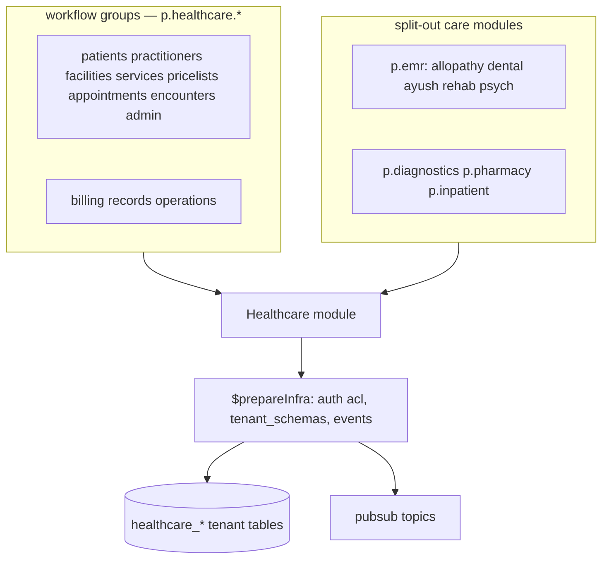

The Healthcare module is the OPD clinic backend: registration, masters, appointments, encounters, billing, records, and operations. Specialty and ancillary care are split out: `@aspen-os/emr` (allopathy, dental, AYUSH, rehab, psychiatry), `@aspen-os/diagnostics` (lab and radiology), `@aspen-os/pharmacy`, and `@aspen-os/inpatient` (nursing and residents) — each declares `$dependencies = ["healthcare"]` on this core kernel. No ADT/IPD bed management, no OT scheduling, no insurance/TPA.

## Module

```ts title="src/module.ts"
export class Healthcare implements Module {
  static create(config?: HealthcareConfig): Healthcare;
  readonly $name = "healthcare"; // proxy key: p.healthcare
  readonly $dependencies: readonly string[] = ["masters"];
}
```

`$prepareRuntime()` and `$cleanup()` are empty: the module wires no schedules or subscriptions yet. `$initialize()` keeps the scaffold shape.

## Configuration

```ts title="src/types.ts"
type HealthcareConfig = {
  tenantCodePrefix?: string; // "HC"
};
```

```ts
const healthcare = Healthcare.create({ tenantCodePrefix: "HC" });
const p = IsolatedTenantPlatform.create(config, [healthcare]);
```

## Dependencies

| Dependency | Kind                      | Purpose                                     |
| ---------- | ------------------------- | ------------------------------------------- |
| `db`       | unit (via `ctx`)          | Tenant tables; gapless numbers via counters |
| `pubsub`   | unit (via `ctx`)          | Domain events per mutation                  |
| `audit`    | context (via `ctx.audit`) | Audit writes for every mutation             |

No module `$consumes` topics. Four care modules depend on this kernel via `$dependencies = ["healthcare"]`: `emr`, `diagnostics`, `pharmacy`, `inpatient`.

## Architecture



## Key concepts

### Branch-scoped tenant rows

Every clinical table carries `branch_id` (default `"main"`); workflows scope reads and writes to one branch. Cross-entity links are soft text references (`patient_id`, `encounter_id`) enforced by workflow guards, never foreign keys.

### Gapless human-readable numbers

`healthcare_counter` backs the numbering steps (`workflow-steps/series.ts` in the core; per-module copies named `<module>-next-series` in `diagnostics`, `pharmacy`, and `inpatient`): UHID, invoice/receipt/package numbers, sale/return/PO/GRN/transfer numbers, lab/radio order numbers, register serials.

### Audit and events per mutation

Writers call `ctx.audit.write()` then `ctx.pubsub.publish()`; reads publish nothing. Specialty writers (`@aspen-os/emr`: allopathy, dental, ayush, rehab, psych) additionally gate on an open, same-patient `healthcare_encounter` via their local `fetchOpenEncounterStep` copy.

### Status representation

Shared lifecycles use `pgEnum`s (`healthcare_appointment_status`, `healthcare_encounter_status`, `healthcare_lab_order_status`, …). Specialty-domain statuses stay clinic-capitalized text columns (`Open`, `Booked`, `Completed`) so ported guards keep their exact semantics. Board status literals live in one place (`workflows/shared/board-query.ts`) so the five queue/board readers cannot drift apart again.

### Shared workflow helpers

Cross-cutting logic shared by `workflows/*` lives in `workflows/shared/`: slot math and interval overlap (`scheduling`), package sell/redeem/expiry (`package-lifecycle`), pricelist codes and versioning (`pricelist-lifecycle`), branch slug/subdomain handling (`branch-lifecycle`), recipient-confirmation guard for shares (`share-guard`), and unified consent reads across the four consent stores (`consent-lifecycle`). The psych session guards (`psych-booking`) moved with `@aspen-os/emr`; `package-lifecycle` and `board-query` are copied into the care modules that use them. The open-encounter gate all specialty writers use is the shared `fetchOpenEncounterStep` (copied per care module, reading the core `healthcare_encounter`).
