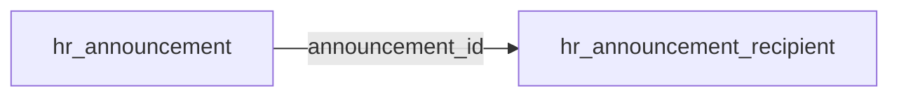

All tables are tenant-scoped. Cross-module links are soft text FKs validated in workflows.

### `hr_announcement` — tenant

Stores author (`ctx.actorId` required), body/title, `audience` JSON (`type` + `ids`, required), `priority` (`normal`/`important`/`urgent`), `status` (`draft`/`scheduled`/`published`/`archived`), and `scheduled_for`.

Indexes: `idx_hr_announcement_status` (`status`), `idx_hr_announcement_author` (`author`), `idx_hr_announcement_scheduled_for` (`scheduled_for`).

### `hr_announcement_recipient` — tenant

Delivery snapshot written at publish time (`announcement_id`, optional `employee_id` / `hr_user_id` / `user_id`).

Indexes: `idx_hr_announcement_recipient_announcement_id` (`announcement_id`), `idx_hr_announcement_recipient_user_id` (`user_id`).

