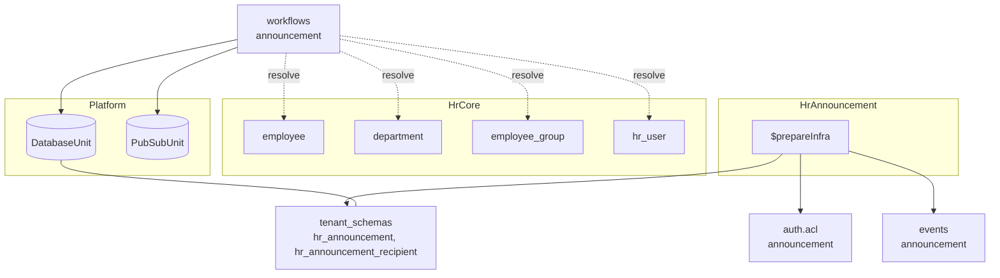
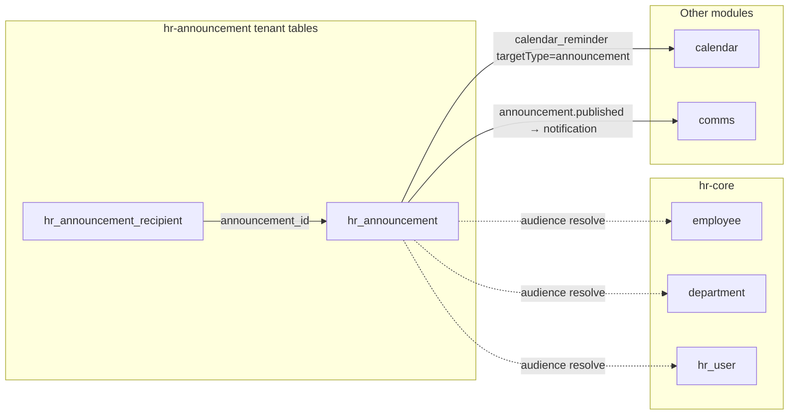

The hr-announcement module owns company announcements — creation, audience targeting, scheduling, publishing, and delivery snapshots — tenant-scoped and dependent on hr-core for employee and org resolution.

## Module

```ts title="src/module.ts"
export class HrAnnouncement implements Module {
  readonly $name = "hrAnnouncement"; // proxy key: p.hrAnnouncement
  readonly $dependencies = ["hrCore"] as const;
}
```

## Configuration

```ts title="src/module.ts"
export interface HrAnnouncementModuleConfig {
  country: "INDIA";
}
```

```ts title="usage"
import { HrCore } from "@aspen-os/hr-core";
import { HrAnnouncement } from "@aspen-os/hr-announcement";

const hrCore = HrCore.create({ country: "INDIA" });
const hrAnnouncement = HrAnnouncement.create({ country: "INDIA" });
```

`country` is reserved for country-specific rules (currently only `"INDIA"`).

## Dependencies

Depends on `hrCore` (`$dependencies = ["hrCore"]`) for audience resolution — employees, departments (with subtree expansion), groups, roles, and HR users. `$initialize()` binds `DatabaseUnit` and `PubSubUnit`; `$prepareInfra()` contributes `auth.acl`, `db.tenant_schemas`, and `events`. No cron or subscription in `$prepareRuntime()`.

## Architecture



`control_plane_schemas` is empty — all tables are tenant-scoped.

Announcement scheduling owns no cron — `hr_announcement.scheduled_for` is materialized as a `calendar_reminder` (`targetType: announcement`) and dispatched by the single `calendar.reminder-scan` cron.

## Announcements

`hr_announcement` stores author (`ctx.actorId` required), body/title, `channel` (`general`/`hr`/`custom`), `audience` JSON (`type` + `ids`), `priority` (`normal`/`important`/`urgent` via `@aspen-os/constants` `NOTIFICATION_SEVERITY`), `status` (`draft`/`scheduled`/`published`/`archived`), and `scheduled_for`. `hr_announcement_recipient` snapshots delivery at publish time. Only `draft`/`scheduled` are editable; publish is idempotent, resolves audience through subtree expansion (departments include children), validates strong-refs (`employees`, `groups`, `roles`, `individuals`), and emits `announcement.published` with `recipientUserIds` (auth `userId`s — employees without HR users are snapshot-only). Read/ack counts are read back from `@aspen-os/comms` notifications (`sourceModule: "hr"`).

## Relationships



All cross-table links are soft text FKs (no DB constraints); invariants are workflow-enforced.

## Access Control

```ts title="src/auth.ts"
export const acl = defineAcl({
  announcement: ["archive", "create", "delete", "publish", "read", "update"],
});
```

<Callout type="info">
  Announcement publishing runs no local scheduler — scheduling is a `calendar_reminder` row; the
  single `calendar.reminder-scan` dispatcher publishes due announcements.
</Callout>
