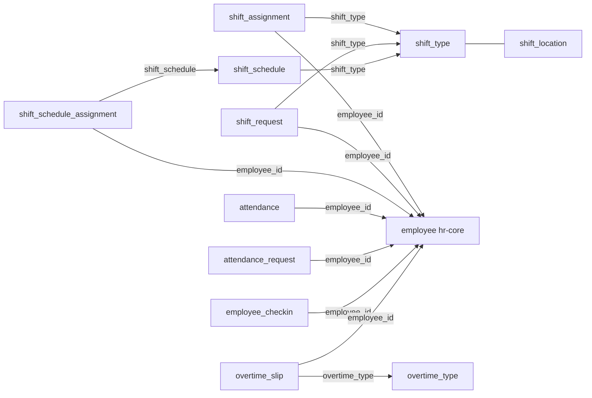

All tables are tenant-scoped (`tenant_schemas`); `control_plane_schemas` is empty. Shared columns `id` (text PK, UUIDv7), `created_at`, `updated_at` (timestamptz) on every table; no hard FKs — links are soft text FKs validated in workflows.

## Enums

| Enum                           | Values                                                        |
| ------------------------------ | ------------------------------------------------------------- |
| `hr_attendance_status`         | `absent`, `half_day`, `on_leave`, `present`, `work_from_home` |
| `hr_checkin_log_type`          | `in`, `out`                                                   |
| `hr_attendance_request_status` | `approved`, `pending`, `rejected`                             |
| `hr_shift_request_status`      | `approved`, `pending`, `rejected`                             |
| `hr_shift_assignment_status`   | `active`, `completed`, `inactive`                             |
| `hr_overtime_status`           | `approved`, `pending`, `rejected`                             |

## Tables

### `attendance`

One row per employee per date.

| Column               | Type                   | Description            |
| -------------------- | ---------------------- | ---------------------- |
| `employee_id`        | text (FK → employee)   | Attendee               |
| `date`               | date                   | Attendance date        |
| `status`             | `hr_attendance_status` | Attendance status      |
| `check_in_time`      | timestamptz            | Derived                |
| `check_out_time`     | timestamptz            | Derived                |
| `working_hours`      | text                   | Duration               |
| `late_entry`         | boolean                | Default false          |
| `late_entry_minutes` | integer                | Default 0              |
| `early_exit`         | boolean                | Default false          |
| `early_exit_minutes` | integer                | Default 0              |
| `is_half_day`        | boolean                | Default false          |
| `half_day_type`      | text                   | Half-day variant       |
| `shift`              | text                   | Shift type ref         |
| `attendance_request` | text                   | Correction request ref |
| `notes`              | text                   | Optional               |
| `metadata`           | jsonb                  | Extra                  |

Indexes: `idx_attendance_employee_id` (`employee_id`), `idx_attendance_date` (`date`).

### `attendance_request`

Correction request over a date range.

| Column             | Type                           | Description       |
| ------------------ | ------------------------------ | ----------------- |
| `employee_id`      | text (FK → employee)           | Requester         |
| `from_date`        | date                           | Start             |
| `to_date`          | date                           | End               |
| `reason`           | text                           | Required          |
| `status`           | `hr_attendance_request_status` | Default `pending` |
| `approved_by`      | text                           | Audit             |
| `approved_at`      | timestamptz                    | Audit             |
| `rejected_by`      | text                           | Audit             |
| `rejected_at`      | timestamptz                    | Audit             |
| `rejection_reason` | text                           | Audit             |

Indexes: `idx_attendance_request_employee_id` (`employee_id`), `idx_attendance_request_status` (`status`).

### `employee_checkin`

Raw punch log.

| Column         | Type                  | Description    |
| -------------- | --------------------- | -------------- |
| `employee_id`  | text (FK → employee)  | Who punched    |
| `time`         | timestamptz           | Punch time     |
| `log_type`     | `hr_checkin_log_type` | `in` / `out`   |
| `shift`        | text                  | Shift type ref |
| `device_id`    | text                  | Capture device |
| `latitude`     | text                  | Geo            |
| `longitude`    | text                  | Geo            |
| `is_off_shift` | boolean               | Default false  |
| `metadata`     | jsonb                 | Extra          |

Indexes: `idx_employee_checkin_employee_id` (`employee_id`).

### `overtime_type`

Rate policy; `delete` soft-deletes via `is_active`.

| Column                       | Type    | Description          |
| ---------------------------- | ------- | -------------------- |
| `name`                       | text    | Type name            |
| `description`                | text    | Optional             |
| `amount_calculation`         | text    | Default `fixed`      |
| `fixed_hourly_rate`          | numeric | Base rate            |
| `standard_multiplier`        | numeric | Default 1.5          |
| `holiday_multiplier`         | numeric | Default 2            |
| `weekend_multiplier`         | numeric | Default 2            |
| `max_overtime_hours_per_day` | numeric | Daily cap            |
| `overtime_salary_component`  | text    | Salary component ref |
| `is_active`                  | boolean | Default true         |

Indexes: `idx_overtime_type_is_active` (`is_active`).

### `overtime_slip`

Dated overtime claim.

| Column                 | Type                 | Description         |
| ---------------------- | -------------------- | ------------------- |
| `employee_id`          | text (FK → employee) | Claimant            |
| `overtime_type`        | text                 | Rate type           |
| `from_date`            | date                 | Start               |
| `to_date`              | date                 | End                 |
| `standard_hours`       | numeric              | Default 0           |
| `holiday_hours`        | numeric              | Default 0           |
| `weekend_hours`        | numeric              | Default 0           |
| `total_overtime_hours` | numeric              | Required total      |
| `amount`               | numeric              | Computed on approve |
| `status`               | `hr_overtime_status` | Default `pending`   |
| `notes`                | text                 | Optional            |
| `metadata`             | jsonb                | Extra               |
| `approved_by`          | text                 | Audit               |
| `approved_at`          | timestamptz          | Audit               |
| `rejected_by`          | text                 | Audit               |
| `rejected_at`          | timestamptz          | Audit               |
| `rejection_reason`     | text                 | Audit               |

Indexes: `idx_overtime_slip_employee_id` (`employee_id`), `idx_overtime_slip_status` (`status`).

### `shift_type`

Daily window definition; `delete` soft-deletes via `is_active`.

| Column                                 | Type    | Description       |
| -------------------------------------- | ------- | ----------------- |
| `name`                                 | text    | Shift name        |
| `start_time`                           | text    | Required          |
| `end_time`                             | text    | Required          |
| `late_entry_grace_minutes`             | integer | Default 0         |
| `early_exit_grace_minutes`             | integer | Default 0         |
| `begin_check_in_before_start`          | integer | Default 0         |
| `allow_check_out_after_end`            | integer | Default 0         |
| `enable_auto_attendance`               | boolean | Default false     |
| `enable_auto_update_sync`              | boolean | Default false     |
| `mark_attendance_on_holidays`          | boolean | Default false     |
| `allow_overtime`                       | boolean | Default false     |
| `overtime_type`                        | text    | Overtime rate ref |
| `holiday_list`                         | text    | Holiday list ref  |
| `working_hours_calculation`            | text    | Rule              |
| `working_hours_threshold_for_half_day` | text    | Threshold         |
| `working_hours_threshold_for_absent`   | text    | Threshold         |
| `process_attendance_after`             | text    | Rule              |
| `determine_check_in_by`                | text    | Rule              |
| `is_active`                            | boolean | Default true      |

Indexes: `idx_shift_type_is_active` (`is_active`).

### `shift_location`

Geofenced site; `delete` soft-deletes via `is_active`.

| Column      | Type    | Description         |
| ----------- | ------- | ------------------- |
| `name`      | text    | Location name       |
| `latitude`  | text    | Center              |
| `longitude` | text    | Center              |
| `radius`    | integer | Meters, default 500 |
| `is_active` | boolean | Default true        |

### `shift_assignment`

Employee → shift type posting.

| Column           | Type                         | Description       |
| ---------------- | ---------------------------- | ----------------- |
| `employee_id`    | text (FK → employee)         | Assignee          |
| `shift_type`     | text                         | Shift type        |
| `shift_location` | text                         | Location ref      |
| `start_date`     | date                         | Start             |
| `end_date`       | date                         | Null = open-ended |
| `status`         | `hr_shift_assignment_status` | Default `active`  |
| `notes`          | text                         | Optional          |

Indexes: `idx_shift_assignment_employee_id` (`employee_id`), `idx_shift_assignment_shift_type` (`shift_type`), `idx_shift_assignment_status` (`status`).

### `shift_request`

Shift change request.

| Column             | Type                      | Description       |
| ------------------ | ------------------------- | ----------------- |
| `employee_id`      | text (FK → employee)      | Requester         |
| `shift_type`       | text                      | Requested shift   |
| `shift_assignment` | text                      | Source assignment |
| `from_date`        | date                      | Start             |
| `to_date`          | date                      | End               |
| `reason`           | text                      | Optional          |
| `status`           | `hr_shift_request_status` | Default `pending` |
| `approved_by`      | text                      | Audit             |
| `approved_at`      | timestamptz               | Audit             |
| `rejected_by`      | text                      | Audit             |
| `rejected_at`      | timestamptz               | Audit             |
| `rejection_reason` | text                      | Audit             |

Indexes: `idx_shift_request_employee_id` (`employee_id`), `idx_shift_request_status` (`status`).

### `shift_schedule`

Weekday template for a shift type.

| Column       | Type    | Description   |
| ------------ | ------- | ------------- |
| `name`       | text    | Schedule name |
| `shift_type` | text    | Shift type    |
| `monday`     | boolean | Default false |
| `tuesday`    | boolean | Default false |
| `wednesday`  | boolean | Default false |
| `thursday`   | boolean | Default false |
| `friday`     | boolean | Default false |
| `saturday`   | boolean | Default false |
| `sunday`     | boolean | Default false |
| `is_active`  | boolean | Default true  |

### `shift_schedule_assignment`

Binds a schedule to an employee over a date range.

| Column           | Type                       | Description       |
| ---------------- | -------------------------- | ----------------- |
| `employee_id`    | text (FK → employee)       | Assignee          |
| `shift_schedule` | text (FK → shift_schedule) | Schedule          |
| `start_date`     | date                       | Start             |
| `end_date`       | date                       | Null = open-ended |
| `is_active`      | boolean                    | Default true      |

Indexes: `idx_shift_schedule_assignment_employee_id` (`employee_id`).

## Relationships

All FKs are soft (logical, no DB constraints); type/schedule existence is workflow-enforced.

