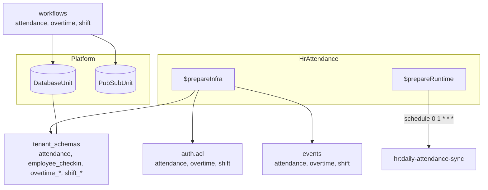
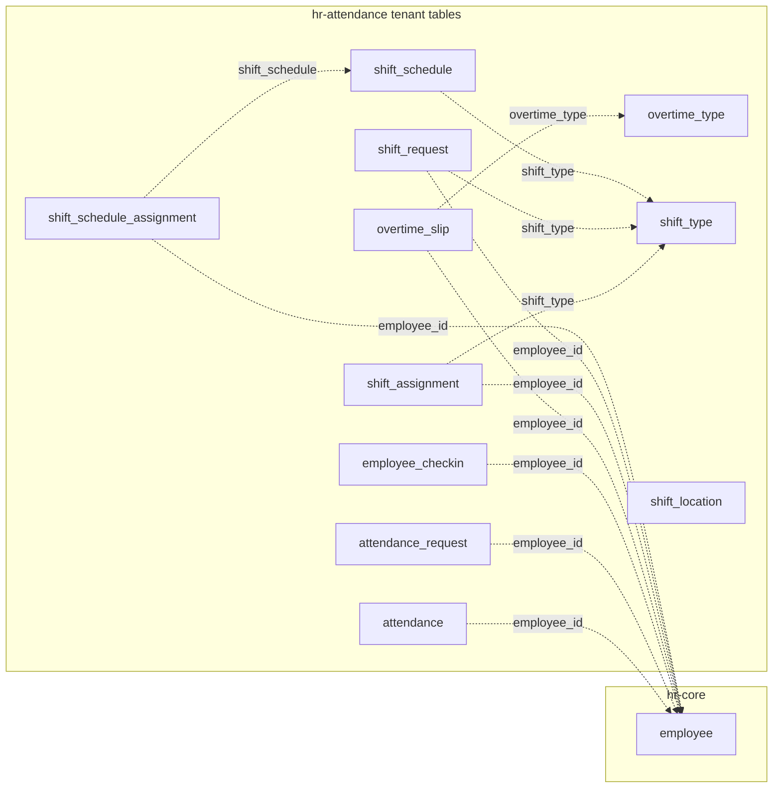

The hr-attendance module owns attendance records, check-ins, overtime, and shift scheduling — all tenant-scoped and linked to hr-core employees via soft `employee_id`.

## Module

```ts title="src/module.ts"
export class HrAttendance implements Module {
  readonly $name = "hrAttendance"; // proxy key: p.hrAttendance
  readonly $dependencies = [] as const;
}
```

## Configuration

```ts title="src/module.ts"
export interface HrAttendanceModuleConfig {
  country: "INDIA";
}
```

```ts title="usage"
import { HrAttendance } from "@aspen-os/hr-attendance";

const hrAttendance = HrAttendance.create({ country: "INDIA" });
```

`country` is reserved for country-specific rules (currently only `"INDIA"`).

## Dependencies

No module `$dependencies`. `$initialize()` binds `DatabaseUnit` and `PubSubUnit`; `$prepareInfra()` contributes `auth.acl`, `db.tenant_schemas`, and `events`; `$prepareRuntime()` schedules `hr:daily-attendance-sync` (`0 1 * * *`) and unregisters it in `$cleanup()`.

## Architecture



`control_plane_schemas` is empty — all tables are tenant-scoped.

## Attendance and Check-ins

`attendance` is one row per employee per date (`employee_id`, `date`, `status` via `hr_attendance_status`, derived `check_in_time`/`check_out_time`, `working_hours`, `late_entry`/`early_exit` flags). `employee_checkin` is the raw punch log (`log_type` `in`/`out`, `time`, optional geo `latitude`/`longitude`, `device_id`). Attendance creation rejects future dates and enforces one record per employee per date.

## Attendance Requests

`attendance_request` is a correction request for a date range (`from_date`/`to_date`, `reason`, `hr_attendance_request_status` default `pending`). `approveAttendanceRequest` / `rejectAttendanceRequest` transition status; workflows publish `attendance:request_created` / `approved` / `rejected`.

## Overtime

`overtime_type` defines rate policy (`amount_calculation` `fixed`, `fixed_hourly_rate`, multipliers `standard`/`holiday`/`weekend`, daily cap `max_overtime_hours_per_day`). `overtime_slip` is a dated claim (`overtime_type`, `from_date`/`to_date`, split hours `standard_hours`/`holiday_hours`/`weekend_hours`, `total_overtime_hours`, `amount` computed on approve when `fixed` mode, `hr_overtime_status`).

## Shift Scheduling

`shift_type` defines a daily window (`start_time`/`end_time`, grace periods `late_entry_grace_minutes`/`early_exit_grace_minutes`, punch windows `begin_check_in_before_start`/`allow_check_out_after_end`, flags `enable_auto_attendance`, `allow_overtime`, holiday handling, and `holiday_list`/`overtime_type` refs). `shift_location` is a geofenced site (`latitude`/`longitude`, `radius`). `shift_assignment` posts an employee to a shift type over a date range (`shift_type`, `start_date`, `end_date`, `hr_shift_assignment_status`), optionally scoped to a `shift_location`. `shift_request` is an employee request for a shift change (`shift_type`, `from_date`/`to_date`, `hr_shift_request_status`). `shift_schedule` is a weekday template (`monday`–`sunday` booleans, `shift_type`), and `shift_schedule_assignment` binds a schedule to an employee over a date range.

## Relationships



All links are soft text FKs (no DB constraints); `shift_type` existence is validated on create of assignments/requests/schedules, and `shift_schedule` existence on schedule assignment.

## Access Control

```ts title="src/auth.ts"
export const acl = defineAcl({
  attendance: ["approve", "create", "read", "reject", "update"],
  overtime: ["approve", "create", "read", "reject", "update"],
  shift: ["approve", "create", "read", "reject", "update"],
});
```

<Callout type="info">
  `hr:daily-attendance-sync` is the only scheduled topic — no in-repo subscription yet; the host
  must subscribe if it implements auto-attendance synthesis.
</Callout>
