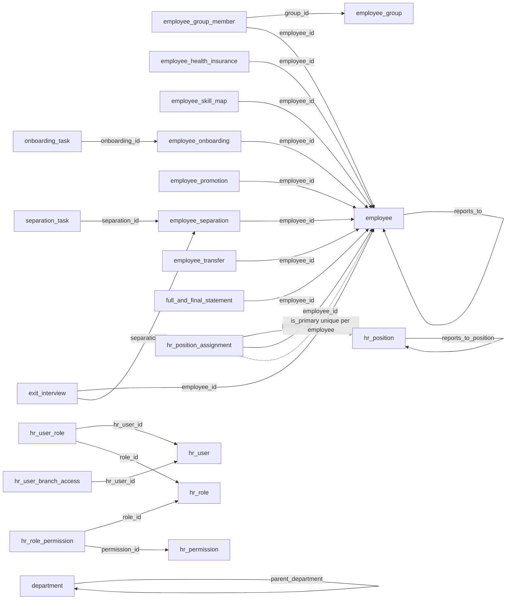

Control-plane and tenant tables (`hr_` and domain prefixes). Shared columns `id` (text PK, UUIDv7), `created_at`, `updated_at` (timestamptz) on every table unless noted; no hard FKs — all cross-row links are soft text FKs validated in workflows.

Enums: see [Enums](/docs/hr-core/enums).

## Tables

### `hr_user` — control-plane

HR user linking an auth user to an employee.

| Column        | Type                 | Description     |
| ------------- | -------------------- | --------------- |
| `employee_id` | text (FK → employee) | Linked employee |
| `user_id`     | text                 | Auth user id    |
| `is_active`   | boolean              | Default true    |

Indexes: `idx_hr_user_employee_id` (`employee_id`), `idx_hr_user_user_id` (`user_id`).

### `hr_role` — control-plane

| Column        | Type    | Description                 |
| ------------- | ------- | --------------------------- |
| `name`        | text    | Role name                   |
| `description` | text    | Optional                    |
| `is_system`   | boolean | System roles survive delete |
| `is_active`   | boolean | Default true                |

### `hr_permission` — control-plane

| Column        | Type                   | Description       |
| ------------- | ---------------------- | ----------------- |
| `module`      | text                   | e.g. `employee`   |
| `action`      | `hr_permission_action` | Permission action |
| `description` | text                   | Optional          |

### `hr_role_permission` — control-plane

| Column          | Type                      | Description        |
| --------------- | ------------------------- | ------------------ |
| `role_id`       | text (FK → hr_role)       | Owning role        |
| `permission_id` | text (FK → hr_permission) | Granted permission |

Indexes: `idx_hr_role_permission_role_id` (`role_id`), `idx_hr_role_permission_permission_id` (`permission_id`).

### `hr_user_role` — control-plane

Branch-scoped role grants.

| Column       | Type                | Description   |
| ------------ | ------------------- | ------------- |
| `hr_user_id` | text (FK → hr_user) | Grantee       |
| `role_id`    | text (FK → hr_role) | Granted role  |
| `branch_id`  | text                | Null = global |

Indexes: `idx_hr_user_role_hr_user_id` (`hr_user_id`), `idx_hr_user_role_role_id` (`role_id`), `idx_hr_user_role_branch_id` (`branch_id`).

### `hr_user_branch_access` — control-plane

Direct branch grants.

| Column         | Type                | Description         |
| -------------- | ------------------- | ------------------- |
| `hr_user_id`   | text (FK → hr_user) | Grantee             |
| `branch_id`    | text                | Granted branch      |
| `access_level` | `hr_access_level`   | Default `read_only` |

Indexes: `idx_hr_user_branch_access_hr_user_id` (`hr_user_id`), `idx_hr_user_branch_access_branch_id` (`branch_id`).

### `hr_settings` — control-plane

Singleton HR settings (upserted).

| Column                             | Type    | Description             |
| ---------------------------------- | ------- | ----------------------- |
| `employee_naming_series`           | text    | Employee id series      |
| `default_holiday_list`             | text    | Default list id         |
| `leave_approval_workflow`          | text    | Approval chain          |
| `leave_without_pay_handling`       | text    | LWP policy              |
| `expense_claim_default`            | text    | Default claim type      |
| `auto_attendance`                  | boolean | Auto mark attendance    |
| `geolocation_tracking`             | boolean | Check-in geo required   |
| `allow_multiple_shift_assignments` | boolean | Overlapping assignments |

### `payroll_settings` — control-plane

Singleton payroll settings (upserted).

| Column                           | Type    | Description           |
| -------------------------------- | ------- | --------------------- |
| `payroll_period_start`           | text    | Pay cycle start       |
| `payroll_period_end`             | text    | Pay cycle end         |
| `fiscal_year_start`              | text    | Fiscal start          |
| `fiscal_year_end`                | text    | Fiscal end            |
| `rounding`                       | text    | Rounding rule         |
| `income_tax_component`           | text    | Tax component         |
| `benefits_application_mandatory` | boolean | Benefits gate         |
| `multi_currency_expense_claims`  | boolean | Multi-currency claims |

### `department` — control-plane

Hierarchical departments.

| Column              | Type                   | Description          |
| ------------------- | ---------------------- | -------------------- |
| `code`              | text                   | Uppercased, unique   |
| `name`              | text                   | Display name         |
| `parent_department` | text (FK → department) | Null = root          |
| `manager`           | text (FK → employee)   | Department head      |
| `cost_center`       | text                   | Optional             |
| `headcount`         | integer                | Sanctioned headcount |
| `metadata`          | jsonb                  | Extra attributes     |
| `is_active`         | boolean                | Soft-delete flag     |

Indexes: `idx_department_is_active` (`is_active`), `idx_department_parent_department` (`parent_department`).

### `employee` — tenant

Core employee record; `employee_id` is the unique business id.

| Column                        | Type                 | Description        |
| ----------------------------- | -------------------- | ------------------ |
| `employee_id`                 | text                 | Unique business id |
| `first_name`                  | text                 | Required           |
| `middle_name`                 | text                 | Optional           |
| `last_name`                   | text                 | Required           |
| `company`                     | text                 | Owning company     |
| `department`                  | text                 | Department id      |
| `status`                      | `hr_employee_status` | Default `active`   |
| `date_of_joining`             | date                 | Required           |
| `date_of_leaving`             | date                 | Set by markAsLeft  |
| `reports_to`                  | text (FK → employee) | Manager fallback   |
| `branch`                      | text                 | Org ref            |
| `holiday_list`                | text                 | Org ref            |
| `gender`                      | `hr_gender`          | Optional           |
| `date_of_birth`               | date                 | Optional           |
| `blood_group`                 | text                 | Optional           |
| `marital_status`              | text                 | Optional           |
| `email`                       | text                 | Contact            |
| `phone`                       | text                 | Contact            |
| `work_email`                  | text                 | Contact            |
| `work_phone`                  | text                 | Contact            |
| `personal_email`              | text                 | Contact            |
| `personal_phone`              | text                 | Contact            |
| `current_address`             | text                 | Address            |
| `permanent_address`           | text                 | Address            |
| `city`                        | text                 | Address            |
| `state`                       | text                 | Address            |
| `country`                     | text                 | Address            |
| `postal_code`                 | text                 | Address            |
| `bank_name`                   | text                 | Bank               |
| `bank_branch`                 | text                 | Bank               |
| `bank_account_number`         | text                 | Bank               |
| `ifsc_code`                   | text                 | Bank               |
| `tax_id`                      | text                 | Payroll ref        |
| `social_security_number`      | text                 | Payroll ref        |
| `salary_structure_assignment` | text                 | Payroll ref        |
| `emergency_contact_name`      | text                 | Emergency          |
| `emergency_contact_phone`     | text                 | Emergency          |
| `emergency_contact_relation`  | text                 | Emergency          |
| `image`                       | text                 | Photo ref          |
| `metadata`                    | jsonb                | Extra              |

Indexes: `idx_employee_employee_id` (`employee_id`), `idx_employee_company` (`company`), `idx_employee_status` (`status`).

### `employee_group` — tenant

| Column        | Type    | Description  |
| ------------- | ------- | ------------ |
| `name`        | text    | Group name   |
| `description` | text    | Optional     |
| `is_active`   | boolean | Default true |

### `employee_group_member` — tenant

| Column        | Type                       | Description  |
| ------------- | -------------------------- | ------------ |
| `group_id`    | text (FK → employee_group) | Owning group |
| `employee_id` | text (FK → employee)       | Member       |

Indexes: `idx_employee_group_member_group_id` (`group_id`), `idx_employee_group_member_employee_id` (`employee_id`).

### `employee_health_insurance` — tenant

| Column             | Type                 | Description    |
| ------------------ | -------------------- | -------------- |
| `employee_id`      | text (FK → employee) | Policy holder  |
| `insurer`          | text                 | Insurer name   |
| `policy_number`    | text                 | Policy number  |
| `start_date`       | date                 | Coverage start |
| `end_date`         | date                 | Coverage end   |
| `premium_amount`   | text                 | Premium        |
| `coverage_details` | text                 | Coverage notes |
| `is_active`        | boolean              | Default true   |
| `metadata`         | jsonb                | Extra          |

Indexes: `idx_employee_health_insurance_employee_id` (`employee_id`).

### `employee_skill_map` — tenant

| Column               | Type                   | Description       |
| -------------------- | ---------------------- | ----------------- |
| `employee_id`        | text (FK → employee)   | Assessed employee |
| `skill`              | text                   | Skill name        |
| `proficiency`        | `hr_skill_proficiency` | Proficiency       |
| `assessed_by`        | text                   | Audit             |
| `assessment_date`    | date                   | Audit             |
| `certification_name` | text                   | Certification     |
| `certification_date` | date                   | Certification     |
| `expiry_date`        | date                   | Certification     |
| `notes`              | text                   | Optional          |

Indexes: `idx_employee_skill_map_employee_id` (`employee_id`).

### `employee_onboarding` — tenant

| Column                     | Type                   | Description       |
| -------------------------- | ---------------------- | ----------------- |
| `employee_id`              | text (FK → employee)   | Joiner            |
| `start_date`               | date                   | Joining date      |
| `expected_completion_date` | date                   | Plan              |
| `actual_completion_date`   | date                   | Actual            |
| `status`                   | `hr_onboarding_status` | Default `pending` |
| `notes`                    | text                   | Optional          |
| `metadata`                 | jsonb                  | Extra             |

Indexes: `idx_employee_onboarding_employee_id` (`employee_id`), `idx_employee_onboarding_status` (`status`).

### `employee_promotion` — tenant

| Column               | Type                  | Description       |
| -------------------- | --------------------- | ----------------- |
| `employee_id`        | text (FK → employee)  | Promotee          |
| `current_department` | text                  | Optional          |
| `new_department`     | text                  | Optional          |
| `effective_date`     | date                  | Effective date    |
| `salary_revision`    | text                  | Revised salary    |
| `reason`             | text                  | Justification     |
| `status`             | `hr_promotion_status` | Default `pending` |
| `approved_by`        | text                  | Audit             |
| `approved_at`        | timestamptz           | Audit             |
| `rejected_by`        | text                  | Audit             |
| `rejected_at`        | timestamptz           | Audit             |
| `rejection_reason`   | text                  | Audit             |

Indexes: `idx_employee_promotion_employee_id` (`employee_id`), `idx_employee_promotion_status` (`status`).

### `employee_separation` — tenant

| Column             | Type                   | Description        |
| ------------------ | ---------------------- | ------------------ |
| `employee_id`      | text (FK → employee)   | Leaver             |
| `resignation_date` | date                   | Optional           |
| `exit_date`        | date                   | Required exit date |
| `reason`           | text                   | Optional           |
| `notes`            | text                   | Optional           |
| `status`           | `hr_separation_status` | Default `pending`  |
| `metadata`         | jsonb                  | Extra              |

Indexes: `idx_employee_separation_employee_id` (`employee_id`), `idx_employee_separation_status` (`status`).

### `employee_transfer` — tenant

| Column             | Type                 | Description       |
| ------------------ | -------------------- | ----------------- |
| `employee_id`      | text (FK → employee) | Transferee        |
| `from_branch`      | text                 | Branch move       |
| `to_branch`        | text                 | Branch move       |
| `from_company`     | text                 | Company move      |
| `to_company`       | text                 | Company move      |
| `from_department`  | text                 | Department move   |
| `to_department`    | text                 | Department move   |
| `effective_date`   | date                 | Effective date    |
| `reason`           | text                 | Justification     |
| `status`           | `hr_transfer_status` | Default `pending` |
| `approved_by`      | text                 | Audit             |
| `approved_at`      | timestamptz          | Audit             |
| `rejected_by`      | text                 | Audit             |
| `rejected_at`      | timestamptz          | Audit             |
| `rejection_reason` | text                 | Audit             |

Indexes: `idx_employee_transfer_employee_id` (`employee_id`), `idx_employee_transfer_status` (`status`).

### `onboarding_task` — tenant

| Column          | Type                            | Description       |
| --------------- | ------------------------------- | ----------------- |
| `onboarding_id` | text (FK → employee_onboarding) | Parent track      |
| `title`         | text                            | Task title        |
| `description`   | text                            | Optional          |
| `assigned_to`   | text                            | Ownership         |
| `department`    | text                            | Ownership         |
| `due_date`      | date                            | Due date          |
| `status`        | `hr_lifecycle_task_status`      | Default `pending` |
| `completed_by`  | text                            | Completion audit  |
| `completed_at`  | timestamptz                     | Completion audit  |
| `notes`         | text                            | Optional          |

Indexes: `idx_onboarding_task_onboarding_id` (`onboarding_id`).

### `separation_task` — tenant

| Column          | Type                            | Description       |
| --------------- | ------------------------------- | ----------------- |
| `separation_id` | text (FK → employee_separation) | Parent case       |
| `title`         | text                            | Task title        |
| `description`   | text                            | Optional          |
| `assigned_to`   | text                            | Ownership         |
| `department`    | text                            | Ownership         |
| `due_date`      | date                            | Due date          |
| `status`        | `hr_lifecycle_task_status`      | Default `pending` |
| `completed_by`  | text                            | Completion audit  |
| `completed_at`  | timestamptz                     | Completion audit  |
| `notes`         | text                            | Optional          |

Indexes: `idx_separation_task_separation_id` (`separation_id`).

### `exit_interview` — tenant

| Column                   | Type                       | Description         |
| ------------------------ | -------------------------- | ------------------- |
| `employee_id`            | text (FK → employee)       | Leaver              |
| `separation_id`          | text                       | Source separation   |
| `interviewer`            | text                       | Interviewer         |
| `scheduled_date`         | timestamptz                | Scheduled           |
| `completed_date`         | timestamptz                | Actual              |
| `status`                 | `hr_exit_interview_status` | Default `scheduled` |
| `feedback`               | text                       | Free-form           |
| `questionnaire_template` | text                       | Template ref        |
| `responses`              | jsonb                      | Structured answers  |

Indexes: `idx_exit_interview_employee_id` (`employee_id`), `idx_exit_interview_status` (`status`).

### `full_and_final_statement` — tenant

| Column             | Type                       | Description         |
| ------------------ | -------------------------- | ------------------- |
| `employee_id`      | text (FK → employee)       | Leaver              |
| `separation_id`    | text                       | Source separation   |
| `pending_salary`   | numeric                    | Default 0           |
| `leave_encashment` | numeric                    | Default 0           |
| `gratuity`         | numeric                    | Default 0           |
| `bonus`            | numeric                    | Default 0           |
| `deductions`       | numeric                    | Default 0           |
| `loan_recovery`    | numeric                    | Default 0           |
| `total_earnings`   | numeric                    | Computed on approve |
| `total_deductions` | numeric                    | Computed on approve |
| `net_payable`      | numeric                    | Computed on approve |
| `status`           | `hr_full_and_final_status` | Default `draft`     |
| `approved_by`      | text                       | Audit               |
| `approved_at`      | timestamptz                | Audit               |
| `paid_at`          | timestamptz                | Payment audit       |
| `payment_entry`    | text                       | Payment audit       |
| `notes`            | text                       | Optional            |
| `metadata`         | jsonb                      | Extra               |

Indexes: `idx_full_and_final_statement_employee_id` (`employee_id`), `idx_full_and_final_statement_status` (`status`).

### `hr_position` — tenant

| Column                | Type                    | Description     |
| --------------------- | ----------------------- | --------------- |
| `name`                | text                    | Position name   |
| `department`          | text                    | Department id   |
| `branch`              | text                    | Branch id       |
| `headcount`           | integer                 | Default 1       |
| `is_active`           | boolean                 | Default true    |
| `reports_to_position` | text (FK → hr_position) | Parent position |
| `job_description`     | text                    | Optional        |

Indexes: `idx_hr_position_department` (`department`), `idx_hr_position_is_active` (`is_active`), `idx_hr_position_reports_to_position` (`reports_to_position`).

### `hr_position_assignment` — tenant

| Column        | Type                    | Description       |
| ------------- | ----------------------- | ----------------- |
| `employee_id` | text (FK → employee)    | Assignee          |
| `position_id` | text (FK → hr_position) | Position          |
| `from_date`   | date                    | Start             |
| `to_date`     | date                    | Null = open-ended |
| `is_primary`  | boolean                 | Default false     |

Indexes: `idx_hr_position_assignment_employee_id` (`employee_id`), `idx_hr_position_assignment_position_id` (`position_id`).

## Relationships

All FKs are soft (logical, no DB constraints); invariants enforced in workflows.

