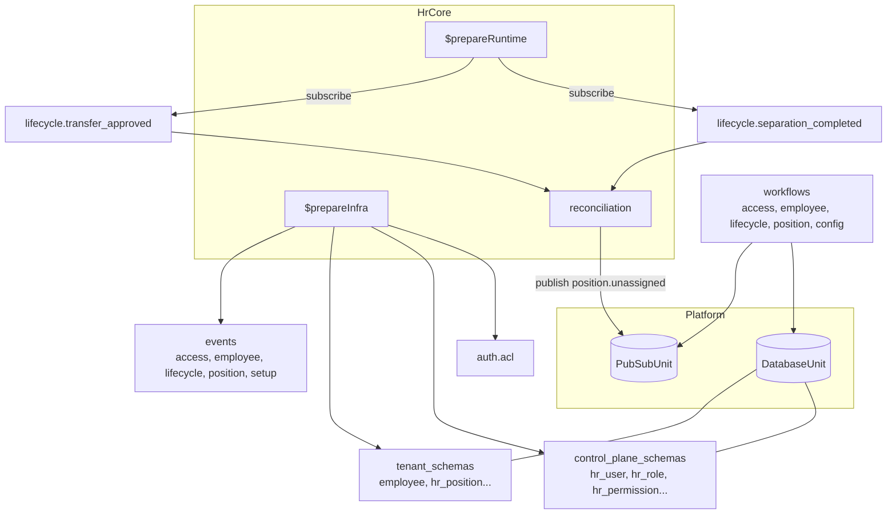
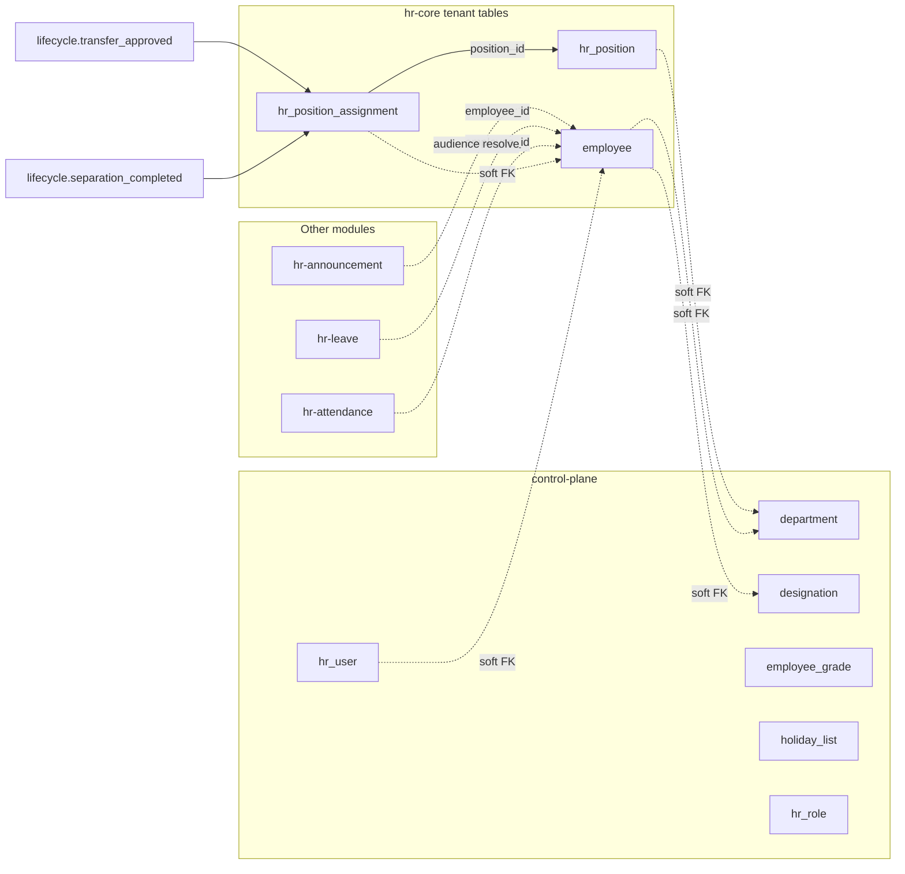

The hr-core module owns canonical employee records, position structure, lifecycle, organizational setup, and access control.

## Module

```ts title="src/module.ts"
export class HrCore implements Module {
  readonly $name = "hrCore"; // proxy key: p.hrCore
  readonly $dependencies = [] as const;
}
```

## Configuration

```ts title="src/module.ts"
export interface HrCoreModuleConfig {
  country: "INDIA";
}
```

```ts title="usage"
import { HrCore } from "@aspen-os/hr-core";

const hrCore = HrCore.create({ country: "INDIA" });
```

`country` is reserved for country-specific validation (currently only `"INDIA"`).

## Dependencies

No module `$dependencies`. `$initialize()` binds `DatabaseUnit` and `PubSubUnit`; `$prepareInfra()` contributes `auth.acl`, `db.{control_plane_schemas, tenant_schemas}`, and `events`. `$prepareRuntime()` registers two reconciliation subscriptions (`lifecycle.separation_completed`, `lifecycle.transfer_approved`) and unregisters them in `$cleanup()`.

## Architecture



## Employee

Canonical employee row (`employee` tenant table) identified by `employee_id` (business id, unique) and `id` (UUIDv7 PK). Carries org placement (`company`, `department`, `designation`, `branch`, `grade`, `holiday_list`), employment type, status (`active`/`inactive`/`left`/`suspended`), and personal/contact/bank fields. `reportsTo` is a soft text FK used as manager fallback when no position assignment resolves. `ensureEmployeeIdUnique` enforces business-id uniqueness on create/update.

## Employee Groups and Supplemental Records

`employee_group` + `employee_group_member` (members removed before group delete; duplicate membership rejected). `employee_health_insurance` (per employee, `policyNumber` required) and `employee_skill_map` (proficiency via `hr_skill_proficiency` enum) both validate the employee exists before insert.

## Position and Assignments

`hr_position` is a stable job slot (`department`, `branch`, `reports_to_position` forming hierarchy, `headcount`, `is_active`). `hr_position_assignment` is a dated posting (`employee_id`, `position_id`, `from_date`, `to_date` nullable for open-ended, `is_primary` unique per employee among current assignments). Position names are unique within a department; `reportsToPosition` cycle checked by ancestor walk (depth 10). Assignment validates headcount, single open-ended per position per employee, and clears conflicting primaries.

## Lifecycle

Onboarding, promotion, transfer, separation are first-class tracks (`employee_onboarding`, `employee_promotion`, `employee_transfer`, `employee_separation`) with status enums; onboarding/separation own task tables (`onboarding_task`, `separation_task`, status `hr_lifecycle_task_status`) that cascade-delete. Promotion/transfer carry `approved/rejected/completed` transitions; `approvePromotion` syncs `employee.designation` (+ grade/department), `approveTransfer` emits `lifecycle.transfer_approved`, completing a separation emits `lifecycle.separation_completed`. Exit interviews (`exit_interview`) and full-and-final settlements (`full_and_final_statement`, totals computed on approve) close the offboarding chain.

## Access Control

```ts title="src/auth.ts"
export const acl = defineAcl({
  employee: ["create", "delete", "read", "update"],
  hrPermission: ["create", "delete", "read", "update"],
  hrRole: ["create", "delete", "read", "update"],
  hrUser: ["create", "delete", "read", "update"],
  lifecycle: ["approve", "create", "read", "reject", "update"],
  position: ["create", "delete", "read", "update"],
  config: ["create", "delete", "read", "update"],
});
```

`hr_user` links an auth `user_id` to an `employee_id`; `hr_role`/`hr_permission`/`hr_role_permission` form RBAC, `hr_user_role` grants roles optionally branch-scoped, `hr_user_branch_access` grants direct branch access with `hr_access_level`.

## Organizational Setup

Control-plane catalog: `department` (hierarchical `parent_department`, `manager` head, `code` uppercased unique, `is_active` soft delete blocked while children/positions/employees exist), `designation`, `employment_type`, `employee_grade`, `holiday_list`/`holiday` (list owns weekly off pattern, holidays reference `hr_holiday_type`), `hr_settings` and `payroll_settings` (singleton upserts). Department moves and head changes emit `setup.department_moved` / `setup.department_head_changed`; ancestor walk (depth 10) prevents cycles.

## Relationships



All cross-table links are soft text FKs (no DB constraints); invariants are workflow-enforced. `hr-attendance`, `hr-leave`, and `hr-announcement` reference `employee` via soft IDs without a hard FK.

<Callout type="warn">
  `lifecycle.separation_completed` and `lifecycle.transfer_approved` are consumed internally for
  position reconciliation — closing open-ended assignments and emitting `position.unassigned`. Hosts
  subscribing to `position.unassigned` must handle both direct unassigns and reconciliation-emitted
  ones.
</Callout>
