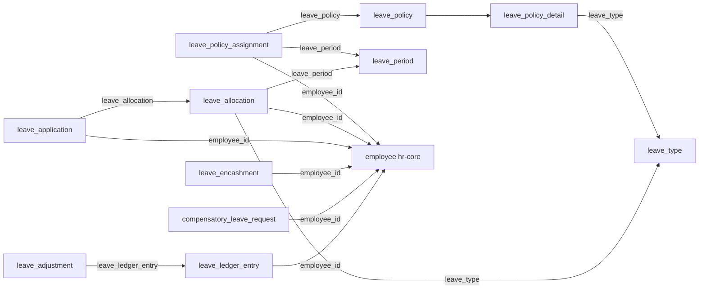

All tables are tenant-scoped (`tenant_schemas`); `control_plane_schemas` is empty. Shared columns `id` (text PK, UUIDv7), `created_at`, `updated_at` (timestamptz) on every table; no hard FKs — links are soft text FKs validated in workflows.

## Enums

| Enum                           | Values                                                  |
| ------------------------------ | ------------------------------------------------------- |
| `hr_leave_application_status`  | `approved`, `cancelled`, `draft`, `pending`, `rejected` |
| `hr_leave_allocation_status`   | `active`, `cancelled`, `expired`                        |
| `hr_compensatory_leave_status` | `approved`, `pending`, `rejected`                       |
| `hr_leave_encashment_status`   | `approved`, `paid`, `pending`, `rejected`               |
| `hr_earned_leave_frequency`    | `half_yearly`, `monthly`, `quarterly`, `yearly`         |
| `hr_leave_block_list_scope`    | `company`, `department`                                 |

## Tables

### `leave_type`

Leave kind definition; `delete` soft-deletes via `is_active`.

| Column                           | Type                        | Description                 |
| -------------------------------- | --------------------------- | --------------------------- |
| `name`                           | text                        | Type name                   |
| `max_days_allowed`               | integer                     | Annual cap, required        |
| `applicable_after_working_days`  | integer                     | Eligibility gate, default 0 |
| `is_earned_leave`                | boolean                     | Default false               |
| `earned_leave_frequency`         | `hr_earned_leave_frequency` | Null unless earned          |
| `is_carry_forward`               | boolean                     | Default false               |
| `max_carry_forward_days`         | integer                     | Carry cap                   |
| `max_continuous_days_allowed`    | integer                     | Single-stretch cap          |
| `is_leave_without_pay`           | boolean                     | Skips balance check         |
| `is_partially_paid`              | boolean                     | Partial pay flag            |
| `allow_negative_balance`         | boolean                     | Default false               |
| `include_holidays_within_leaves` | boolean                     | Default false               |
| `is_active`                      | boolean                     | Default true                |

Indexes: `idx_leave_type_is_active` (`is_active`).

### `leave_period`

Calendar window; `delete` soft-deletes via `is_active`.

| Column       | Type    | Description    |
| ------------ | ------- | -------------- |
| `name`       | text    | Period name    |
| `company`    | text    | Owning company |
| `start_date` | date    | Start          |
| `end_date`   | date    | End            |
| `is_active`  | boolean | Default true   |

Indexes: `idx_leave_period_is_active` (`is_active`).

### `leave_policy`

Header; `delete` hard-deletes after cascading to details.

| Column        | Type    | Description  |
| ------------- | ------- | ------------ |
| `name`        | text    | Policy name  |
| `description` | text    | Optional     |
| `is_active`   | boolean | Default true |

### `leave_policy_detail`

Per-type cap within a policy.

| Column               | Type                     | Description        |
| -------------------- | ------------------------ | ------------------ |
| `leave_policy_id`    | text (FK → leave_policy) | Owning policy      |
| `leave_type`         | text                     | Capped type        |
| `max_days`           | integer                  | Type cap, required |
| `carry_forward_days` | integer                  | Default 0          |

Indexes: `idx_leave_policy_detail_leave_policy_id` (`leave_policy_id`).

### `leave_policy_assignment`

Binds policy + period to an employee.

| Column           | Type                 | Description  |
| ---------------- | -------------------- | ------------ |
| `employee_id`    | text (FK → employee) | Assignee     |
| `leave_policy`   | text                 | Policy ref   |
| `leave_period`   | text                 | Period ref   |
| `effective_from` | date                 | Start        |
| `effective_to`   | date                 | End          |
| `is_active`      | boolean              | Default true |

Indexes: `idx_leave_policy_assignment_employee_id` (`employee_id`), `idx_leave_policy_assignment_leave_policy` (`leave_policy`), `idx_leave_policy_assignment_leave_period` (`leave_period`).

### `leave_allocation`

Granted balance; `delete` sets `status: cancelled`.

| Column                    | Type                         | Description       |
| ------------------------- | ---------------------------- | ----------------- |
| `employee_id`             | text (FK → employee)         | Holder            |
| `leave_type`              | text                         | Allocated type    |
| `leave_period`            | text                         | Period ref        |
| `leave_policy_assignment` | text                         | Source assignment |
| `total_days`              | numeric                      | Required          |
| `used_days`               | numeric                      | Default 0         |
| `earned_days`             | numeric                      | Default 0         |
| `carry_forwarded_days`    | numeric                      | Default 0         |
| `status`                  | `hr_leave_allocation_status` | Default `active`  |

Indexes: `idx_leave_allocation_employee_id` (`employee_id`), `idx_leave_allocation_leave_type` (`leave_type`), `idx_leave_allocation_status` (`status`).

### `leave_application`

Leave request.

| Column             | Type                          | Description         |
| ------------------ | ----------------------------- | ------------------- |
| `employee_id`      | text (FK → employee)          | Applicant           |
| `leave_type`       | text                          | Requested type      |
| `from_date`        | date                          | Start               |
| `to_date`          | date                          | End                 |
| `total_days`       | numeric                       | Day count, required |
| `is_half_day`      | boolean                       | Default false       |
| `half_day_date`    | date                          | Half-day detail     |
| `leave_allocation` | text                          | Charged allocation  |
| `reason`           | text                          | Optional            |
| `status`           | `hr_leave_application_status` | Default `draft`     |
| `approved_by`      | text                          | Audit               |
| `approved_at`      | timestamptz                   | Audit               |
| `cancelled_at`     | timestamptz                   | Cancellation time   |
| `rejected_by`      | text                          | Audit               |
| `rejected_at`      | timestamptz                   | Audit               |
| `rejection_reason` | text                          | Audit               |

Indexes: `idx_leave_application_employee_id` (`employee_id`), `idx_leave_application_status` (`status`).

### `leave_encashment`

Encashment claim; `markLeaveEncashmentPaid` is terminal.

| Column             | Type                         | Description       |
| ------------------ | ---------------------------- | ----------------- |
| `employee_id`      | text (FK → employee)         | Claimant          |
| `leave_type`       | text                         | Source type       |
| `leave_period`     | text                         | Source period     |
| `encashable_days`  | numeric                      | Required          |
| `encashed_days`    | numeric                      | Required          |
| `amount`           | numeric                      | Payout            |
| `status`           | `hr_leave_encashment_status` | Default `pending` |
| `approved_by`      | text                         | Audit             |
| `approved_at`      | timestamptz                  | Audit             |
| `rejected_by`      | text                         | Audit             |
| `rejected_at`      | timestamptz                  | Audit             |
| `rejection_reason` | text                         | Audit             |

Indexes: `idx_leave_encashment_employee_id` (`employee_id`), `idx_leave_encashment_status` (`status`).

### `leave_block_list`

Blackout window blocking `createLeaveApplication`.

| Column       | Type                        | Description  |
| ------------ | --------------------------- | ------------ |
| `name`       | text                        | Block name   |
| `scope`      | `hr_leave_block_list_scope` | Scope        |
| `company`    | text                        | Scope ref    |
| `department` | text                        | Scope ref    |
| `from_date`  | date                        | Start        |
| `to_date`    | date                        | End          |
| `reason`     | text                        | Optional     |
| `is_active`  | boolean                     | Default true |

Indexes: `idx_leave_block_list_is_active` (`is_active`).

### `leave_adjustment`

Manual balance correction (create-only + list).

| Column               | Type                           | Description      |
| -------------------- | ------------------------------ | ---------------- |
| `employee_id`        | text (FK → employee)           | Holder           |
| `leave_type`         | text                           | Target type      |
| `leave_period`       | text                           | Target period    |
| `days`               | numeric                        | Adjustment (+/−) |
| `adjusted_by`        | text                           | Corrector        |
| `reason`             | text                           | Required         |
| `leave_ledger_entry` | text (FK → leave_ledger_entry) | Backing entry    |

Indexes: `idx_leave_adjustment_employee_id` (`employee_id`).

### `leave_ledger_entry`

Append-only balance journal.

| Column              | Type                 | Description                                  |
| ------------------- | -------------------- | -------------------------------------------- |
| `employee_id`       | text (FK → employee) | Holder                                       |
| `leave_type`        | text                 | Affected type                                |
| `days`              | numeric              | Delta                                        |
| `transaction_type`  | text                 | `application`/`cancellation`/`compensatory`… |
| `description`       | text                 | Required                                     |
| `leave_application` | text                 | Source application                           |

Indexes: `idx_leave_ledger_entry_employee_id` (`employee_id`), `idx_leave_ledger_entry_leave_type` (`leave_type`).

### `compensatory_leave_request`

Compensatory leave for a worked-off day.

| Column             | Type                           | Description                     |
| ------------------ | ------------------------------ | ------------------------------- |
| `employee_id`      | text (FK → employee)           | Requester                       |
| `work_date`        | date                           | Worked date                     |
| `number_of_days`   | numeric                        | Default 1                       |
| `leave_type`       | text                           | Credited type                   |
| `leave_allocation` | text                           | Allocation ref (set on approve) |
| `reason`           | text                           | Required                        |
| `status`           | `hr_compensatory_leave_status` | Default `pending`               |
| `approved_by`      | text                           | Audit                           |
| `approved_at`      | timestamptz                    | Audit                           |
| `rejected_by`      | text                           | Audit                           |
| `rejected_at`      | timestamptz                    | Audit                           |
| `rejection_reason` | text                           | Audit                           |

Indexes: `idx_compensatory_leave_request_employee_id` (`employee_id`), `idx_compensatory_leave_request_status` (`status`).

## Relationships

All FKs are soft (logical, no DB constraints); type/period/policy existence is workflow-enforced.

