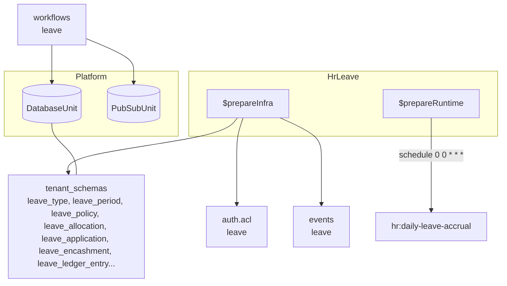
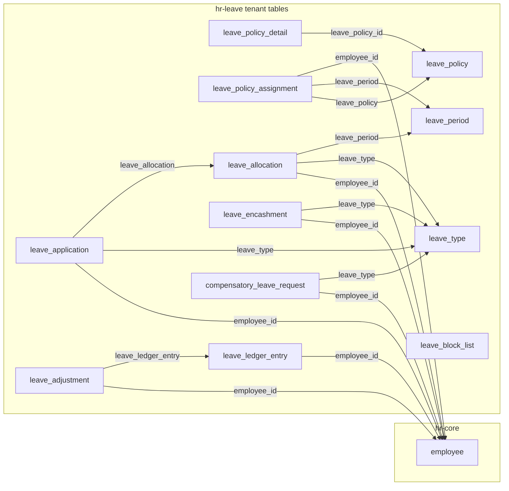

The hr-leave module owns leave types, policies, allocations, applications, encashment, compensatory leave, block lists, adjustments, and the append-only ledger — all tenant-scoped and linked to hr-core employees via soft `employee_id`.

## Module

```ts title="src/module.ts"
export class HrLeave implements Module {
  readonly $name = "hrLeave"; // proxy key: p.hrLeave
  readonly $dependencies = [] as const;
}
```

## Configuration

```ts title="src/module.ts"
export interface HrLeaveModuleConfig {
  country: "INDIA";
}
```

```ts title="usage"
import { HrLeave } from "@aspen-os/hr-leave";

const hrLeave = HrLeave.create({ country: "INDIA" });
```

`country` is reserved for country-specific rules (currently only `"INDIA"`).

## Dependencies

No module `$dependencies`. `$initialize()` binds `DatabaseUnit` and `PubSubUnit`; `$prepareInfra()` contributes `auth.acl`, `db.tenant_schemas`, and `events`; `$prepareRuntime()` schedules `hr:daily-leave-accrual` (`0 0 * * *`) and unregisters it in `$cleanup()`.

## Architecture



`control_plane_schemas` is empty — all tables are tenant-scoped.

## Leave Types and Periods

`leave_type` defines a leave kind (`name`, `max_days_allowed`, eligibility `applicable_after_working_days`, flags `is_earned_leave` / `is_carry_forward` / `is_leave_without_pay` / `is_partially_paid`, `earned_leave_frequency` monthly/quarterly/half_yearly/yearly, `max_carry_forward_days`, `max_continuous_days_allowed`). `leave_period` is a calendar window (`name`, `company`, `start_date`/`end_date`, `is_active`). Both soft-delete via `is_active`.

## Policies and Assignments

`leave_policy` is a header; `leave_policy_detail` caps a leave type within a policy (`leave_policy_id`, `leave_type`, `max_days`, `carry_forward_days`). `leave_policy_assignment` binds a policy + period to an employee over a validity window (`employee_id`, `leave_policy`, `leave_period`, `effective_from`/`effective_to`, `is_active`).

## Allocations, Applications, and Ledger

`leave_allocation` grants days to an employee (`leave_type`, `leave_period`, optional `leave_policy_assignment`, `total_days`, `used_days`, `earned_days`, `carry_forwarded_days`, `hr_leave_allocation_status`). `leave_application` requests a window (`leave_type`, `from_date`/`to_date`, `total_days`, optional `is_half_day`, `leave_allocation` charge ref, `hr_leave_application_status`). Approving an application bumps `used_days` and appends a `leave_ledger_entry` (`transaction_type: application`); cancelling reverses it. `leave_ledger_entry` is append-only (`employee_id`, `leave_type`, `days` delta, `transaction_type`, `description`, optional `leave_application`).

## Encashment, Compensatory, Block Lists, and Adjustments

`leave_encashment` claims encashment of unused days (`leave_type`, `leave_period`, `encashable_days`/`encashed_days`, `amount`, `hr_leave_encashment_status`; paid is terminal via `markLeaveEncashmentPaid`). `compensatory_leave_request` compensates a worked-off `work_date` (`leave_type`, `number_of_days`, `hr_compensatory_leave_status`; approval creates a `leave_allocation` and a `transaction_type: compensatory` ledger entry). `leave_block_list` is a blackout window (`scope` company/department, `from_date`/`to_date`, blocks `createLeaveApplication` when overlapped). `leave_adjustment` is a manual correction (`employee_id`, `leave_type`, `days`, `adjusted_by`, `reason`, backing `leave_ledger_entry`).

## Relationships



All links are soft text FKs (no DB constraints); `leave_type`/`leave_period`/`leave_policy` existence is validated on create of dependent rows.

## Access Control

```ts title="src/auth.ts"
export const acl = defineAcl({
  leave: ["approve", "create", "read", "reject", "update"],
});
```

<Callout type="info">
  `hr:daily-leave-accrual` is the only scheduled topic — no in-repo subscription yet; the host must
  subscribe if it implements earned-leave accrual.
</Callout>
