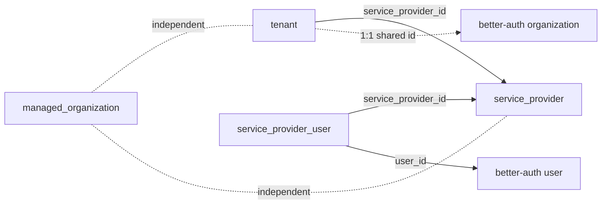

The Management Plane declares control-plane tables with `managed_organization` PG name `managed_organization` and empty tenant schemas. Shared columns `id`, `created_at`, `updated_at` are timestamptz/uuidv7 unless noted; tenant `id` is text sharing better-auth `organization.id`.

## Enums

| Enum                      | Values                                         |
| ------------------------- | ---------------------------------------------- |
| `tenant_status`           | `onboarding`, `active`, `suspended`, `churned` |
| `service_provider_status` | `active`, `inactive`                           |

## Tables

### `tenant`

Companion to better-auth `organization`; holds lifecycle, plan, SP assignment, and per-tenant DB connection params.

| Column                | Type                                         | Description            |
| --------------------- | -------------------------------------------- | ---------------------- |
| `churn_reason`        | text                                         | Churn reason           |
| `churned_at`          | timestamptz                                  | Churn timestamp        |
| `database_host`       | text                                         | Per-tenant DB host     |
| `database_name`       | text                                         | Per-tenant DB name     |
| `database_password`   | text                                         | Per-tenant DB password |
| `database_port`       | integer                                      | Per-tenant DB port     |
| `database_ssl`        | boolean                                      | Per-tenant DB SSL      |
| `database_user`       | text                                         | Per-tenant DB user     |
| `id`                  | text (PK) (FK → better-auth organization.id) | Shared tenant/org id   |
| `plan`                | text                                         | Subscription plan      |
| `service_provider_id` | text (FK → service_provider.id)              | Assigned SP            |
| `signup_at`           | timestamptz                                  | Signup timestamp       |
| `status`              | `tenant_status`                              | Lifecycle status       |
| `suspended_at`        | timestamptz                                  | Suspension timestamp   |
| `suspended_reason`    | text                                         | Suspension reason      |

Indexes: `idx_tenant_status` on `status`, `idx_tenant_service_provider` on `service_provider_id`, `idx_tenant_plan` on `plan`.

### `service_provider`

Implementation partner.

| Column        | Type                      | Description         |
| ------------- | ------------------------- | ------------------- |
| `address`     | text                      | Address             |
| `description` | text                      | Description         |
| `email`       | text                      | Contact email       |
| `id`          | text (PK)                 | uuidv7              |
| `logo`        | text                      | Logo reference      |
| `name`        | text                      | Display name        |
| `phone`       | text                      | Contact phone       |
| `slug`        | text (unique)             | URL-safe identifier |
| `status`      | `service_provider_status` | `active`            |
| `website`     | text                      | Website URL         |

Indexes: `idx_service_provider_status` on `status`.

### `service_provider_user`

Join linking a platform user to a service provider; no `spId` on `user`.

| Column                | Type                            | Description   |
| --------------------- | ------------------------------- | ------------- |
| `id`                  | text (PK)                       | uuidv7        |
| `service_provider_id` | text (FK → service_provider.id) | Owning SP     |
| `user_id`             | text (FK → better-auth user.id) | Platform user |

Indexes: `service_provider_user_unique` unique on `(service_provider_id, user_id)`, `service_provider_user_user_unique` unique on `user_id`, `idx_service_provider_user_sp` on `service_provider_id`.

### `managed_organization`

Platform-level organization; PG table `managed_organization`.

| Column     | Type          | Description         |
| ---------- | ------------- | ------------------- |
| `branding` | jsonb         | Branding JSON       |
| `id`       | text (PK)     | uuidv7              |
| `name`     | text          | Display name        |
| `slug`     | text (unique) | URL-safe identifier |

Indexes: `idx_managed_organization_slug` on `slug`, `idx_managed_organization_name` on `name`.

## Relationships

All links are soft (workflow-enforced), except `tenant.id` shares better-auth `organization.id`; no hard DB FKs.
