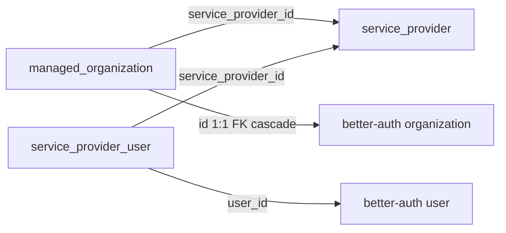

The Management Plane declares control-plane tables and empty tenant schemas. Shared columns `id` and `updated_at` apply to all tables and are not repeated per table; `managed_organization.id` is the better-auth `organization.id` (1:1 PK/FK).

## Enums

| Enum                      | Values                                         |
| ------------------------- | ---------------------------------------------- |
| `tenant_status`           | `onboarding`, `active`, `suspended`, `churned` |
| `service_provider_status` | `active`, `inactive`                           |

## Tables

### `service_provider`

Implementation partner. `logo` stores the Storage logical key (`logos/service-provider/<id>/<file>`); bytes live in Storage (`file_metadata` + S3), never in the database.

| Column        | Type                      | Description                    |
| ------------- | ------------------------- | ------------------------------ |
| `address`     | text                      | Address                        |
| `description` | text                      | Description                    |
| `email`       | text                      | Contact email                  |
| `logo`        | text                      | Logo Storage key (`logos/...`) |
| `name`        | text                      | Display name                   |
| `phone`       | text                      | Contact phone                  |
| `slug`        | text (unique)             | URL-safe identifier            |
| `status`      | `service_provider_status` | `active`                       |
| `website`     | text                      | Website URL                    |

Indexes: `idx_service_provider_status` on `status`.

### `service_provider_user`

Join linking a platform user to a service provider; no `spId` on `user`.

| Column                | Type                            | Description   |
| --------------------- | ------------------------------- | ------------- |
| `service_provider_id` | text (FK → service_provider.id) | Owning SP     |
| `user_id`             | text (FK → better-auth user.id) | Platform user |

Indexes: `service_provider_user_unique` unique on `(service_provider_id, user_id)`, `service_provider_user_user_unique` unique on `user_id`, `idx_service_provider_user_sp` on `service_provider_id`.

### `managed_organization`

Tenant companion to the better-auth `organization` row, sharing its primary key 1:1. `name`/`slug` live on better-auth `organization`; `branding` carries `{ logo?, primaryColor? }` where `logo` is a Storage logical key (`logos/organization/<id>/<file>`).

| Column                | Type            | Description          |
| --------------------- | --------------- | -------------------- |
| `branding`            | jsonb           | Branding JSON        |
| `plan`                | text            | Subscription plan    |
| `service_provider_id` | text            | Assigned SP (soft)   |
| `signup_at`           | timestamptz     | Signup timestamp     |
| `status`              | `tenant_status` | Lifecycle status     |
| `suspended_at`        | timestamptz     | Suspension timestamp |
| `suspended_reason`    | text            | Suspension reason    |

`id` is a text PK referencing better-auth `organization.id` (`onDelete: cascade`). Indexes: `idx_managed_organization_status` on `status`, `idx_managed_organization_service_provider` on `service_provider_id`, `idx_managed_organization_plan` on `plan`.

## Relationships

```mermaid
flowchart LR
  org[managed_organization] -->|service_provider_id| sp[service_provider]
  spu[service_provider_user] -->|service_provider_id| sp
  spu -->|user_id| user[better-auth user]
  org -->|id 1:1 FK cascade| authOrg[better-auth organization]
```

`managed_organization.id → organization.id` is a hard FK. SP assignment and `service_provider_user` links are soft (workflow-enforced).
