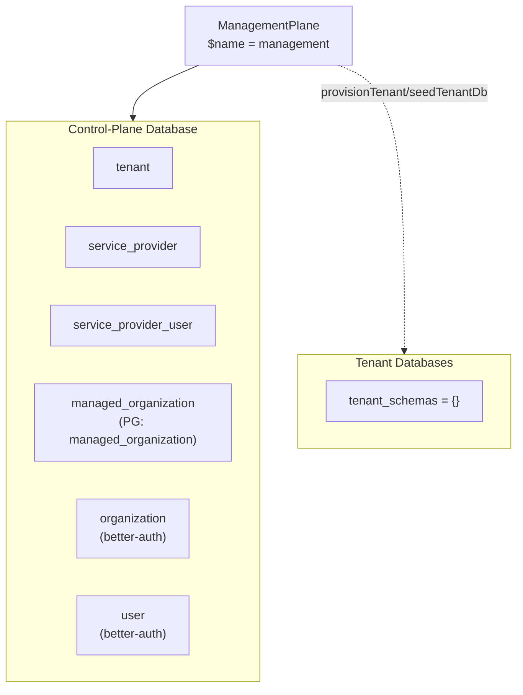
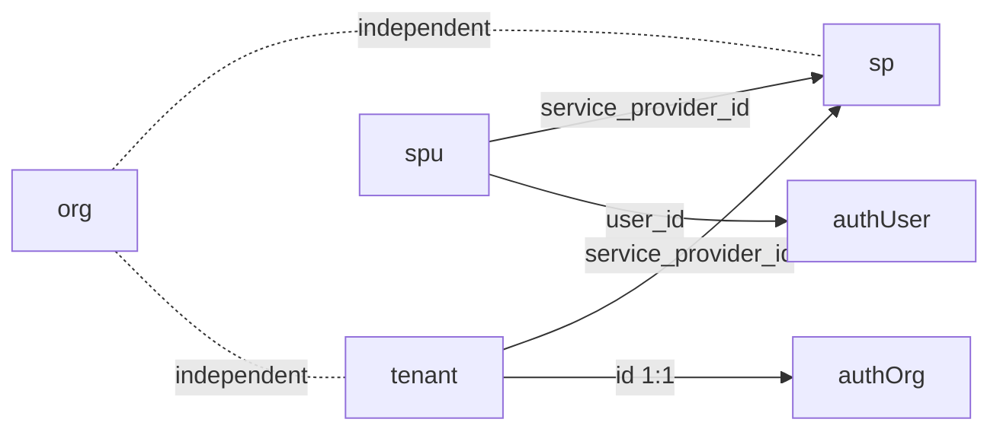

The Management Plane is the control-plane module managing tenants, service providers, managed organizations, and platform users.

## Module

```ts title="src/module.ts"
export class ManagementPlane implements Module {
  static create(config: ManagementPlaneConfig): ManagementPlane;
  readonly $name = "management"; // proxy key: p.management
  readonly $dependencies: readonly string[] = [];
}
```

## Configuration

```ts title="src/module.ts"
export type ManagementPlaneConfig = undefined;
```

```ts
import { ManagementPlane } from "@aspen-os/management";

const management = ManagementPlane.create(undefined);
```

No external config; DB/ACL/events declared via `$prepareInfra()`.

## Dependencies

No module dependencies (`$dependencies: []`). Unit bindings via `$initialize(units: { db: DatabaseUnit; auth: AuthUnit; pubsub: PubSubUnit })` — `db` for control-plane tables and `provisionTenant`/`seedTenantDb`, `auth` for better-auth organization creation in `tenants.onboard`, `pubsub` for domain events. `tenants` is a getter bound to the stored `db` (throws before `$initialize`); `serviceProviders`, `organizations`, `users` are readonly.

## Architecture



`$prepareInfra()` returns control-plane schemas (`tenant`, `service_provider`, `service_provider_user`, `managed_organization`), empty tenant schemas, merged ACL, and domain events.

## Key Concepts

### Tenants

Control-plane companion to better-auth `organization` (shared `id`). Lifecycle via `activate`/`suspend`/`reactivate`/`churn`; SP assignment via `assignServiceProvider`/`unassignServiceProvider`; `onboard` provisions the tenant DB and seeds the `organization` row on isolated tenancy.

### Service Providers

Implementation partners (`service_provider`). Status `active`/`inactive`; assigned tenants and users queried via `listAssignedTenants`/`listUsers`.

### Managed Organizations

Platform-level organizations (`managed_organization`, PG `managed_organization`) to avoid collision with better-auth `organization`. CRUD via `organizations` group.

### Platform Users

Better-auth `user` rows plus `service_provider_user` membership (1:1 user→SP). Role `sp_user` requires an SP assignment; other roles must not have one.

## Relationships



Soft logical links; uniqueness on `service_provider_user (service_provider_id, user_id)` and `(user_id)` enforces 1:1 user→SP.

<Callout type="info">
  `tenants.onboard` creates the better-auth `organization` via `AuthUnit` and deletes it if
  `provisionTenant` fails. `update` cannot change `tenant.status` — use lifecycle transitions.
</Callout>
