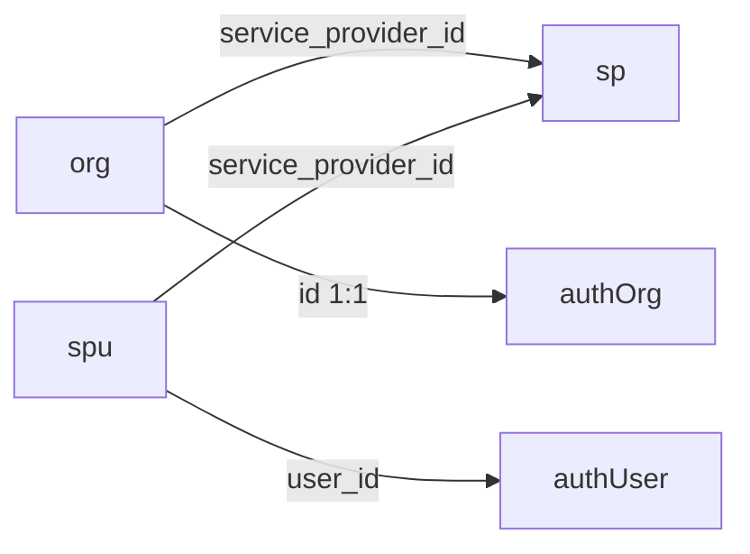

The Management Plane is the control-plane module managing tenants, service providers, managed organizations, and platform users.

## Module

```ts title="src/module.ts"
export class ManagementPlane implements Module {
  static create(config: ManagementPlaneConfig): ManagementPlane;
  readonly $name = "management"; // proxy key: p.management
  readonly $dependencies: readonly string[] = [];
}
```

## Configuration

```ts title="src/module.ts"
export type ManagementPlaneConfig = undefined;
```

```ts
import { ManagementPlane } from "@aspen-os/management";

const management = ManagementPlane.create(undefined);
```

No external config; DB/ACL/events declared via `$prepareInfra()`.

## Dependencies

No module dependencies (`$dependencies: []`). Unit bindings via `$initialize(units: Record<string, Unit>)` — `db` for control-plane tables and `provisionTenant`/`seedTenantDb`, `storage` for logo objects via `setManagementStorage()`. `tenants` is a getter bound to the stored `db` (throws before `$initialize`); `serviceProviders`, `organizations`, `users` are readonly. Logo bytes never touch the database; workflows in `services/logo-storage.ts` write through the Storage unit and persist only the logical key.

## Architecture

```mermaid
flowchart TB
  subgraph ControlPlane["Control-Plane Database"]
    org["managed_organization<br/>(tenant companion)<br/>branding.logo = Storage key"]
    sp["service_provider<br/>logo = Storage key"]
    spu["service_provider_user"]
    authOrg["organization<br/>(better-auth)<br/>name/slug/logo = Storage key"]
    authUser["user<br/>(better-auth)"]
  end
  subgraph TenantDB["Tenant Databases"]
    empty["tenant_schemas = {}"]
  end
  subgraph Storage["Storage (S3 + file_metadata)"]
    logos["logos/tenant|organization|service-provider/<id>/<file>"]
  end
  MP["ManagementPlane<br/>$name = management"]
  MP --> ControlPlane
  MP -. provisionTenant/seedTenantDb .-> TenantDB
  MP -. upload/remove/signed URLs .-> Storage
  authOrg -. logo key .-> logos
  org -. branding.logo key .-> logos
  sp -. logo key .-> logos
  org --- authOrg
```

`$prepareInfra()` returns control-plane schemas (`managed_organization`, `service_provider`, `service_provider_user`, `tenant_status` enum), empty tenant schemas, merged ACL, and domain events.

## Key Concepts

### Tenants

A tenant is a better-auth `organization` row plus its `managed_organization` companion (shared `id`, PK/FK). Lifecycle via `activate`/`suspend`/`reactivate`/`churn`; SP assignment via `assignServiceProvider`/`unassignServiceProvider`; `onboard` provisions the tenant DB, seeds the `organization` row, and inserts the companion. The tenant logo lives on better-auth `organization.logo` as a Storage logical key (`logos/tenant/<id>/<file>`); upload via `tenants.uploadLogo` / `tenants.issueLogoUploadUrl` + `tenants.attachLogo`, remove via `tenants.removeLogo`, display via `tenants.getLogoUrl`. The isolated database name is derived, not stored: `tenants.resolveDatabase` uses the configured `TenantResolver` or the `tenantDbPrefix_<tenantId>` convention.

### Service Providers

Implementation partners (`service_provider`). Status `active`/`inactive`; assigned tenants and users queried via `listAssignedTenants`/`listUsers`. `logo` is a Storage logical key (`logos/service-provider/<id>/<file>`); upload via `serviceProviders.uploadLogo` / `issueLogoUploadUrl` + `attachLogo`, remove via `removeLogo`, display via `getLogoUrl`.

### Managed Organizations

The `managed_organization` companion holds branding on top of the tenant lifecycle fields; `name`/`slug` live on better-auth `organization`. `organizations` exposes `get`/`list`/`update` plus the logo surface — `create` is gone because the companion is only created by `tenants.onboard`. `branding.logo` is a Storage logical key (`logos/organization/<id>/<file>`); upload via `organizations.uploadLogo` / `issueLogoUploadUrl` + `attachLogo`, remove via `removeLogo`, display via `getLogoUrl`. `update` accepts only Storage keys, never raw bytes or external URLs.

### Platform Users

Better-auth `user` rows plus `service_provider_user` membership (1:1 user→SP). Role `sp_user` requires an SP assignment; other roles must not have one.

## Relationships


```mermaid
flowchart LR
  org -- service_provider_id --> sp
  spu -- service_provider_id --> sp
  spu -- user_id --> authUser
  org -- id 1:1 --> authOrg
```

Soft logical links; uniqueness on `service_provider_user (service_provider_id, user_id)` and `(user_id)` enforces 1:1 user→SP.

<Callout type="info">
  `tenants.onboard` creates the better-auth `organization` via `AuthUnit`, deletes it if
  `provisionTenant` fails, then inserts the `managed_organization` companion. `update` cannot change
  `tenant.status` — use lifecycle transitions.
</Callout>
