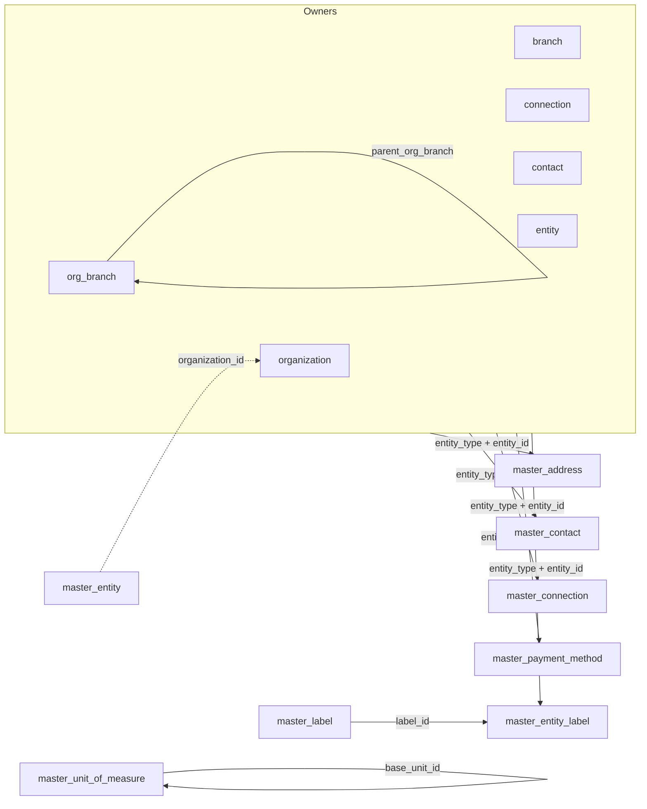

Tenant tables with `master_` and `org_branch` prefixes; `control_plane_schemas = {}`. Shared columns `id` (text PK, UUIDv7), `created_at`, `updated_at` (timestamptz) stated once — not per table.

## Enums

| Enum                                   | Values                                                                                                                                                                          |
| -------------------------------------- | ------------------------------------------------------------------------------------------------------------------------------------------------------------------------------- |
| `master_entity_type`                   | `branch`, `connection`, `contact`, `entity`, `organization`, `org_branch`                                                                                                       |
| `master_entity_type_enum`              | `bank`, `clinic`, `customer`, `government`, `hospital`, `insurer`, `laboratory`, `other`, `partner`, `pharmacy`, `regulator`, `staffing_agency`, `training_institute`, `vendor` |
| `master_entity_status_enum`            | `active`, `archived`, `inactive`                                                                                                                                                |
| `master_contact_type`                  | `bank`, `client`, `insurer`, `investor`, `other`, `parent_company`, `partner`, `regulator`, `subsidiary`, `vendor`                                                              |
| `master_integration_type`              | `api_key`, `basic_auth`, `database`, `oauth2`, `other`, `webhook`                                                                                                               |
| `master_connection_status`             | `active`, `expired`, `inactive`, `revoked`                                                                                                                                      |
| `master_uom_category_enum`             | `area`, `count`, `data`, `length`, `mass`, `other`, `temperature`, `time`, `volume`                                                                                             |
| `master_payment_method_type_enum`      | `bank_account`, `card`, `cheque`, `imps`, `upi`                                                                                                                                 |
| `master_payment_method_status_enum`    | `active`, `archived`, `inactive`                                                                                                                                                |
| `master_payment_method_direction_enum` | `both`, `inbound`, `outbound`                                                                                                                                                   |
| `master_card_brand_enum`               | `amex`, `mastercard`, `other`, `rupay`, `visa`                                                                                                                                  |
| `org_branch_type`                      | `factory`, `headquarters`, `office`, `other`, `remote`, `store`, `warehouse`                                                                                                    |

## Tables

### `master_address`

| Column        | Type                 | Description       |
| ------------- | -------------------- | ----------------- |
| `entity_type` | `master_entity_type` | Owner type        |
| `entity_id`   | text                 | Owner row id      |
| `label`       | text                 | Address label     |
| `line1`       | text                 | Required          |
| `line2`       | text                 |                   |
| `city`        | text                 |                   |
| `state`       | text                 |                   |
| `postal_code` | text                 |                   |
| `country`     | text                 | Uppercase alpha-2 |
| `metadata`    | jsonb                |                   |

Indexes: `idx_master_address_entity` (`entity_type`, `entity_id`), `idx_master_address_country` (`country`).

### `master_contact`

| Column            | Type                            | Description                        |
| ----------------- | ------------------------------- | ---------------------------------- |
| `name`            | text                            | Derived `first_name` + `last_name` |
| `first_name`      | text                            |                                    |
| `last_name`       | text                            |                                    |
| `email`           | text                            |                                    |
| `phone`           | text                            |                                    |
| `title`           | text                            | Job title                          |
| `company`         | text                            |                                    |
| `type`            | `master_contact_type`           |                                    |
| `linked_user_id`  | text                            | Auth user link                     |
| `created_by`      | text                            |                                    |
| `is_removed`      | boolean                         | Default `false`                    |
| `deletion_reason` | text                            | Required on `remove`               |
| `removed_at`      | timestamptz                     |                                    |
| `entity_type`     | `master_entity_type` (nullable) | Null for global                    |
| `entity_id`       | text (nullable)                 | Null for global                    |
| `metadata`        | jsonb                           |                                    |

Indexes: `idx_master_contact_email` (`email`), `idx_master_contact_entity` (`entity_type`, `entity_id`), `idx_master_contact_type` (`type`).

### `master_connection`

| Column           | Type                       | Description              |
| ---------------- | -------------------------- | ------------------------ |
| `entity_type`    | `master_entity_type`       | Owner type               |
| `entity_id`      | text                       | Owner row id             |
| `name`           | text                       |                          |
| `type`           | `master_integration_type`  |                          |
| `status`         | `master_connection_status` | Default `active`         |
| `base_url`       | text                       | Endpoint URL             |
| `description`    | text                       |                          |
| `credential_ref` | text                       | kvStore secret reference |
| `last_tested_at` | timestamptz                |                          |
| `last_used_at`   | timestamptz                |                          |
| `metadata`       | jsonb                      |                          |

Indexes: `idx_master_connection_entity` (`entity_type`, `entity_id`), `idx_master_connection_status` (`status`), `idx_master_connection_type` (`type`).

### `master_entity`

| Column                | Type                        | Description            |
| --------------------- | --------------------------- | ---------------------- |
| `name`                | text                        | Legal/trade name       |
| `code`                | text (unique)               | Unique per tenant      |
| `type`                | `master_entity_type_enum`   |                        |
| `status`              | `master_entity_status_enum` | Default `active`       |
| `industry`            | text                        |                        |
| `website`             | text                        |                        |
| `phone`               | text                        |                        |
| `email`               | text                        |                        |
| `tax_id`              | text                        | VAT/GST                |
| `registration_number` | text                        |                        |
| `founded_date`        | date                        |                        |
| `timezone`            | text                        | IANA                   |
| `locale`              | text                        | BCP-47                 |
| `organization_id`     | text                        | Soft FK → organization |
| `metadata`            | jsonb                       |                        |

Indexes: `idx_master_entity_type` (`type`), `idx_master_entity_status` (`status`), `idx_master_entity_organization` (`organization_id`), unique `idx_master_entity_code` (`code`).

### `master_label`

| Column       | Type | Description             |
| ------------ | ---- | ----------------------- |
| `name`       | text |                         |
| `color`      | text |                         |
| `scope_type` | text | Nullable; null = global |
| `scope_id`   | text | Nullable                |

Indexes: `idx_master_label_scope` (`scope_type`, `scope_id`), `idx_master_label_name` (`name`), unique `uq_master_label_scope_name` (`scope_type`, `scope_id`, `name`) nulls-not-distinct.

### `master_entity_label`

| Column        | Type                       | Description            |
| ------------- | -------------------------- | ---------------------- |
| `label_id`    | text (FK → `master_label`) |                        |
| `entity_type` | text                       | Polymorphic owner type |
| `entity_id`   | text                       | Polymorphic owner id   |
| `applied_by`  | text                       |                        |
| `applied_at`  | timestamptz                |                        |

Indexes: unique `uq_master_entity_label_unique` (`entity_type`, `entity_id`, `label_id`), `idx_master_entity_label_label` (`label_id`), `idx_master_entity_label_entity` (`entity_type`, `entity_id`).

### `org_branch`

| Column              | Type              | Description           |
| ------------------- | ----------------- | --------------------- |
| `code`              | text (unique)     | Branch code           |
| `name`              | text              |                       |
| `type`              | `org_branch_type` |                       |
| `capacity`          | integer           |                       |
| `parent_org_branch` | text              | Self-ref; null = root |
| `timezone`          | text              |                       |
| `opened_date`       | date              |                       |
| `closed_date`       | date              |                       |
| `metadata`          | jsonb             |                       |

Indexes: `idx_org_branch_type` (`type`), `idx_org_branch_parent` (`parent_org_branch`).

### `master_payment_method`

| Column                | Type                                   | Description             |
| --------------------- | -------------------------------------- | ----------------------- |
| `entity_type`         | `master_entity_type`                   | Owner type              |
| `entity_id`           | text                                   | Owner row id            |
| `name`                | text                                   | Display name            |
| `type`                | `master_payment_method_type_enum`      |                         |
| `direction`           | `master_payment_method_direction_enum` |                         |
| `status`              | `master_payment_method_status_enum`    | Default `active`        |
| `code`                | text                                   |                         |
| `bank_name`           | text                                   |                         |
| `account_holder_name` | text                                   |                         |
| `account_number`      | text                                   |                         |
| `account_type`        | text                                   |                         |
| `branch_name`         | text                                   |                         |
| `routing_number`      | text                                   |                         |
| `swift_code`          | text                                   |                         |
| `currency`            | text                                   |                         |
| `card_brand`          | `master_card_brand_enum` (nullable)    |                         |
| `card_last4`          | text                                   | Masked only             |
| `card_expiry_month`   | integer                                | 1–12                    |
| `card_expiry_year`    | integer                                | 4-digit                 |
| `cheque_series`       | text                                   |                         |
| `upi_id`              | text                                   | VPA                     |
| `details`             | jsonb                                  | Type-specific extension |
| `is_primary`          | boolean                                | Default `false`         |
| `is_active`           | boolean                                | Default `true`          |
| `metadata`            | jsonb                                  |                         |

Indexes: `idx_master_payment_method_entity` (`entity_type`, `entity_id`), `idx_master_payment_method_type` (`type`), `idx_master_payment_method_is_primary` (`is_primary`), `idx_master_payment_method_is_active` (`is_active`).

### `master_setting`

Key–value store; `user_id` null holds tenant-wide `org.*` keys.

| Column    | Type                | Description                 |
| --------- | ------------------- | --------------------------- |
| `key`     | text                | `org.id`, `org.branding`, … |
| `user_id` | text                | Null for tenant-wide        |
| `value`   | jsonb (`JsonValue`) |                             |

Indexes: `idx_master_setting_user` (`user_id`), unique `uq_master_setting_user_key` (`user_id`, `key`) nulls-not-distinct.

### `master_unit_of_measure`

One base unit per category (workflow-enforced); derived units reference the base.

| Column              | Type                       | Description            |
| ------------------- | -------------------------- | ---------------------- |
| `name`              | text                       |                        |
| `code`              | text (unique)              | e.g. `kg`              |
| `category`          | `master_uom_category_enum` |                        |
| `symbol`            | text                       |                        |
| `decimal_places`    | integer                    | Default `2`            |
| `is_base_unit`      | boolean                    | Default `false`        |
| `base_unit_id`      | text                       | Self-FK; null for base |
| `conversion_factor` | numeric                    | Null for base          |
| `is_active`         | boolean                    | Default `true`         |
| `metadata`          | jsonb                      |                        |

Indexes: unique `idx_master_uom_code` (`code`), `idx_master_uom_category` (`category`), `idx_master_uom_is_active` (`is_active`).

## Relationships

Soft (logical, workflow-enforced) — no DB-level FKs to owners.

