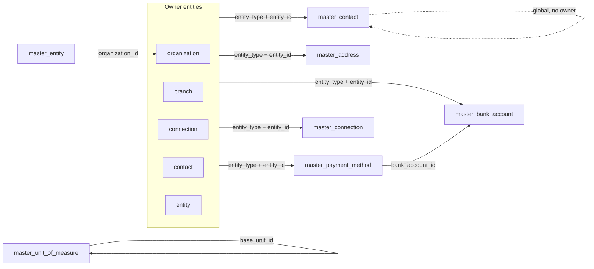

Tenant tables (`master_` prefix) and 13 enums. Shared columns: `id` (text PK, UUIDv7), `created_at`, `updated_at` (timestamptz).

## Enums

| Enum                                   | Values                                                                                                                                                                          |
| -------------------------------------- | ------------------------------------------------------------------------------------------------------------------------------------------------------------------------------- |
| `master_entity_type`                   | `organization`, `branch`, `connection`, `contact`, `entity`                                                                                                                     |
| `master_contact_type`                  | `client`, `vendor`, `partner`, `subsidiary`, `parent_company`, `investor`, `regulator`, `insurer`, `bank`, `other`                                                              |
| `master_integration_type`              | `api_key`, `oauth2`, `webhook`, `basic_auth`, `database`, `other`                                                                                                               |
| `master_connection_status`             | `active`, `inactive`, `expired`, `revoked`                                                                                                                                      |
| `master_entity_type_enum`              | `customer`, `vendor`, `partner`, `hospital`, `clinic`, `laboratory`, `pharmacy`, `insurer`, `regulator`, `bank`, `staffing_agency`, `training_institute`, `government`, `other` |
| `master_entity_status_enum`            | `active`, `inactive`, `archived`                                                                                                                                                |
| `master_uom_category_enum`             | `length`, `mass`, `volume`, `count`, `time`, `area`, `temperature`, `data`, `other`                                                                                             |
| `master_payment_method_type_enum`      | `bank_account`, `card`, `upi`, `imps`, `cheque`                                                                                                                                 |
| `master_payment_method_status_enum`    | `active`, `inactive`, `archived`                                                                                                                                                |
| `master_payment_method_direction_enum` | `inbound`, `outbound`, `both`                                                                                                                                                   |
| `master_card_brand_enum`               | `visa`, `mastercard`, `amex`, `rupay`, `other`                                                                                                                                  |
| `master_filter_view_access`            | `personal`, `global`                                                                                                                                                            |
| `master_filter_view_type`              | `list`, `board`, `calendar`, `timeline`                                                                                                                                         |

## Tables

Polymorphic tables share `entity_type` + `entity_id`. `master_unit_of_measure` is tenant-wide (no scope pair); `master_setting` scopes by key prefix.

### `master_contact`

Contact record, optionally owner-scoped or global.

| Column            | Type                | Description                                |
| ----------------- | ------------------- | ------------------------------------------ |
| `name`            | text                | Derived from `first_name` + `last_name`    |
| `first_name`      | text                | Split first name                           |
| `last_name`       | text                | Split last name                            |
| `email`           | text                | Contact email                              |
| `phone`           | text                | Contact phone                              |
| `title`           | text                | Job title                                  |
| `company`         | text                | Company name                               |
| `type`            | master_contact_type | Defaults to `other`                        |
| `linked_user_id`  | text                | Internal AuthUnit user link                |
| `created_by`      | text                | Who added the contact                      |
| `is_removed`      | boolean             | Soft-delete flag, default `false`          |
| `deletion_reason` | text                | Required on `remove`                       |
| `removed_at`      | timestamptz         | When removed                               |
| `entity_type`     | master_entity_type  | Owner type, nullable for global contacts   |
| `entity_id`       | text                | Owner row id, nullable for global contacts |
| `metadata`        | jsonb               | Flexible metadata                          |

Indexes: `idx_master_contact_email` (`email`), `idx_master_contact_entity` (`entity_type`, `entity_id`), `idx_master_contact_type` (`type`).

### `master_address`

Canonical address shape referenced via `entityType`/`entityId`. Country is ISO 3166-1 alpha-2, stored uppercase.

| Column        | Type  | Description       |
| ------------- | ----- | ----------------- |
| `label`       | text  | Address label     |
| `line1`       | text  | Required          |
| `line2`       | text  |                   |
| `city`        | text  |                   |
| `state`       | text  | State/Province    |
| `postal_code` | text  |                   |
| `country`     | text  | Uppercase alpha-2 |
| `metadata`    | jsonb |                   |

Indexes: `idx_master_address_entity` (`entity_type`, `entity_id`), `idx_master_address_country` (`country`).

### `master_bank_account`

Bank account record. `is_primary` and `is_active` are scoped per `(entity_type, entity_id)`.

| Column                | Type    | Description   |
| --------------------- | ------- | ------------- |
| `account_holder_name` | text    |               |
| `account_number`      | text    |               |
| `account_type`        | text    |               |
| `bank_name`           | text    |               |
| `branch_name`         | text    |               |
| `routing_number`      | text    |               |
| `swift_code`          | text    |               |
| `currency`            | text    | Default `USD` |
| `is_active`           | boolean |               |
| `is_primary`          | boolean |               |
| `metadata`            | jsonb   |               |

Indexes: (`entity_type`, `entity_id`), `is_primary`, `is_active`.

### `master_connection`

Integration connection. No plaintext credentials — `credential_ref` points at the encrypted kvStore secret.

| Column           | Type                     | Description              |
| ---------------- | ------------------------ | ------------------------ |
| `name`           | text                     |                          |
| `type`           | master_integration_type  |                          |
| `status`         | master_connection_status | Default `active`         |
| `base_url`       | text                     | Endpoint URL             |
| `description`    | text                     |                          |
| `credential_ref` | text                     | kvStore secret reference |
| `last_tested_at` | timestamptz              | Last successful test     |
| `last_used_at`   | timestamptz              | Last use                 |
| `metadata`       | jsonb                    |                          |

Indexes: `idx_master_connection_entity` (`entity_type`, `entity_id`), `idx_master_connection_status` (`status`), `idx_master_connection_type` (`type`).

### `master_entity`

Tenant-level business party. Optional `organization_id` links to an `organization` profile row.

| Column                | Type                      | Description                  |
| --------------------- | ------------------------- | ---------------------------- |
| `name`                | text (not null)           | Legal/trade name             |
| `code`                | text (unique)             | Unique per tenant            |
| `type`                | master_entity_type_enum   |                              |
| `status`              | master_entity_status_enum | Default `active`             |
| `industry`            | text                      |                              |
| `website`             | text                      |                              |
| `phone`               | text                      |                              |
| `email`               | text                      |                              |
| `tax_id`              | text                      | VAT/GST/tax registration     |
| `registration_number` | text                      | Company registration number  |
| `founded_date`        | date                      |                              |
| `timezone`            | text                      | IANA timezone                |
| `locale`              | text                      | BCP-47 locale                |
| `organization_id`     | text                      | FK → organization (optional) |
| `metadata`            | jsonb                     |                              |

Indexes: `idx_master_entity_type` (`type`), `idx_master_entity_status` (`status`), `idx_master_entity_organization` (`organization_id`), unique `idx_master_entity_code` (`code`).

### `master_unit_of_measure`

Tenant-wide reference data. One base unit per category (workflow-enforced); derived units reference the base via `base_unit_id` + `conversion_factor`.

| Column              | Type                     | Description                   |
| ------------------- | ------------------------ | ----------------------------- |
| `name`              | text (not null)          | e.g. "Kilogram"               |
| `code`              | text (not null, unique)  | e.g. `kg`                     |
| `category`          | master_uom_category_enum |                               |
| `symbol`            | text                     | e.g. `kg`                     |
| `decimal_places`    | integer                  | Default `2`                   |
| `is_base_unit`      | boolean                  | Default `false`               |
| `base_unit_id`      | text                     | Null for base units (self-FK) |
| `conversion_factor` | numeric                  | Null for base units           |
| `is_active`         | boolean                  | Default `true`                |
| `metadata`          | jsonb                    |                               |

Indexes: unique `idx_master_uom_code` (`code`), `idx_master_uom_category` (`category`), `idx_master_uom_is_active` (`is_active`).

### `master_payment_method`

Payment mode per `(entity_type, entity_id)`. `is_primary` is scoped per `(entity_type, entity_id, direction)`. Card data is masked-only (brand/last4/expiry; no PAN).

| Column              | Type                                 | Description                        |
| ------------------- | ------------------------------------ | ---------------------------------- |
| `type`              | master_payment_method_type_enum      |                                    |
| `name`              | text (not null)                      | Display name                       |
| `code`              | text                                 |                                    |
| `direction`         | master_payment_method_direction_enum |                                    |
| `status`            | master_payment_method_status_enum    | Default `active`                   |
| `bank_account_id`   | text                                 | Logical FK → `master_bank_account` |
| `bank_name`         | text                                 | Denormalized display               |
| `card_brand`        | master_card_brand_enum               |                                    |
| `card_last4`        | text                                 | Masked only                        |
| `card_expiry_month` | integer                              | 1–12                               |
| `card_expiry_year`  | integer                              | 4-digit                            |
| `upi_id`            | text                                 | VPA, e.g. `business@okhdfcbank`    |
| `cheque_series`     | text                                 | Cheque prefix/leaf range           |
| `details`           | jsonb                                | Type-specific extension            |
| `is_primary`        | boolean                              | Default `false`                    |
| `entity_type`       | master_entity_type                   | Owner type                         |
| `entity_id`         | text (not null)                      | Owner row id                       |
| `is_active`         | boolean                              | Default `true`                     |
| `metadata`          | jsonb                                |                                    |

Indexes: `idx_master_payment_method_entity` (`entity_type`, `entity_id`), `idx_master_payment_method_type` (`type`), `idx_master_payment_method_is_primary` (`is_primary`), `idx_master_payment_method_is_active` (`is_active`).

### `master_filter_view`

Cross-domain saved filter/sort/group config. `is_default` is unique per `(owner_id, domain, project_id)`.

| Column       | Type                      | Description                         |
| ------------ | ------------------------- | ----------------------------------- |
| `name`       | text (not null)           |                                     |
| `domain`     | text (not null)           | Free-form `<module>:<entity>`       |
| `conditions` | jsonb                     | Default `[]`                        |
| `sort`       | jsonb                     | Default `[]`                        |
| `group_by`   | text                      |                                     |
| `view_type`  | master_filter_view_type   | Default `list`                      |
| `access`     | master_filter_view_access | Default `personal`                  |
| `owner_id`   | text (not null)           | Owning user                         |
| `project_id` | text                      | Tasks scope; null for other domains |
| `is_default` | boolean                   | Default `false`                     |
| `metadata`   | jsonb                     |                                     |

Indexes: `idx_master_filter_view_domain_access` (`domain`, `access`), `idx_master_filter_view_owner` (`owner_id`), `idx_master_filter_view_project` (`project_id`).

### `master_setting`

Tenant key–value store. `org.*` keys are tenant-wide (`user_id` null); other keys are per-user.

| Column    | Type  | Description                 |
| --------- | ----- | --------------------------- |
| `key`     | text  | `org.id`, `org.branding`, … |
| `user_id` | text  | Null for tenant-wide rows   |
| `value`   | jsonb | Setting value               |

Indexes: `idx_master_setting_user` (`user_id`); unique `uq_master_setting_user_key` (`user_id`, `key`), nulls-not-distinct.

## Relationships

References are soft (logical, no DB-level FKs). Primary flags and the UOM base-unit invariant are workflow-enforced.

