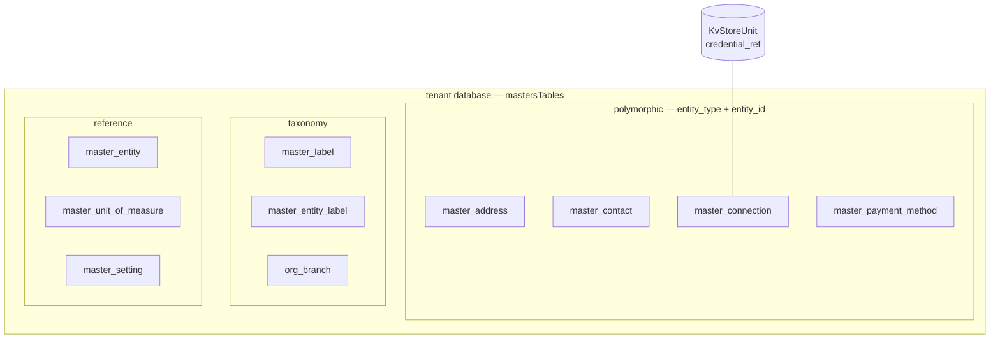
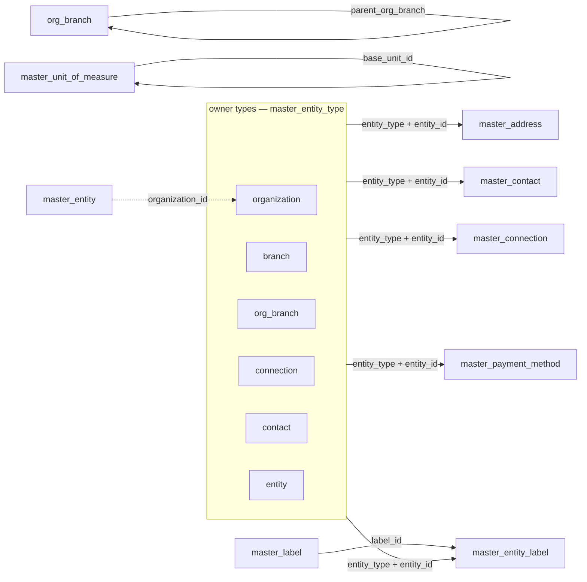

The Masters module owns polymorphic master data — contacts, addresses, and connections plus tenant reference data — with shared label and org-branch taxonomy.

## Module

```ts title="src/module.ts"
export class Masters implements Module {
  static create(config?: MastersModuleConfig): Masters;
  readonly $name = "masters"; // proxy key: p.masters
  readonly $dependencies: readonly string[] = [];
  $initialize(units: { db: DatabaseUnit; kvStore: KvStoreUnit }): void;
  $prepareInfra(): ModuleInfra { auth: { acl }, db: { control_plane_schemas, tenant_schemas }, events }
}
```

## Configuration

```ts title="src/module.ts"
export type MastersModuleConfig = undefined;

const masters = Masters.create();
```

No configuration — `Masters.create()` takes an optional `undefined`.

## Dependencies

| Dependency | Kind                 | Purpose                                                                                            |
| ---------- | -------------------- | -------------------------------------------------------------------------------------------------- |
| `db`       | unit (`$initialize`) | Tenant tables (`tenant_schemas = mastersTables`); `control_plane_schemas = {}`                     |
| `kvStore`  | unit (`$initialize`) | Encrypted credential storage for `master_connection.credential_ref`; bound to `connections` getter |

No module dependencies (`$dependencies = []`).

## Architecture



All tables are tenant schemas (`master_` / `org_branch`); there are no control-plane tables.

## Key concepts

### Polymorphic ownership

`master_address`, `master_contact`, `master_connection`, and `master_payment_method` carry `entity_type` (`master_entity_type`) + `entity_id`. `master_contact` allows `null` for global address-book entries. Other tables are tenant-wide.

### Labels and entity labels

`master_label` is the taxonomy; `master_entity_label` is the join (`entity_type`, `entity_id`, `label_id`, `applied_by`). Unique on `(entity_type, entity_id, label_id)`.

### Org branches

`org_branch` models organizational hierarchy with `code` (unique), `type` (`org_branch_type`), `parent_org_branch` (self-ref, nullable), and optional `opened_date` / `closed_date` / `capacity`. Workflows: `create`, `get`, `list`, `tree`, `update` (exposed as `p.masters.orgBranches`).

### Connections and secrets

`master_connection` stores `type`, `status`, `base_url`, and `credential_ref` — never plaintext. `connections.create` and `rotateCredential` write the secret to `kvStore`; `check` tests `base_url` and records `last_tested_at`.

### Settings scoping

`master_setting` is a KV store. `user_id` null rows hold tenant-wide `org.*` keys; other rows are per-user. Unique on `(user_id, key)` nulls-not-distinct.

## Relationships



All FKs are soft (logical, workflow-enforced). `master_entity_label` and `org_branch` parent are app-enforced; UOM base-unit invariant is step-enforced.

<Callout type="info">
Masters does not own notes — use `@aspen-os/notes` with `scopeType = masters:<entityType>`. It does not own a `master_bank_account` or `master_filter_view`; payment details live on `master_payment_method`.
</Callout>
