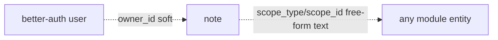

The Notes module defines tenant tables with no prefix. Shared columns `id` (text PK, UUIDv7), `created_at`, `updated_at` (timestamptz) apply to all tables and are not repeated per table.

## Enums

| Enum              | Values                                                             |
| ----------------- | ------------------------------------------------------------------ |
| `notes_access`    | `personal`, `global`                                               |
| `notes_note_type` | `general`, `call`, `email`, `meeting`, `contract_renewal`, `issue` |

## Tables

### `note`

A first-class note: quick-capture (`title` optional) or a scoped annotation via `scope_type`/`scope_id`. `access` defaults to `personal`; `owner_id` defaults from the creating actor.

| Column       | Type              | Description                                                 |
| ------------ | ----------------- | ----------------------------------------------------------- |
| `title`      | text              | Optional — untitled quick-capture allowed                   |
| `body`       | text (not null)   | Markdown/text content                                       |
| `type`       | notes_note_type   | `NOTE_TYPE`, default `general`                              |
| `access`     | notes_access      | `personal` / `global`, default `personal`                   |
| `owner_id`   | text (not null)   | Soft FK → better-auth `user` (creating actor)               |
| `scope_type` | text              | `<module>:<entity>` registry value (e.g. `masters:contact`) |
| `scope_id`   | text              | Owning row's UUIDv7 id                                      |
| `tags`       | text[] (not null) | Default `[]` — no separate tag entity in v1                 |
| `metadata`   | jsonb (not null)  | Opaque — attachment refs, structured fields; default `{}`   |

Indexes: `idx_note_owner` (`owner_id`), `idx_note_access` (`access`), `idx_note_scope` (`scope_type`, `scope_id`).

## Relationships

The polymorphic scope is a soft logical link (no FK), so notes outlive the scoped entity's module.
