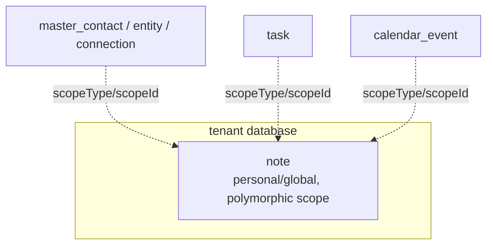
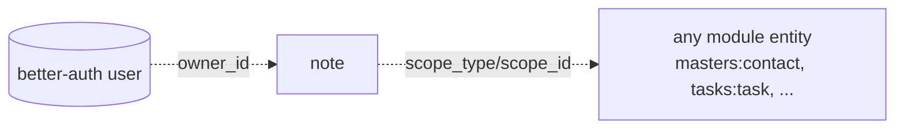

The Notes module owns the first-class `note` entity — optional `title`/`body`, `personal`/`global` access, `tags`, and an optional polymorphic `(scopeType, scopeId)` scope with a `type` (`NOTE_TYPE`).

## Module

```ts title="src/module.ts"
export class Notes implements Module {
  static create(config?: NotesModuleConfig): Notes;
  readonly $name = "notes"; // proxy key: p.notes
  readonly $dependencies: readonly string[] = [];
}
```

## Configuration

```ts title="src/module.ts"
export type NotesModuleConfig = undefined;

Notes.create(); // stateless — $initialize / $prepareRuntime / $cleanup are empty
```

## Dependencies

No module dependencies (`$dependencies: []`). Stateless — no unit bindings; workflows receive `db` via the platform context.

## Architecture



The single `note` table is a tenant schema; there are no control-plane tables.

## Key concepts

### Polymorphic scope

`scopeType` is a free-form `<module>:<entity>` registry value (e.g. `masters:contact`, `tasks:task`, `calendar:event`); `scopeId` is the owning row's UUIDv7 id. Both required together; half-scoped notes are rejected. Unscoped notes are standalone quick-capture entries.

### Access inheritance

Every note has `access` (`personal` default or `global`) plus `ownerId` derived from `actorId` at creation. Runtime enforcement via `workflow-steps/access-service.ts`:

```text
assertCanAccess  = global OR ownerId === actorId OR tenant admin   (read)
assertCanMutate  = ownerId === actorId OR tenant admin             (update/delete)
```

`create` accepts an explicit `ownerId` only from a tenant admin.

## Relationships



The polymorphic scope is intentionally free-form text (no FK) so notes outlive the scoped entity's module.

## Module structure

```text
packages/notes/src/
  module.ts         # $name, stateless lifecycle
  auth.ts           # defineAcl 1 resource
  pubsub.ts         # 3 note events
  db-schemas/       # note table + 2 enums
  workflows/        # notes group — one file per action
  workflow-steps/   # fetch-note, access-service
  schemas/          # Valibot validation
```
