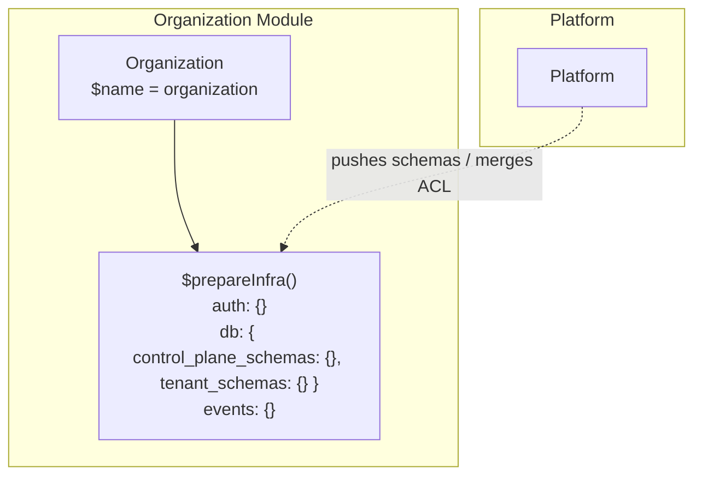
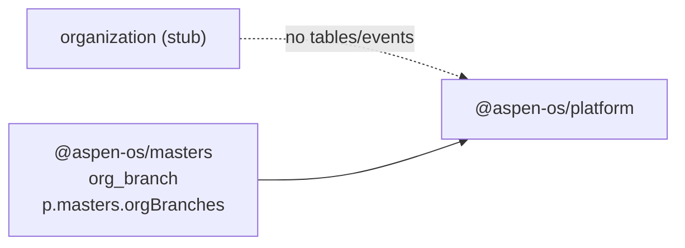

The Organization module is a stub placeholder with no domain, tables, events, or workflows; branch hierarchy lives in `@aspen-os/masters` as `org_branch` via `p.masters.orgBranches`.

## Module

```ts title="src/module.ts"
export class Organization implements Module {
  static create(config: OrganizationConfig = { country: "INDIA" }): Organization;
  readonly $name = "organization"; // proxy key: p.organization
  readonly $dependencies: readonly string[] = [];
}
```

## Configuration

```ts title="src/module.ts"
export interface OrganizationConfig {
  country: "INDIA";
}
```

```ts
import { Organization } from "@aspen-os/organization";

const organization = Organization.create(); // defaults to { country: "INDIA" }
const custom = Organization.create({ country: "INDIA" });
```

Reserved for future country-specific validation; currently unused.

## Dependencies

No module dependencies (`$dependencies: []`). No unit bindings — `$initialize` / `$prepareRuntime` / `$cleanup` are no-ops.

## Architecture



`$prepareInfra()` returns empty `control_plane_schemas`, `tenant_schemas`, `events`, and `defineAcl({})`.

## Relationships



Branch domain was moved to Masters — see `masters:org_branch` and `p.masters.orgBranches` (`branches` deprecated alias).

<Callout type="info">
  This is a scaffold stub per `.agents/skills/write-module/SKILL.md`. Do not add branch logic here —
  use `@aspen-os/masters`.
</Callout>
