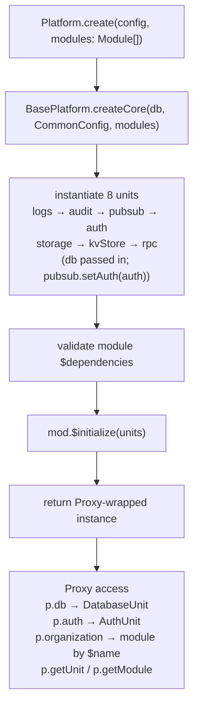
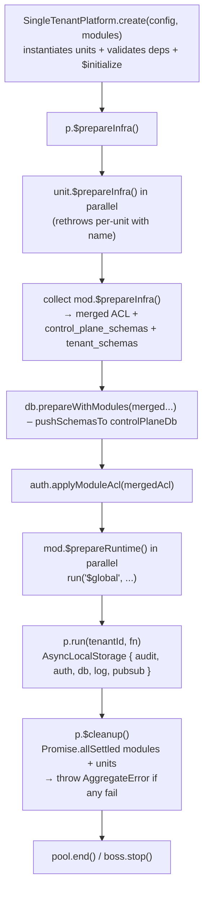
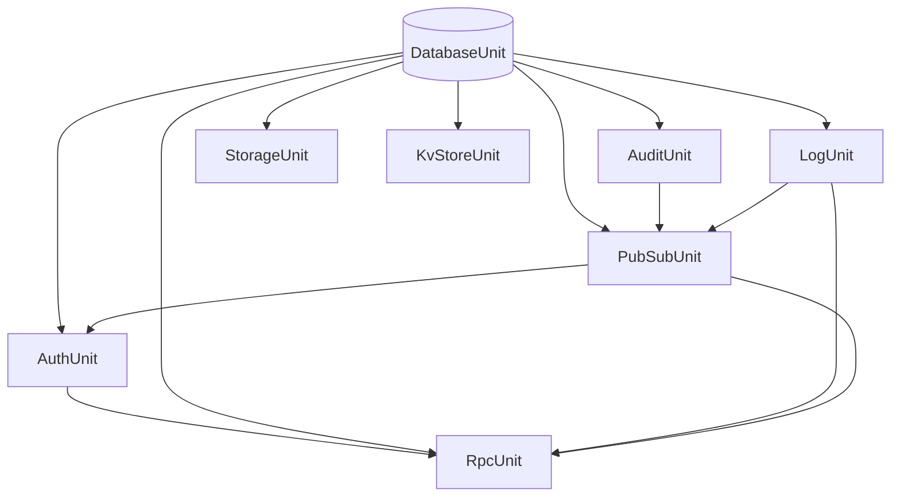

The platform is organized around three concepts: **units** (infrastructure), **modules** (domain logic), and the platform **orchestrator** — one of three platform classes — that wires them together.

## Entry Surfaces

`@aspen-os/platform` declares three subpaths in `exports`:

```json title="package.json"
{
  "exports": {
    "./client": "./.output/client/index.js",
    "./server": "./.output/server/index.js",
    "./server/db-schemas": "./.output/server/db/schema/index.js"
  }
}
```

No bare `"."` entry — import via subpaths. `./server/db-schemas` re-exports the platform's Drizzle schemas (`audit_log`, `workflow_runs`, etc.) for external tooling.

### Server (`@aspen-os/platform/server`)

Exports three platform classes, all extending `BasePlatform`:

- `SingleTenantPlatform` — single DB, `run(tenantId, fn)` with `"$global"` sentinel
- `SharedTenantPlatform` — one DB with RLS, `run(tenantId, fn)`
- `IsolatedTenantPlatform` — DB-per-tenant, `run(tenantId, fn)` with per-tenant pools (overrides `$prepareInfra`)

Also exports:

- `BasePlatform`, `CommonConfig` type
- `getContext()` — access `AsyncLocalStorage` inside `run()`
- `Workflow`, `WorkflowStep` — durable workflow builder
- `Unit`, `Module` interfaces, `ModuleInfra` type
- `defineAcl`, `AclDeclaration`
- `isGlobalTenantId`, `generateUuidv7`, `uuidv7`
- All 8 unit classes and their config types
- `PlatformInstance`, `PlatformUnits`, `TenancyMode`, `TenantResolver` types
- `context`, `password`, `EmailSchema` etc.

### Client (`@aspen-os/platform/client`)

Exports a single `Platform` class (browser-side, 3 units: `auth`, `logs`, `rpc` stubs). Client `AuthUnit` takes only `AuthConfig`; no `db`, no tenancy.

<Callout type="warn">
  Server `run(tenantId, fn)` requires a tenant id (`"$global"` for control-plane / single-tenant). Client `Platform.run(fn)` takes **no** tenant id — it sets `{ auth, logs, rpc }` on `AsyncLocalStorage` and invokes `fn()` synchronously.
</Callout>

## Configuration

Each platform class extends `CommonConfig` with its own `db` shape:

```ts title="src/server/base-platform.ts"
type CommonConfig = {
  auth: AuthConfig;
  kvStore: KvStoreConfig;
  logs: LogConfig;
  pubsub: PubSubConfig;
  rpc: RpcConfig;
  storage: StorageConfig;
};
// SingleTenantConfig  = CommonConfig & { db: DatabaseConfig }
// SharedTenantConfig  = CommonConfig & { db: DatabaseConfig }
// IsolatedTenantConfig= CommonConfig & { db: IsolatedTenantDatabaseConfig }
```

`CommonConfig` has no `db` — the tenancy mode is the `DatabaseUnit` constructor's second arg, not a config field. `IsolatedTenantDatabaseConfig` carries `controlPlaneDbName`, `tenantDbPrefix`, `tenantDbDefaults`, and a `TenantResolver`.

## Architecture



## Lifecycle



### `create(config, modules)`

Static factory — the **only** way to construct a platform. Modules are an **array**, not an object:

```ts
const p = SingleTenantPlatform.create(config, [organizationModule]);
```

Inside `createCore()`: instantiate units in dependency order, cross-wire `pubsub.setAuth(auth)`, validate `$dependencies`, call `$initialize`, return Proxy.

### `$prepareInfra()`

Base implementation: runs every unit's `$prepareInfra()` (`Promise.all`, rethrows per-unit as `Failed to prepare unit "name"`), merges `ModuleInfra` (schemas + ACL), calls `db.prepareWithModules(controlSchemas, tenantSchemas)` on the control-plane DB, applies ACL via `auth.applyModuleAcl`, then runs each module's `$prepareRuntime()` via `run("$global", ...)`.

`SharedTenantPlatform` does **not** auto-apply RLS — call `db.applyRlsPolicies(db)` explicitly. `IsolatedTenantPlatform` **overrides** `$prepareInfra`: prepares `db`/`auth` with `try/catch` + `console.error`, prepares remaining units sequentially, runs `$prepareRuntime` per-module with `run("$global", ...)`, then iterates `resolver.list()` and runs `mod.$prepareTenant?.(tenantId)` per tenant (also `console.error` on failure, not throw).

### `run(tenantId, fn)`

```ts title="src/server/base-platform.ts"
run<TValue>(tenantId: string, fn: () => TValue | Promise<TValue>): Promise<TValue>
```

One signature — no overloads. Single-tenant callers pass `"$global"` (resolves to `controlPlaneDb`); shared callers run inside `db.runWithTenant` only when the workflow explicitly uses it; isolated callers resolve `getTenantDb(tenantId)` and expose it via `context`. Inside `fn`, `getContext()` yields `{ audit, auth, db, log, pubsub, tenantId? }`.

### `$cleanup()`

```ts title="src/server/base-platform.ts"
async $cleanup(): Promise<void> {
  const moduleResults = await Promise.allSettled(modules.map(m => run("$global", () => m.$cleanup())));
  const unitResults   = await Promise.allSettled(Object.values(units).map(u => u.$cleanup()));
  const failures = [...moduleResults, ...unitResults].flatMap(r => r.status==="rejected"?[r.reason]:[]);
  if (failures.length) throw new AggregateError(failures, `Failed to clean up ${failures.length} unit(s)/module(s)`);
}
```

Aggregate — not per-item logging. Modules are cleaned before units.

## Dependency Graph



`DatabaseUnit` is the root; `RpcUnit` is the most connected (4 deps).

## Diagnostics

No `healthCheck()` on the platform. Use the RPC procedure and PubSub probes:

```ts
const result = await p.rpc.server.handle(request, { db: p.db.db, pubsub: p.pubsub });
// router.health.check → { status: "ok" }

await p.pubsub.getQueueSize("some:topic"); // works on unregistered topics
p.pubsub.getUnsubscribedProducedTopics(); // topics published with no subscriber
```

## Accessing Units and Modules

The instance is a Proxy — units first, then modules by `$name`:

```ts
p.db; // → DatabaseUnit
p.auth; // → AuthUnit
p.organization; // → Organization (module $name)
p.management; // → ManagementPlane
p.getUnit("db"); // → DatabaseUnit
p.getModule("organization"); // throws if missing
```
