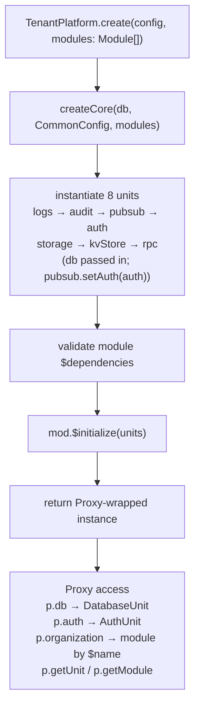
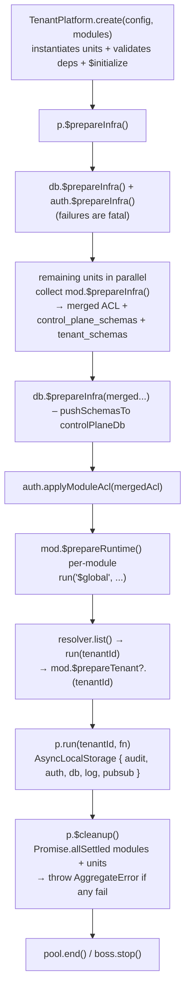
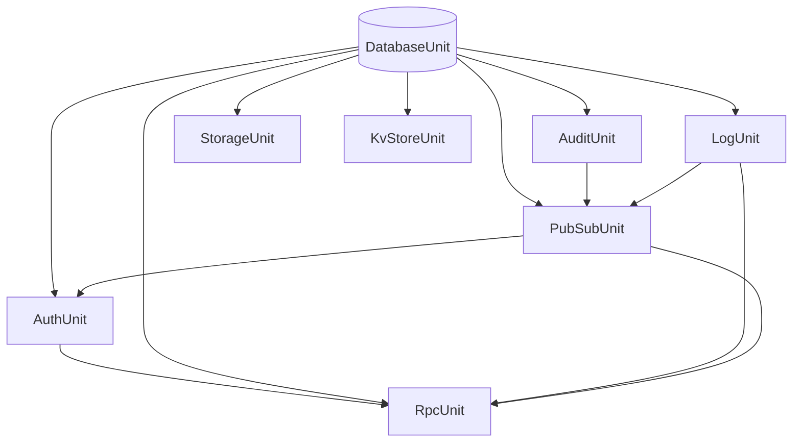

The platform is organized around three concepts: **units** (infrastructure), **modules** (domain logic), and the platform **orchestrator** — `TenantPlatform` — that wires them together.

## Entry Surfaces

`@aspen-os/platform` declares three subpaths in `exports`:

```json title="package.json"
{
  "exports": {
    "./client": { "default": "./.output/client/index.js", "types": "./.output/client/index.d.ts" },
    "./server": { "default": "./.output/server/index.js", "types": "./.output/server/index.d.ts" },
    "./server/db-schemas": {
      "default": "./.output/server/db/schema/index.js",
      "types": "./.output/server/db/schema/index.d.ts"
    }
  }
}
```

No bare `"."` entry — import via subpaths. `./server/db-schemas` re-exports the platform's Drizzle schemas (`audit_log`, `workflow_runs`, etc.) for external tooling.

### Server (`@aspen-os/platform/server`)

Exports a single platform class, `TenantPlatform` — control-plane DB + per-tenant DBs (physical isolation), `run(tenantId, fn)` with per-tenant pools.

Also exports:

- `TenantConfig`, `TenantPlatformInstance`, `CommonConfig` types
- `getContext()` — access `AsyncLocalStorage` inside `run()`
- `Workflow`, `WorkflowStep` — durable workflow builder
- `Unit`, `Module` interfaces, `ModuleInfra` type
- `defineAcl`, `AclDeclaration`
- `isGlobalTenantId`, `generateUuidv7`, `uuidv7`
- All 8 unit config types and unit type exports
- `PlatformInstance`, `PlatformUnits`, `TenantResolver` types
- `context`, `password`, `EmailSchema` etc.

### Client (`@aspen-os/platform/client`)

Exports a single `Platform` class (browser-side, 3 units: `auth`, `logs`, `rpc` stubs). Client `AuthUnit` takes only `AuthConfig`; no `db`, no tenancy.

<Callout type="warn">
  Server `run(tenantId, fn)` requires a tenant id (`"$global"` for control-plane work). Client `Platform.run(fn)` takes **no** tenant id — it sets `{ auth, logs, rpc }` on `AsyncLocalStorage` and invokes `fn()` synchronously.
</Callout>

## Configuration

`TenantConfig` extends `CommonConfig` with the isolated `db` shape:

```ts title="src/server/base-platform.ts"
type CommonConfig = {
  auth: AuthConfig;
  kvStore: KvStoreConfig;
  logs: LogConfig;
  pubsub: PubSubConfig;
  rpc: RpcConfig;
  storage: StorageConfig;
};
// TenantConfig = CommonConfig & { db: TenantDatabaseConfig }
```

`CommonConfig` has no `db`. `TenantDatabaseConfig` carries `controlPlaneDbName`, `tenantDbPrefix`, `tenantDbDefaults`, and a `TenantResolver`.

## Architecture


```mermaid
flowchart TB
  Create["TenantPlatform.create(config, modules: Module[])"] --> Core["createCore(db, CommonConfig, modules)"]
  Core --> Units["instantiate 8 units\nlogs → audit → pubsub → auth\nstorage → kvStore → rpc\n(db passed in; pubsub.setAuth(auth))"]
  Units --> Validate["validate module $dependencies"]
  Validate --> Init["mod.$initialize(units)"]
  Init --> Proxy["return Proxy-wrapped instance"]
  Proxy --> Access["Proxy access\np.db → DatabaseUnit\np.auth → AuthUnit\np.organization → module by $name\np.getUnit / p.getModule"]
```

## Lifecycle


```mermaid
flowchart TB
  A["TenantPlatform.create(config, modules)\ninstantiates units + validates deps + $initialize"] --> B["p.$prepareInfra()"]
  B --> B1["db.$prepareInfra() + auth.$prepareInfra()\n(failures are fatal)"]
  B1 --> B2["remaining units in parallel\ncollect mod.$prepareInfra()\n→ merged ACL + control_plane_schemas + tenant_schemas"]
  B2 --> B3["db.$prepareInfra(merged...) – pushSchemasTo controlPlaneDb"]
  B3 --> B4["auth.applyModuleAcl(mergedAcl)"]
  B4 --> B5["mod.$prepareRuntime() per-module\nrun('$global', ...)"]
  B5 --> B6["resolver.list() → run(tenantId)\n→ mod.$prepareTenant?.(tenantId)"]
  B6 --> C["p.run(tenantId, fn)\nAsyncLocalStorage { audit, auth, db, log, pubsub }"]
  C --> D["p.$cleanup()\nPromise.allSettled modules + units\n→ throw AggregateError if any fail"]
  D --> E["pool.end() / boss.stop()"]
```

### `create(config, modules)`

Static factory — the **only** way to construct a platform. Modules are an **array**, not an object:

```ts
const p = TenantPlatform.create(config, [organizationModule]);
```

Inside `createCore()`: instantiate units in dependency order, cross-wire `pubsub.setAuth(auth)`, validate `$dependencies`, call `$initialize`, return Proxy.

### `$prepareInfra()`

Prepares `db`/`auth` first (failures are fatal so callers never see a false success), then the remaining units in parallel, merges `ModuleInfra` (schemas + ACL, collisions throw, ACL actions deduped), calls `db.$prepareInfra(controlSchemas, tenantSchemas)` on the control-plane DB, applies ACL via `auth.applyModuleAcl`, then runs each module's `$prepareRuntime()` in parallel via `run("$global", ...)`, then runs `mod.$prepareTenant?.(tenantId)` per tenant in parallel (failures aggregated into `AggregateError`).

### `run(tenantId, fn)`

```ts title="src/server/base-platform.ts"
run<TValue>(tenantId: string, fn: () => TValue | Promise<TValue>): Promise<TValue>
```

One signature — no overloads. `"$global"` routes to `controlPlaneDb`; any other tenant id resolves `getTenantDb(tenantId)` and exposes it via `context`. Inside `fn`, `getContext()` yields `{ audit, auth, db, log, pubsub, tenantId? }`.

### `$cleanup()`

```ts title="src/server/base-platform.ts"
async $cleanup(): Promise<void> {
  const moduleResults = await Promise.allSettled(modules.map(m => run("$global", () => m.$cleanup())));
  const unitResults   = await Promise.allSettled(Object.values(units).map(u => u.$cleanup()));
  const failures = [...moduleResults, ...unitResults].flatMap(r => r.status==="rejected"?[r.reason]:[]);
  if (failures.length) throw new AggregateError(failures, `Failed to clean up ${failures.length} unit(s)/module(s)`);
}
```

Aggregate — not per-item logging. Modules are cleaned before units.

## Dependency Graph


```mermaid
flowchart TB
  DB[(DatabaseUnit)]
  DB --> Audit[AuditUnit]
  DB --> Logs[LogUnit]
  DB --> PubSub[PubSubUnit]
  Audit --> PubSub
  Logs --> PubSub
  DB --> Auth[AuthUnit]
  PubSub --> Auth
  DB --> Storage[StorageUnit]
  DB --> KvStore[KvStoreUnit]
  Auth --> Rpc[RpcUnit]
  DB --> Rpc
  Logs --> Rpc
  PubSub --> Rpc
```

`DatabaseUnit` is the root; `RpcUnit` is the most connected (4 deps).

## Diagnostics

No `healthCheck()` on the platform. Use the RPC procedure and PubSub probes:

```ts
const result = await p.rpc.server.handle(request, { db: p.db.db, pubsub: p.pubsub });
// router.health.check → { status: "ok" }

await p.pubsub.getQueueSize("some.topic"); // works on unregistered topics
p.pubsub.getUnsubscribedProducedTopics(); // topics published with no subscriber
```

## Accessing Units and Modules

The instance is a Proxy — units first, then modules by `$name`:

```ts
p.db; // → DatabaseUnit
p.auth; // → AuthUnit
p.organization; // → Organization (module $name)
p.management; // → ManagementPlane
p.getUnit("db"); // → DatabaseUnit
p.getModule("organization"); // throws if missing
```
