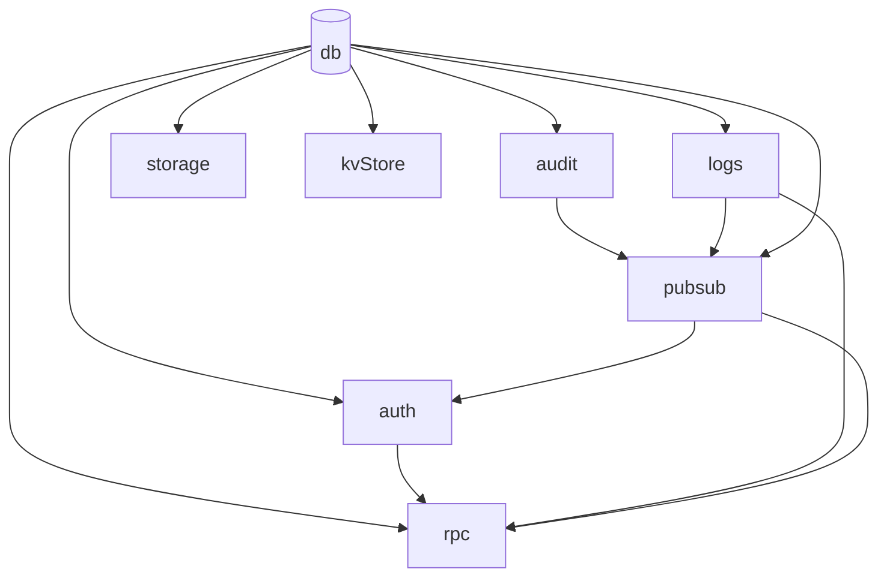
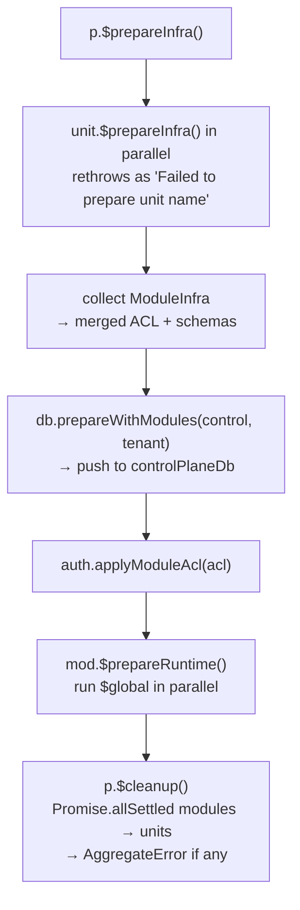

A **Unit** is an infrastructure service managed by the platform. There are exactly eight on the server and three on the client. You never instantiate units yourself — you provide config and the platform wires them via dependency injection.

## The Unit Interface

```ts title="src/server/types.ts"
export interface Unit {
  readonly $name: string;
  $prepareInfra?: () => Promise<void>;
  $cleanup: () => Promise<void>;
}
```

Server units use a `$` prefix on lifecycle methods — separating framework calls (`DatabaseUnit.$cleanup()` shuts the pool) from public API (`DatabaseUnit.db` is the drizzle instance).

```ts title="src/server/types.ts"
export interface Module {
  readonly $name: string;
  readonly $dependencies: readonly string[];
  readonly $consumes?: readonly string[];
  $initialize: (units: any) => void;
  $prepareInfra: () => ModuleInfra;
  $prepareRuntime: () => void | Promise<void>;
  $prepareTenant?: (tenantId: string) => Promise<void>;
  $cleanup: () => void | Promise<void>;
}
```

## The Eight Server Units

All eight are constructed inside `BasePlatform.createCore()`. `audit` takes no config — it is always present:

| Key       | Unit class     | `$name`     | Depends on                   | Purpose                                       |
| --------- | -------------- | ----------- | ---------------------------- | --------------------------------------------- |
| `db`      | `DatabaseUnit` | `"db"`      | —                            | postgres-js pool + Drizzle ORM, tenancy state |
| `audit`   | `AuditUnit`    | `"audit"`   | `{ db }`                     | Field-level audit log                         |
| `logs`    | `LogUnit`      | `"logs"`    | `{ db }`                     | Structured logging                            |
| `pubsub`  | `PubSubUnit`   | `"pubsub"`  | `{ audit, db, log }`         | Pub/sub + schedules                           |
| `auth`    | `AuthUnit`     | `"auth"`    | `{ db, pubsub }`             | better-auth + ACL                             |
| `storage` | `StorageUnit`  | `"storage"` | `{ db }`                     | S3 file storage                               |
| `rpc`     | `RpcUnit`      | `"rpc"`     | `{ auth, db, logs, pubsub }` | oRPC router                                   |
| `kvStore` | `KvStoreUnit`  | `"kvStore"` | `{ db }`                     | Key-value cache                               |

<Callout type="info">
  Each unit has a reference page under **Units**: [Database](/docs/platform/units/database),
  [Auth](/docs/platform/units/auth), [PubSub](/docs/platform/units/pubsub),
  [Storage](/docs/platform/units/storage), [KV Store](/docs/platform/units/kv-store),
  [Logs](/docs/platform/units/logs), [RPC](/docs/platform/units/rpc),
  [Audit](/docs/platform/units/audit).
</Callout>

### Dependency Graph



`DatabaseUnit` is the root; every other unit depends on it transitively. `RpcUnit` is the most connected. `pubsub.setAuth(auth)` is called after `auth` creation.

## The Three Client Units

`@aspen-os/platform/client` instantiates only three:

| Key    | Unit class | Purpose                                       |
| ------ | ---------- | --------------------------------------------- |
| `auth` | `AuthUnit` | Wraps better-auth React client                |
| `logs` | `LogUnit`  | Stub — throws on `$prepareInfra` / `$cleanup` |
| `rpc`  | `RpcUnit`  | Stub — no-op                                  |

Client units have no constructor injection. `AuthUnit` takes only `AuthConfig` (better-auth `baseURL`).

## How Units Are Created

```ts
const p = SingleTenantPlatform.create(
  {
    db: { host, port, user, password, database },
    auth: { baseURL, secret },
    logs: { defaultLevel: "info", serviceName: "my-app" },
    pubsub: {},
    storage: { bucket, prefix, provider: { ... } },
    rpc: { prefix: "/api/rpc" },
    kvStore: { defaultTtl: 3600, keyPrefix: "app" },
  },
  [organization],
);
```

`createCore()` instantiates each with `new` in dependency order; the resulting `PlatformUnits` is passed to `mod.$initialize(units)`.

<Callout type="warn">
  The unit set is fixed. You cannot add, remove, or replace units. `audit` takes no config and is
  always instantiated.
</Callout>

## Unit Lifecycle



### `$prepareInfra()`

`DatabaseUnit.$prepareInfra()` pushes schemas; `PubSubUnit.$prepareInfra()` is a **no-op** (pg-boss starts lazily); `AuthUnit.$prepareInfra()` reapplies ACL. Isolated mode overrides this flow (see [Overview](/docs/platform/overview)).

### `$cleanup()`

After all modules, then all units, via `Promise.allSettled`; failures aggregated into `AggregateError`, not per-item `console.error`.

## Accessing Units

### Proxy access (preferred)

```ts
p.db; // → DatabaseUnit
p.audit; // → AuditUnit
p.pubsub; // → PubSubUnit
```

### Typed accessor

```ts
p.getUnit("db");
p.getUnit("auth");
```

### Inside request context

```ts
import { getContext } from "@aspen-os/platform/server";

await p.run("$global", async () => {
  const { audit, auth, db, log, pubsub } = getContext();
});
```

## Why You Can't Create Custom Units

Units are fixed infrastructure. For new functionality, create a **module** — modules are pluggable, receive units via `$initialize()`, and follow their own lifecycle. See [Modules](/docs/platform/module) and [Custom Module](/docs/platform/custom-module).
