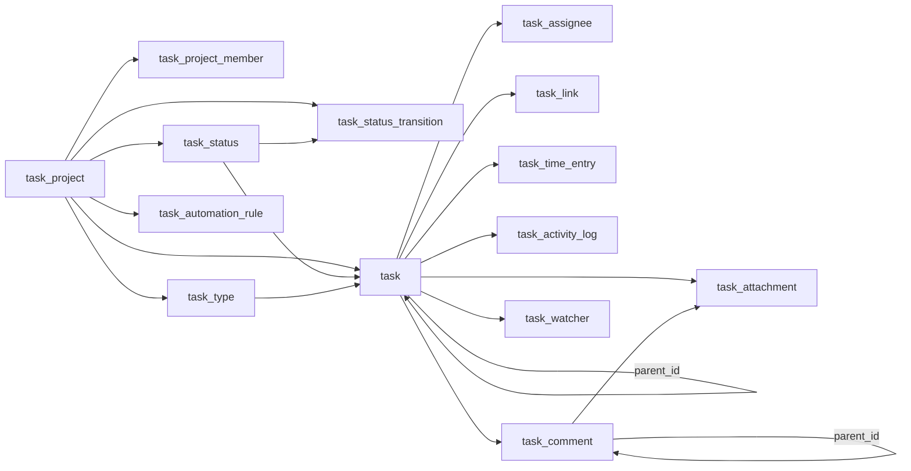

Control and tenant tables with `task_` prefix; shared columns `id` (text PK, UUIDv7), `created_at`, `updated_at` (timestamptz) where present — stated once.

## Enums

| Enum                  | Values                                                                                  |
| --------------------- | --------------------------------------------------------------------------------------- |
| `task_priority`       | `urgent`, `high`, `medium`, `low`, `none`                                               |
| `task_link_type`      | `blocks`, `blocked_by`, `related_to`, `duplicates`, `caused_by`, `split_from`           |
| `project_status`      | `active`, `archived`, `paused`                                                          |
| `project_member_role` | `admin`, `member`, `viewer`                                                             |
| `status_category`     | `backlog`, `unstarted`, `started`, `completed`, `cancelled`                             |
| `automation_trigger`  | `status_change`, `assignment_change`, `due_date_passed`, `task_created`, `task_updated` |

## Tables

### `task_project` (control)

| Column                 | Type                    | Description            |
| ---------------------- | ----------------------- | ---------------------- |
| `key`                  | text (unique)           | 2–10 uppercase letters |
| `name`                 | text                    |                        |
| `description`          | text                    | Nullable               |
| `lead_id`              | text                    | Project lead           |
| `status`               | `project_status`        | Default `active`       |
| `start_date`           | timestamptz             | Nullable               |
| `target_date`          | timestamptz             | Nullable               |
| `default_task_type_id` | text (FK → `task_type`) | Nullable               |
| `task_counter`         | integer                 | Default `0`            |

Indexes: unique `key`, `idx_task_project_lead` (`lead_id`), `idx_task_project_status` (`status`).

### `task_project_member` (control)

| Column       | Type                       | Description      |
| ------------ | -------------------------- | ---------------- |
| `project_id` | text (FK → `task_project`) |                  |
| `user_id`    | text                       |                  |
| `role`       | `project_member_role`      | Default `member` |
| `joined_at`  | timestamptz                |                  |

Indexes: unique `uq_task_project_member_project_user` (`project_id`, `user_id`), `idx_task_project_member_project` (`project_id`), `idx_task_project_member_user` (`user_id`).

### `task_status` (control)

| Column        | Type                       | Description       |
| ------------- | -------------------------- | ----------------- |
| `name`        | text                       |                   |
| `category`    | `status_category`          |                   |
| `color`       | text                       | Nullable          |
| `is_default`  | boolean                    | Default `false`   |
| `is_resolved` | boolean                    | Default `false`   |
| `sort_order`  | integer                    | Default `0`       |
| `project_id`  | text (FK → `task_project`) | Nullable = global |

Indexes: `idx_task_status_project` (`project_id`), `idx_task_status_sort` (`sort_order`).

### `task_status_transition` (control)

| Column             | Type                       | Description     |
| ------------------ | -------------------------- | --------------- |
| `project_id`       | text (FK → `task_project`) |                 |
| `from_status_id`   | text (FK → `task_status`)  |                 |
| `to_status_id`     | text (FK → `task_status`)  |                 |
| `requires_comment` | boolean                    | Default `false` |
| `requires_role`    | text                       | Nullable        |

Indexes: unique `uq_task_status_transition` (`from_status_id`, `to_status_id`, `project_id`), `idx_task_status_transition_project` (`project_id`).

### `task_type` (control)

| Column       | Type                       | Description       |
| ------------ | -------------------------- | ----------------- |
| `name`       | text                       |                   |
| `color`      | text                       | Nullable          |
| `icon`       | text                       | Nullable          |
| `is_default` | boolean                    | Default `false`   |
| `project_id` | text (FK → `task_project`) | Nullable = global |

Indexes: `idx_task_type_project` (`project_id`).

### `task` (tenant)

| Column            | Type                       | Description                      |
| ----------------- | -------------------------- | -------------------------------- |
| `number`          | text                       | Display `KEY-SEQ`, nullable      |
| `task_number`     | integer                    | Sequential per project, nullable |
| `title`           | text                       |                                  |
| `description`     | text                       | Nullable                         |
| `project_id`      | text (FK → `task_project`) |                                  |
| `status_id`       | text (FK → `task_status`)  |                                  |
| `type_id`         | text (FK → `task_type`)    | Nullable                         |
| `parent_id`       | text (FK → `task`)         | Self-ref, nullable               |
| `reporter_id`     | text                       |                                  |
| `priority`        | `task_priority`            | Default `none`                   |
| `labels`          | text[]                     | Default `[]`                     |
| `sort_order`      | integer                    | Default `0`                      |
| `estimated_hours` | numeric                    | Nullable                         |
| `start_date`      | timestamptz                | Nullable                         |
| `due_date`        | timestamptz                | Nullable                         |
| `assigned_at`     | timestamptz                | Nullable                         |
| `completed_at`    | timestamptz                | Nullable                         |
| `is_archived`     | boolean                    | Default `false`                  |

Indexes: `idx_task_project` (`project_id`), `idx_task_status` (`status_id`), `idx_task_type` (`type_id`), `idx_task_parent` (`parent_id`), `idx_task_reporter` (`reporter_id`), `idx_task_priority` (`priority`), `idx_task_archived` (`is_archived`), `idx_task_due_date` (`due_date`).

### `task_assignee` (tenant)

| Column        | Type               | Description     |
| ------------- | ------------------ | --------------- |
| `task_id`     | text (FK → `task`) |                 |
| `user_id`     | text               |                 |
| `assigned_by` | text               |                 |
| `is_lead`     | boolean            | Default `false` |
| `assigned_at` | timestamptz        |                 |

Indexes: unique `uq_task_assignee_task_user` (`task_id`, `user_id`), `idx_task_assignee_task` (`task_id`), `idx_task_assignee_user` (`user_id`).

### `task_link` (tenant)

| Column      | Type               | Description |
| ----------- | ------------------ | ----------- |
| `source_id` | text (FK → `task`) |             |
| `target_id` | text (FK → `task`) |             |
| `link_type` | `task_link_type`   |             |

Indexes: unique `uq_task_link_source_target_type` (`source_id`, `target_id`, `link_type`), `idx_task_link_source` (`source_id`), `idx_task_link_target` (`target_id`).

### `task_time_entry` (tenant)

| Column        | Type               | Description     |
| ------------- | ------------------ | --------------- |
| `task_id`     | text (FK → `task`) |                 |
| `user_id`     | text               |                 |
| `duration`    | integer            | Minutes         |
| `date`        | date               |                 |
| `description` | text               | Nullable        |
| `billable`    | boolean            | Default `false` |

Indexes: `idx_task_time_entry_task` (`task_id`), `idx_task_time_entry_user` (`user_id`), `idx_task_time_entry_date` (`date`).

### `task_activity_log` (tenant)

| Column      | Type               | Description         |
| ----------- | ------------------ | ------------------- |
| `task_id`   | text (FK → `task`) |                     |
| `user_id`   | text               |                     |
| `action`    | text               | e.g. `task_created` |
| `old_value` | jsonb              | Nullable            |
| `new_value` | jsonb              | Nullable            |

Indexes: `idx_task_activity_log_task` (`task_id`), `idx_task_activity_log_action` (`action`), `idx_task_activity_log_created` (`created_at`).

### `task_comment` (tenant)

| Column       | Type                       | Description        |
| ------------ | -------------------------- | ------------------ |
| `task_id`    | text (FK → `task`)         |                    |
| `user_id`    | text                       |                    |
| `body`       | text                       |                    |
| `parent_id`  | text (FK → `task_comment`) | Self-ref, nullable |
| `is_deleted` | boolean                    | Default `false`    |
| `edited_at`  | timestamptz                | Nullable           |

Indexes: `idx_task_comment_task` (`task_id`), `idx_task_comment_parent` (`parent_id`), `idx_task_comment_user` (`user_id`).

### `task_attachment` (tenant)

| Column        | Type                       | Description     |
| ------------- | -------------------------- | --------------- |
| `task_id`     | text (FK → `task`)         |                 |
| `file_id`     | text                       | Storage file id |
| `uploaded_by` | text                       |                 |
| `comment_id`  | text (FK → `task_comment`) | Nullable        |

Indexes: `idx_task_attachment_task` (`task_id`), `idx_task_attachment_comment` (`comment_id`).

### `task_watcher` (tenant)

| Column    | Type               | Description |
| --------- | ------------------ | ----------- |
| `task_id` | text (FK → `task`) |             |
| `user_id` | text               |             |

Indexes: unique `uq_task_watcher_task_user` (`task_id`, `user_id`), `idx_task_watcher_task` (`task_id`), `idx_task_watcher_user` (`user_id`).

### `task_automation_rule` (tenant)

| Column       | Type                       | Description    |
| ------------ | -------------------------- | -------------- |
| `name`       | text                       |                |
| `project_id` | text (FK → `task_project`) |                |
| `trigger`    | `automation_trigger`       |                |
| `conditions` | jsonb                      | Nullable       |
| `actions`    | jsonb                      |                |
| `is_active`  | boolean                    | Default `true` |

Indexes: `idx_task_automation_rule_project` (`project_id`), `idx_task_automation_rule_trigger` (`trigger`), `idx_task_automation_rule_active` (`is_active`).

## Relationships

All FKs are logical (text), workflow-enforced. Saved views moved to `@aspen-os/masters` (`master_filter_view`, `domain: "tasks:task"`) is not a task table.
