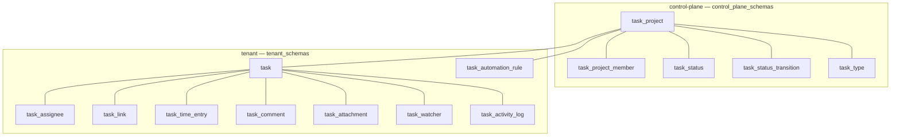
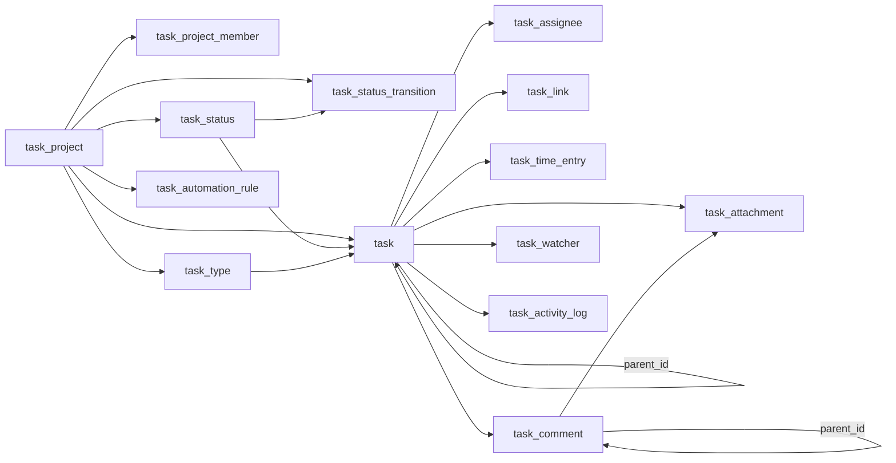

The Tasks module manages projects, tasks, and their collaboration surface — statuses, types, assignees, links, comments, attachments, time tracking, and automation.

## Module

```ts title="src/module.ts"
export class Tasks implements Module {
  static create(): Tasks;
  readonly $name = "tasks"; // proxy key: p.tasks
  readonly $dependencies = ["masters"] as const;
  $prepareInfra(): ModuleInfra { auth: { acl }, db: { control_plane_schemas, tenant_schemas }, events }
}
```

## Configuration

```ts title="src/module.ts"
export type TaskModuleConfig = undefined;

const tasks = Tasks.create();
```

No configuration — `Tasks.create()` takes no args.

## Dependencies

| Dependency | Kind                   | Purpose                                                                                                          |
| ---------- | ---------------------- | ---------------------------------------------------------------------------------------------------------------- |
| `masters`  | module `$dependencies` | Label taxonomy (`master_label`) and contact identities consumed by task labels/mentions (soft FK, no hard DB FK) |
| `db`       | unit                   | Control and tenant tables; no `kvStore` or `storage`                                                             |
| `pubsub`   | unit                   | Publishes `task:*` events; consumers include `@aspen-os/calendar` bridge                                         |
| `audit`    | context                | `ctx.audit.write` per mutation                                                                                   |

`$initialize()` is empty — workflows are stateless flat `Workflow` objects.

## Architecture



Control (`task_project`, `task_project_member`, `task_status`, `task_status_transition`, `task_type`) and tenant tables (`task`, `task_assignee`, `task_link`, `task_time_entry`, `task_comment`, `task_attachment`, `task_watcher`, `task_activity_log`, `task_automation_rule`); no `task_label_def` — labels live in `@aspen-os/masters`.

## Key concepts

### Projects and keys

`task_project.key` (2–10 uppercase letters, unique) drives display numbers `KEY-SEQ` via `task_counter`. `leadId` auto-membered as `admin`. `delete` blocked when tasks exist — archive instead.

### Statuses and transitions

`task_status` is project-scoped or global (`project_id` null). `is_default` unique per scope; `is_resolved` marks completion. Optional `task_status_transition` rules default to open model when empty; `validateTransition` checks explicit rules; `requires_comment` / `requires_role` are transition guards.

### Tasks

`task` holds `status_id`, `type_id`, `parent_id` (self-ref, max depth 3, cycle-checked), `priority` (`task_priority`), `labels` (text[]), `estimated_hours`, dates, and archived flag. Creation increments `task_counter`; subtasks and `bulkUpdate` are explicit workflows.

### Collaboration

`task_assignee` (one lead via `is_lead`), `task_watcher` (idempotent), `task_comment` (threaded `parent_id`, soft-delete), `task_attachment` (optionally `comment_id`), `task_activity_log` (append-only), `task_link` (directed `task_link_type` with inverse), `task_time_entry` (minutes, `billable`).

## Relationships



All relationships are logical (text FKs), workflow-enforced; `task` parent depth and cycle checks are code guards.

<Callout type="info">
  Saved views live in `@aspen-os/masters` as `p.masters.filterViews` (`domain: "tasks:task"`). Task
  reminders live in `@aspen-os/calendar` (`targetType = task`) via the `task:due_date_changed`
  bridge — this module owns no reminder surface.
</Callout>
