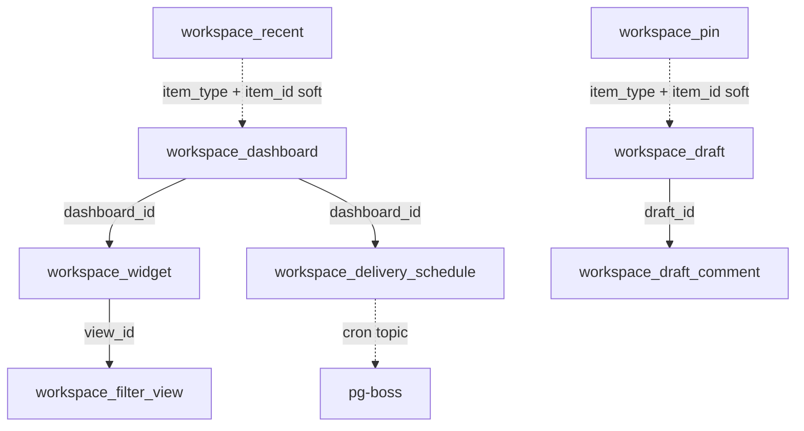

The module owns tenant tables with `workspace_` prefix and no control-plane tables. Shared columns `id` (uuidv7 PK), `created_at`, `updated_at` (timestamptz) stated once; `updated_at` auto-updates on row change.

## Enums

| Enum                           | Values                                                    |
| ------------------------------ | --------------------------------------------------------- |
| `workspace_access`             | `personal`, `global`                                      |
| `workspace_draft_status`       | `draft`, `submitted`, `approved`, `rejected`, `published` |
| `workspace_widget_type`        | `metric`, `breakdown`, `list`, `embed`                    |
| `workspace_item_type`          | `draft`, `view`, `dashboard`                              |
| `workspace_filter_view_access` | `personal`, `global`                                      |
| `workspace_filter_view_type`   | `list`, `board`, `calendar`, `timeline`                   |

## Tables

### `workspace_dashboard`

Named collection of widgets over a grid layout.

| Column        | Type                            | Description     |
| ------------- | ------------------------------- | --------------- |
| `access`      | `workspace_access`              | `personal`      |
| `description` | text                            | Description     |
| `layout`      | jsonb (`WidgetPlacement[]`)     | Grid layout     |
| `metadata`    | jsonb                           | Opaque metadata |
| `name`        | text                            | Dashboard name  |
| `owner_id`    | text (FK → better-auth user.id) | Owner           |

Indexes: `idx_workspace_dashboard_owner` on `owner_id`, `idx_workspace_dashboard_access` on `access`.

### `workspace_delivery_schedule`

Per-dashboard cron delivery.

| Column         | Type                               | Description                        |
| -------------- | ---------------------------------- | ---------------------------------- |
| `config`       | jsonb (`ScheduleConfig`)           | `{ recipients, format, subject? }` |
| `created_by`   | text                               | Creator                            |
| `cron`         | text                               | pg-boss cron expression            |
| `dashboard_id` | text (FK → workspace_dashboard.id) | Parent dashboard                   |
| `is_active`    | boolean                            | `true`; `pause`/`resume` toggles   |
| `last_error`   | text                               | Last run error                     |
| `last_run_at`  | timestamptz                        | Last run timestamp                 |

Indexes: `idx_workspace_delivery_schedule_dashboard` on `dashboard_id`.

### `workspace_draft`

Saved, unpublished content with approval lifecycle and soft-delete.

| Column               | Type                            | Description           |
| -------------------- | ------------------------------- | --------------------- |
| `access`             | `workspace_access`              | `personal`            |
| `approved_at`        | timestamptz                     | Approve timestamp     |
| `approved_by`        | text                            | Approver              |
| `body`               | text                            | Content, default `''` |
| `deleted_at`         | timestamptz                     | Trash timestamp       |
| `metadata`           | jsonb                           | Opaque metadata       |
| `notes`              | text                            | Annotation            |
| `owner_id`           | text (FK → better-auth user.id) | Owner                 |
| `published_at`       | timestamptz                     | Publish timestamp     |
| `published_by`       | text                            | Publisher             |
| `rejected_at`        | timestamptz                     | Reject timestamp      |
| `rejected_by`        | text                            | Rejector              |
| `rejection_reason`   | text                            | Reject reason         |
| `status`             | `workspace_draft_status`        | `draft`               |
| `submitted_at`       | timestamptz                     | Submit timestamp      |
| `submitted_by`       | text                            | Submitter             |
| `target_domain`      | text                            | Publish domain        |
| `target_entity_id`   | text                            | Target entity id      |
| `target_entity_type` | text                            | Target entity type    |
| `title`              | text                            | Title                 |

Indexes: `idx_workspace_draft_owner` on `owner_id`, `idx_workspace_draft_status` on `status`, `idx_workspace_draft_access` on `access`.

### `workspace_draft_comment`

Threaded comments on a draft.

| Column      | Type                           | Description  |
| ----------- | ------------------------------ | ------------ |
| `author_id` | text                           | Author       |
| `content`   | text                           | Body         |
| `draft_id`  | text (FK → workspace_draft.id) | Parent draft |

Indexes: `idx_workspace_draft_comment_draft` on `draft_id`.

### `workspace_filter_view`

Saved filter/sort/group configuration.

| Column       | Type                            | Description                  |
| ------------ | ------------------------------- | ---------------------------- |
| `access`     | `workspace_filter_view_access`  | `personal`                   |
| `conditions` | jsonb (`FilterViewCondition[]`) | Filter conditions            |
| `domain`     | text                            | Domain (`<module>:<entity>`) |
| `group_by`   | text                            | Group-by field               |
| `is_default` | boolean                         | Default flag                 |
| `metadata`   | jsonb                           | Opaque metadata              |
| `name`       | text                            | View name                    |
| `owner_id`   | text (FK → better-auth user.id) | Owner                        |
| `project_id` | text                            | Project scope                |
| `sort`       | jsonb (`FilterViewSort[]`)      | Sort clauses                 |
| `view_type`  | `workspace_filter_view_type`    | `list`                       |

Indexes: `idx_workspace_filter_view_domain_access` on `(domain, access)`, `idx_workspace_filter_view_owner` on `owner_id`, `idx_workspace_filter_view_project` on `project_id`.

### `workspace_pin`

Per-user sidebar shortcut.

| Column       | Type    | Description        |
| ------------ | ------- | ------------------ |
| `item_id`    | text    | Pinned item id     |
| `item_type`  | text    | Registry value     |
| `sort_order` | integer | Order, default `0` |
| `user_id`    | text    | Owner              |

Indexes: `idx_workspace_pin_user` on `user_id`, `idx_workspace_pin_user_item` unique on `(user_id, item_type, item_id)`.

### `workspace_recent`

Per-user recent items; `touch` upserts and trims to `maxRecentItems`.

| Column             | Type                  | Description                  |
| ------------------ | --------------------- | ---------------------------- |
| `item_id`          | text                  | Item id                      |
| `item_type`        | `workspace_item_type` | `draft`, `view`, `dashboard` |
| `last_accessed_at` | timestamptz           | Last access time             |
| `user_id`          | text                  | Owner                        |

Indexes: `idx_workspace_recent_user` on `user_id`, `idx_workspace_recent_user_item` unique on `(user_id, item_type, item_id)`.

### `workspace_widget`

Declarative widget on a dashboard; inherits dashboard access.

| Column              | Type                                 | Description                             |
| ------------------- | ------------------------------------ | --------------------------------------- |
| `config`            | jsonb (`WidgetConfig`)               | Type-specific config                    |
| `dashboard_id`      | text (FK → workspace_dashboard.id)   | Parent dashboard                        |
| `domain`            | text                                 | Datasource domain                       |
| `filter`            | jsonb (`WidgetFilterCondition[]`)    | Inline filter, exclusive with `view_id` |
| `last_error`        | text                                 | Refresh error                           |
| `last_refreshed_at` | timestamptz                          | Refresh timestamp                       |
| `title`             | text                                 | Title                                   |
| `type`              | `workspace_widget_type`              | Widget type                             |
| `view_id`           | text (FK → workspace_filter_view.id) | Reused filter view                      |

Indexes: `idx_workspace_widget_dashboard` on `dashboard_id`.

## Relationships

All relationships are soft (workflow-enforced); no hard FKs.
