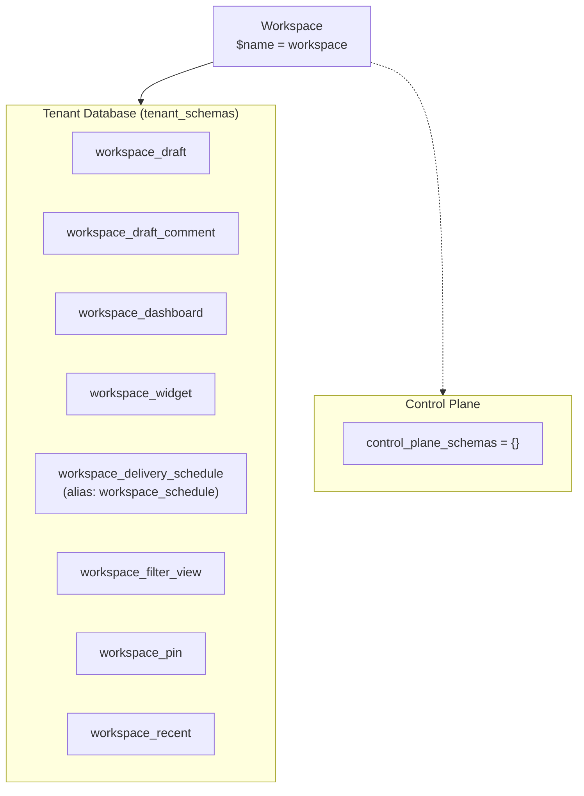
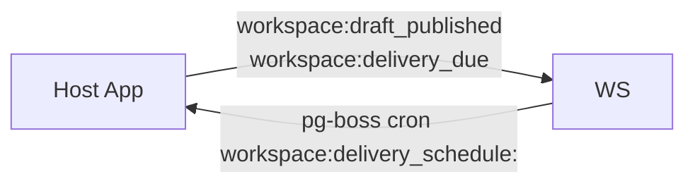
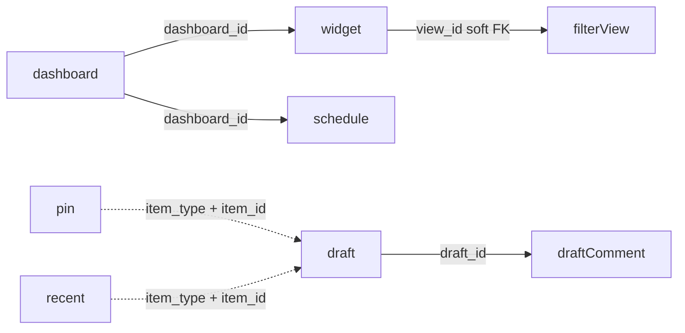

The Workspace module is a tenant-scoped surface for drafts, dashboards (with widgets and delivery schedules), filter views, pins, recent items, and quick search.

## Module

```ts title="src/module.ts"
export class Workspace implements Module {
  static create(config?: WorkspaceModuleConfig): Workspace;
  readonly $name = "workspace"; // proxy key: p.workspace
  readonly $dependencies: readonly string[] = [];
}
```

## Configuration

```ts title="src/types.ts"
export interface WorkspaceModuleConfig {
  maxRecentItems?: number; // default 50
  quickSearchLimit?: number; // default 10
}
```

```ts
import { Workspace } from "@aspen-os/workspace";

const workspace = Workspace.create(); // { maxRecentItems: 50, quickSearchLimit: 10 }
const custom = Workspace.create({ maxRecentItems: 100, quickSearchLimit: 20 });
```

## Dependencies

No module dependencies (`$dependencies: []`). Unit bindings: `db` and `pubsub` stored in `$initialize` for `$prepareRuntime`/`$cleanup`; `ctx.audit` resolved via `getContext()` in `$prepareRuntime` to register the schedule runner. `$prepareRuntime` registers a pg-boss cron per active delivery schedule plus the delivery handler; `$cleanup` unregisters them.

## Architecture





Filter views are workspace-owned (`workspace_filter_view`), not Masters; widgets reference a view via `viewId` or inline `filter`.

## Key Concepts

### Access

`workspace_draft`, `workspace_dashboard`, `workspace_filter_view` carry `access` (`personal`/`global`); widgets and delivery schedules inherit dashboard access. Pins and recent are user-scoped (`userId = actorId`) with no access column.

### Schedules

Canonical table `workspace_delivery_schedule` (alias `workspace_schedule` for back-compat). Topic `workspace:delivery_due` is canonical; `workspace:schedule_due` is deprecated but still emitted.

## Relationships



All FKs are soft (workflow-enforced); no hard DB FKs.

<Callout type="info">
  `deliverySchedules` is an alias of `schedules` (`src/workflows/index.ts`); prefer
  `deliverySchedules`.
</Callout>
